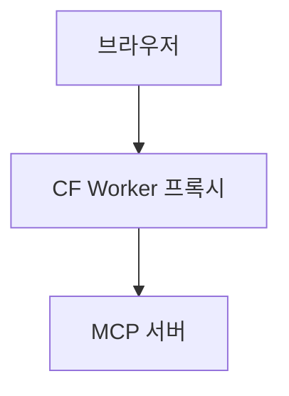
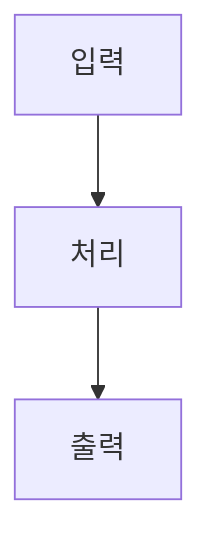

# 실험실 포트폴리오 개편 Implementation Plan

> **For agentic workers:** REQUIRED SUB-SKILL: Use superpowers:subagent-driven-development (recommended) or superpowers:executing-plans to implement this plan task-by-task. Steps use checkbox (`- [ ]`) syntax for tracking.

**Goal:** `/lab` 을 프로젝트 포트폴리오로 개편한다 — 목록은 로고 카드로 최소화하고, 상세는 마크다운 섹션 템플릿을 계측기 톤의 전용 레이아웃으로 렌더한다. 콘텐츠는 다른 레포 세션이 `/portfolio` 스킬로 채워 넘긴다.

**Architecture:** `projects.body_md` 를 `##` 제목 기준으로 파싱해 타입이 붙은 섹션 배열로 바꾸고, 섹션 종류마다 전용 React 컴포넌트를 태운다. 파서는 절대 예외를 던지지 않고 규약 위반 섹션을 `raw` 로 떨어뜨려, 콘텐츠가 어긋나도 페이지가 살아 있게 한다. 스타일은 실험실 전용 CSS 변수 한 겹으로 감싸 라이트/다크를 토큰 교체만으로 처리한다.

**Tech Stack:** Next.js 16 (App Router, RSC) · React 19 · TypeScript · 순수 CSS(globals.css, Tailwind 유틸 미사용) · Supabase JS · Playwright(캡처 스크립트 전용) · `node:test` + Node 23 내장 타입 스트리핑

## Global Constraints

- 설계 원본: `docs/superpowers/specs/2026-08-22-lab-portfolio-design.md`. 충돌 시 스펙이 우선한다.
- **새 런타임 의존성을 추가하지 않는다.** `playwright` 만 devDependency 로 추가한다. 3D·모션그래픽·애니메이션 라이브러리 금지.
- **모노스페이스(`var(--font-mono)`)는 라벨·수치·상태에만 쓰고 문장에는 절대 쓰지 않는다.**
- 24px 격자는 페이지 바탕에만 깐다. 카드·표·패널은 불투명 서피스(`--lab-panel`)로 덮어 격자가 글자 뒤로 비치지 않게 한다.
- 민트 액센트는 화면당 서너 곳까지만 쓴다.
- 색상값을 컴포넌트에 직접 박지 않는다. `--lab-*` CSS 변수를 거쳐 쓰고, 라이트/다크에서 변수만 재정의한다.
- 본문 활자: Pretendard 13~14px, 행간 1.8, 최대 44em.
- `prefers-reduced-motion: reduce` 에서 모든 연출을 끈다.
- 포스트(`/posts`) 쪽 레이아웃·컴포넌트를 변경하지 않는다. `Thumb` 컴포넌트는 포스트가 계속 쓰므로 삭제하지 않는다.
- 프로젝트 `url` 은 스킴을 포함한 절대 URL 이다. 코드에서 `https://` 를 붙이지 않는다.
- 커밋 메시지에 co-author / AI attribution 트레일러를 넣지 않는다 (`CLAUDE.md`).
- 각 태스크 끝에서 검증이 통과하면 그 자리에서 커밋하고 `main` 에 직접 푸시한다. PR 을 만들지 않는다.
- 한국어 커밋 메시지, 한국어 주석. 영어 병기 괄호를 쓰지 않는다.

---

## 파일 구조

**신규**

| 파일 | 책임 |
|---|---|
| `db/migrations/0013_project_portfolio.sql` | `projects` 컬럼 추가·백필·정리 |
| `src/lib/project-sections.ts` | `body_md` → `Section[]` 파서. 순수 함수, 예외 없음 |
| `src/lib/project-sections.test.ts` | 파서 단위 테스트 (`node:test`) |
| `src/components/project/ProjectHero.tsx` | 히어로 — 미디어 + HUD + 바로가기 |
| `src/components/project/SectionRail.tsx` | 좌측 sticky 레일 (client, scrollspy) |
| `src/components/project/sections/Intro.tsx` | 제품 소개 |
| `src/components/project/sections/Requirements.tsx` | 요구사항 체크 카드 |
| `src/components/project/sections/TechChoices.tsx` | 기술 선정 비교표 |
| `src/components/project/sections/Architecture.tsx` | 구조 — sticky 다이어그램 + 단계 (client) |
| `src/components/project/sections/Trials.tsx` | 시행착오 접이식 카드 (client) |
| `src/components/project/sections/Remaining.tsx` | 남은 것 |
| `skills/portfolio/SKILL.md` | 수집 규약. 유저 스코프로 심볼릭 링크 |
| `scripts/project.mjs` | `push` / `pull` |
| `scripts/capture-project.mjs` | Playwright 캡처 → 업로드 → DB 갱신 |
| `scripts/setup-skills.mjs` | `~/.claude/skills/portfolio` 링크 |
| `projects/*.md` | 프로젝트 원고 (git 추적) |

**수정**

| 파일 | 변경 |
|---|---|
| `src/lib/types.ts` | `Project` 타입 교체 |
| `src/lib/queries.ts:54-83` | `ProjectRow` · `rowToProject` 교체 |
| `src/components/project/ProjectCard.tsx` | 전면 재작성 |
| `src/components/page/ProjectDetailView.tsx` | 전면 재작성 |
| `src/app/lab/page.tsx` | 헤더·안내문 정리 |
| `src/app/globals.css` | 실험실 전용 토큰·클래스 추가 |
| `scripts/setup-storage.mjs` | 버킷 목록 순회 구조로 |
| `package.json` | 스크립트 3개 + `playwright` devDependency |

---

### Task 1: 데이터 모델 — 마이그레이션과 타입

**Files:**
- Create: `db/migrations/0013_project_portfolio.sql`
- Modify: `db/schema.sql:54-69`
- Modify: `src/lib/types.ts:43-55`
- Modify: `src/lib/queries.ts:54-83`
- Modify: `src/components/project/ProjectCard.tsx`, `src/components/page/ProjectDetailView.tsx` (타입 깨짐만 임시 봉합)

**Interfaces:**
- Consumes: 없음 (첫 태스크)
- Produces: `Project` 타입 —
  ```ts
  export type ProjectHost = "vercel" | "cloudflare" | "local" | "none";
  export type Project = {
    slug: string; name: string; year: string; tagline: string;
    logoEmoji: string; logoBg: string; logoUrl: string | null;
    status: string; body: string; stack: string[];
    url: string | null; host: ProjectHost;
    heroMedia: string | null; heroPoster: string | null; shots: string[];
  };
  ```

- [ ] **Step 1: 마이그레이션 SQL 작성**

`db/migrations/0013_project_portfolio.sql`:

```sql
-- 실험실 포트폴리오 개편 — 카드/히어로용 컬럼 추가, 카드에서 빠진 컬럼 제거
-- 실행: Supabase Dashboard → SQL Editor → 붙여넣고 Run

alter table projects
  add column if not exists tagline     text,
  add column if not exists logo_emoji  text,
  add column if not exists logo_bg     text,
  add column if not exists logo_url    text,
  add column if not exists status      text,
  add column if not exists hero_media  text,
  add column if not exists hero_poster text,
  add column if not exists shots       text[] not null default '{}';

-- tagline 은 기존 description 에서 가져온다 (드롭 전에 백필).
update projects set tagline = description where tagline is null;

-- 로고가 아직 없으므로 이모지·배경색 기본값을 채워 카드가 빈칸으로 뜨지 않게 한다.
update projects set logo_emoji = '🧪' where logo_emoji is null or logo_emoji = '';
update projects set logo_bg    = '#1B1C1E' where logo_bg is null or logo_bg = '';
update projects set status     = '운영중' where status is null or status = '';

-- url 은 도메인만 저장돼 있었다. 절대 URL 로 승격한다.
update projects
set url = 'https://' || url
where url is not null and url <> '' and url !~ '^https?://';

alter table projects
  drop column if exists description,
  drop column if exists plan,
  drop column if exists build_note,
  drop column if exists thumb_kind;
```

- [ ] **Step 2: 마이그레이션 실행**

Supabase Dashboard → SQL Editor 에 위 파일을 붙여넣고 Run.
확인: SQL Editor 에서 `select slug, tagline, logo_emoji, status, url from projects order by sort_order;`
Expected: 4행이 나오고 `tagline` 이 예전 설명으로 채워져 있으며 `url` 이 `https://` 로 시작한다.

- [ ] **Step 3: `db/schema.sql` 의 projects 정의를 현재 상태에 맞춘다**

`db/schema.sql` 의 `create table if not exists projects (...)` 블록을 통째로 교체:

```sql
create table if not exists projects (
  id          uuid primary key default gen_random_uuid(),
  slug        text unique not null,
  name        text not null,
  year        text not null,
  tagline     text,                          -- 카드 아래 한 줄
  logo_emoji  text,                          -- 카드 아이콘 (logo_url 없을 때)
  logo_bg     text,                          -- 로고 타일 배경색
  logo_url    text,                          -- 실제 로고 이미지. 있으면 이모지보다 우선
  status      text,                          -- 운영중 | 실험중 | 중단
  body_md     text,                          -- 개발기 본문 마크다운
  stack       text[] not null default '{}',
  url         text,                          -- 스킴 포함 절대 URL
  host        text,                          -- vercel | cloudflare | local | none
  hero_media  text,                          -- 스크롤 영상 URL
  hero_poster text,                          -- 대표 스크린샷 URL
  shots       text[] not null default '{}',
  sort_order  int  not null default 0,
  created_at  timestamptz not null default now()
);
```

- [ ] **Step 4: `Project` 타입 교체**

`src/lib/types.ts` 의 `Project` 타입을 지우고 그 자리에:

```ts
export type ProjectHost = "vercel" | "cloudflare" | "local" | "none";

export type Project = {
  slug: string;
  name: string;
  year: string;
  tagline: string;
  logoEmoji: string;
  logoBg: string;
  logoUrl: string | null;
  status: string;
  body: string;
  stack: string[];
  url: string | null;
  host: ProjectHost;
  heroMedia: string | null;
  heroPoster: string | null;
  shots: string[];
};
```

- [ ] **Step 5: `ProjectRow` · `rowToProject` 교체**

`src/lib/queries.ts` 의 `type ProjectRow = {...}` 와 `function rowToProject(...)` 를 교체:

```ts
type ProjectRow = {
  slug: string;
  name: string;
  year: string;
  tagline: string | null;
  logo_emoji: string | null;
  logo_bg: string | null;
  logo_url: string | null;
  status: string | null;
  body_md: string | null;
  stack: string[];
  url: string | null;
  host: string | null;
  hero_media: string | null;
  hero_poster: string | null;
  shots: string[] | null;
  sort_order: number;
};

const PROJECT_HOSTS = ["vercel", "cloudflare", "local", "none"] as const;

function rowToProject(r: ProjectRow): Project {
  const host = PROJECT_HOSTS.find((h) => h === r.host) ?? "none";
  return {
    slug: r.slug,
    name: r.name,
    year: r.year,
    tagline: r.tagline ?? "",
    logoEmoji: r.logo_emoji || "🧪",
    logoBg: r.logo_bg || "#1B1C1E",
    logoUrl: r.logo_url || null,
    status: r.status ?? "",
    body: r.body_md ?? "",
    stack: r.stack ?? [],
    url: r.url || null,
    host,
    heroMedia: r.hero_media || null,
    heroPoster: r.hero_poster || null,
    shots: r.shots ?? [],
  };
}
```

`ThumbKind` import 가 `queries.ts` 에서 더는 안 쓰이면 import 목록에서 뺀다 (포스트 쪽에서 계속 쓰면 그대로 둔다 — `rowToPost` 를 확인할 것).

- [ ] **Step 6: 소비처 임시 봉합**

이 태스크의 목표는 타입체크 통과다. 화면 재작성은 Task 4·5 에서 한다.

`src/components/project/ProjectCard.tsx` — `p.k` / `p.desc` / `p.plan` / `p.build` 참조를 지우고, `Thumb` 자리에 `p.logoEmoji`, 설명 자리에 `p.tagline` 을 넣는다. `p.url` 이 `string | null` 이 됐으므로 하단 메타 줄을 `{p.url && ...}` 로 감싼다.

`src/components/page/ProjectDetailView.tsx` — `project.desc` → `project.tagline`, `기획`/`구현` 그리드 블록(`plan`·`build` 사용)을 통째로 삭제한다.

- [ ] **Step 7: 타입체크와 빌드**

Run: `npx tsc --noEmit && npm run build`
Expected: 둘 다 에러 없이 종료. `/lab` 과 `/lab/[slug]` 가 프리렌더 목록에 남아 있어야 한다.

- [ ] **Step 8: 커밋**

```bash
git add db/ src/lib/types.ts src/lib/queries.ts src/components/project/ProjectCard.tsx src/components/page/ProjectDetailView.tsx
git commit -m "lab: 포트폴리오용 projects 스키마·타입 정리"
git push
```

---

### Task 2: 본문 파서와 테스트

**Files:**
- Create: `src/lib/project-sections.ts`
- Create: `src/lib/project-sections.test.ts`
- Modify: `package.json` (test 스크립트)

**Interfaces:**
- Consumes: 없음 (순수 함수, DB·React 의존 없음)
- Produces:
  ```ts
  export type Section =
    | { kind: "intro";        title: string; md: string }
    | { kind: "requirements"; title: string; items: { done: boolean; text: string }[] }
    | { kind: "tech";         title: string; head: string[]; rows: string[][] }
    | { kind: "architecture"; title: string; diagram: string | null; steps: { label: string; md: string }[] }
    | { kind: "trials";       title: string; cases: { title: string; symptom: string; attempt: string; result: string }[] }
    | { kind: "remaining";    title: string; md: string }
    | { kind: "raw";          title: string; md: string };
  export function parseProjectBody(md: string): Section[];
  export function sectionAnchor(index: number, title: string): string;
  ```
  `sectionAnchor` 는 레일 링크와 섹션 `id` 가 같은 값을 쓰도록 한 곳에서 만든다. 반환은 `sec-1`, `sec-2` … 형태다 (한글 제목을 그대로 쓰면 `#` 앵커가 URL 인코딩돼 지저분해진다).

- [ ] **Step 1: 실패하는 테스트 작성**

`src/lib/project-sections.test.ts`:

```ts
import test from "node:test";
import assert from "node:assert/strict";
import { parseProjectBody, sectionAnchor } from "./project-sections.ts";

const FULL = `## 제품 소개

첫 문단이다.

두 번째 문단이다.

## 요구사항

- [x] 서버 주소만 넣으면 붙는다
- [ ] stdio 와 sse 를 함께 본다

## 기술 선정

| 후보 | 고른 것 | 이유 |
| --- | --- | --- |
| Vercel / CF Workers | CF Workers | 프록시가 필요했다 |

## 구조

\`\`\`mermaid
flowchart LR
  A --> B
\`\`\`

### 브라우저가 주소를 넘긴다

넘긴 주소로 연결을 연다.

### Worker 가 대신 던진다

initialize 를 대신 보낸다.

## 시행착오

### SSE 가 30초마다 끊겼다

**증상** 연결은 되는데 30초쯤에 죽었다.

**시도** 재연결 로직을 붙였다가 되돌렸다.

**결론** Worker 기본 타임아웃이었다.

## 남은 것

- 섹션을 그날그날 끄고 켜기
`;

test("여섯 섹션을 순서대로 분류한다", () => {
  const secs = parseProjectBody(FULL);
  assert.deepEqual(
    secs.map((s) => s.kind),
    ["intro", "requirements", "tech", "architecture", "trials", "remaining"],
  );
});

test("요구사항 체크박스를 파싱한다", () => {
  const s = parseProjectBody(FULL)[1];
  assert.equal(s.kind, "requirements");
  if (s.kind !== "requirements") return;
  assert.deepEqual(s.items, [
    { done: true, text: "서버 주소만 넣으면 붙는다" },
    { done: false, text: "stdio 와 sse 를 함께 본다" },
  ]);
});

test("기술 선정 표에서 구분선을 걷어낸다", () => {
  const s = parseProjectBody(FULL)[2];
  assert.equal(s.kind, "tech");
  if (s.kind !== "tech") return;
  assert.deepEqual(s.head, ["후보", "고른 것", "이유"]);
  assert.deepEqual(s.rows, [["Vercel / CF Workers", "CF Workers", "프록시가 필요했다"]]);
});

test("구조에서 mermaid 와 단계를 갈라낸다", () => {
  const s = parseProjectBody(FULL)[3];
  assert.equal(s.kind, "architecture");
  if (s.kind !== "architecture") return;
  assert.match(s.diagram ?? "", /flowchart LR/);
  assert.equal(s.steps.length, 2);
  assert.equal(s.steps[0].label, "브라우저가 주소를 넘긴다");
  assert.match(s.steps[0].md, /연결을 연다/);
});

test("시행착오 케이스를 증상·시도·결론으로 쪼갠다", () => {
  const s = parseProjectBody(FULL)[4];
  assert.equal(s.kind, "trials");
  if (s.kind !== "trials") return;
  assert.equal(s.cases.length, 1);
  assert.equal(s.cases[0].title, "SSE 가 30초마다 끊겼다");
  assert.match(s.cases[0].symptom, /30초쯤에 죽었다/);
  assert.match(s.cases[0].attempt, /되돌렸다/);
  assert.match(s.cases[0].result, /타임아웃/);
});

test("모르는 제목은 raw 로 떨어진다", () => {
  const secs = parseProjectBody("## 회고\n\n좋았다.\n");
  assert.equal(secs.length, 1);
  assert.equal(secs[0].kind, "raw");
  assert.equal(secs[0].title, "회고");
});

test("표가 없는 기술 선정도 던지지 않고 raw 가 된다", () => {
  const secs = parseProjectBody("## 기술 선정\n\n그냥 문단이다.\n");
  assert.equal(secs[0].kind, "raw");
});

test("mermaid 가 없는 구조도 살아남는다", () => {
  const secs = parseProjectBody("## 구조\n\n### 한 단계\n\n설명.\n");
  assert.equal(secs[0].kind, "architecture");
  if (secs[0].kind !== "architecture") return;
  assert.equal(secs[0].diagram, null);
  assert.equal(secs[0].steps.length, 1);
});

test("증상·시도·결론이 없는 케이스는 빈 문자열로 채운다", () => {
  const secs = parseProjectBody("## 시행착오\n\n### 무너진 케이스\n\n그냥 서술.\n");
  assert.equal(secs[0].kind, "trials");
  if (secs[0].kind !== "trials") return;
  assert.equal(secs[0].cases[0].title, "무너진 케이스");
  assert.equal(secs[0].cases[0].symptom, "그냥 서술.");
  assert.equal(secs[0].cases[0].attempt, "");
  assert.equal(secs[0].cases[0].result, "");
});

test("빈 본문은 빈 배열이다", () => {
  assert.deepEqual(parseProjectBody(""), []);
  assert.deepEqual(parseProjectBody("   \n\n"), []);
});

test("## 앞의 머리말은 intro 로 흡수한다", () => {
  const secs = parseProjectBody("제목 없는 도입부.\n\n## 남은 것\n\n- 하나\n");
  const first = secs[0];
  assert.equal(first.kind, "intro");
  if (first.kind !== "intro") return;
  assert.match(first.md, /도입부/);
});

test("코드블록 안의 ## 은 섹션을 가르지 않는다", () => {
  const secs = parseProjectBody(
    "## 제품 소개\n\n\`\`\`md\n## 가짜 제목\n\`\`\`\n\n설명.\n",
  );
  assert.equal(secs.length, 1);
  assert.equal(secs[0].kind, "intro");
});

test("앵커는 인덱스 기반으로 안정적이다", () => {
  assert.equal(sectionAnchor(0, "제품 소개"), "sec-1");
  assert.equal(sectionAnchor(4, "시행착오"), "sec-5");
});
```

- [ ] **Step 2: 테스트 스크립트 추가**

`package.json` 의 `scripts` 에 추가 (Node 23 은 `.ts` 타입 스트리핑을 기본 지원한다):

```json
"test": "node --test 'src/**/*.test.ts'"
```

- [ ] **Step 3: 테스트가 실패하는지 확인**

Run: `npm test`
Expected: FAIL — `Cannot find module './project-sections.ts'`

- [ ] **Step 4: 파서 구현**

`src/lib/project-sections.ts`:

```ts
// projects.body_md → 타입이 붙은 섹션 배열.
//
// 이 파서는 절대 예외를 던지지 않는다. 다른 레포의 Claude 세션이 규약을 어긴
// 마크다운을 넘겨도 페이지는 살아 있어야 하므로, 형식이 어긋난 섹션은 raw 로
// 떨어뜨려 일반 마크다운으로 렌더한다.

export type Section =
  | { kind: "intro"; title: string; md: string }
  | { kind: "requirements"; title: string; items: { done: boolean; text: string }[] }
  | { kind: "tech"; title: string; head: string[]; rows: string[][] }
  | { kind: "architecture"; title: string; diagram: string | null; steps: { label: string; md: string }[] }
  | { kind: "trials"; title: string; cases: { title: string; symptom: string; attempt: string; result: string }[] }
  | { kind: "remaining"; title: string; md: string }
  | { kind: "raw"; title: string; md: string };

// 규약이 정한 제목 → 렌더러 종류. 여기 없는 제목은 raw 로 간다.
const KNOWN: Record<string, Section["kind"]> = {
  "제품 소개": "intro",
  "요구사항": "requirements",
  "기술 선정": "tech",
  "구조": "architecture",
  "시행착오": "trials",
  "남은 것": "remaining",
};

// 레일 링크와 섹션 id 가 같은 값을 쓰도록 한 곳에서 만든다.
// 한글 제목을 그대로 앵커로 쓰면 URL 인코딩돼 지저분해지므로 인덱스를 쓴다.
export function sectionAnchor(index: number, _title: string): string {
  return `sec-${index + 1}`;
}

// 코드펜스 안의 줄을 헤딩으로 오인하지 않도록, 펜스 밖 여부를 함께 돌려준다.
function* walk(md: string): Generator<{ line: string; inFence: boolean }> {
  let fence: string | null = null;
  for (const line of md.split("\n")) {
    const m = /^(\s*)(`{3,}|~{3,})/.exec(line);
    if (m) {
      const mark = m[2][0];
      if (fence === null) fence = mark;
      else if (fence === mark) fence = null;
      yield { line, inFence: true };
      continue;
    }
    yield { line, inFence: fence !== null };
  }
}

type Block = { title: string; body: string };

// `## 제목` 기준으로 자른다. 첫 `##` 앞의 머리말은 title 없는 블록이 된다.
function splitBlocks(md: string): Block[] {
  const blocks: Block[] = [];
  let title = "";
  let buf: string[] = [];
  const flush = () => {
    const body = buf.join("\n").trim();
    if (title || body) blocks.push({ title, body });
    buf = [];
  };
  for (const { line, inFence } of walk(md)) {
    const h = !inFence ? /^##\s+(.+?)\s*$/.exec(line) : null;
    if (h && !/^###/.test(line)) {
      flush();
      title = h[1].trim();
    } else {
      buf.push(line);
    }
  }
  flush();
  return blocks;
}

// `### 제목` 기준으로 다시 자른다 (구조의 단계, 시행착오의 케이스).
function splitSubs(body: string): { label: string; md: string }[] {
  const out: { label: string; md: string }[] = [];
  let label: string | null = null;
  let buf: string[] = [];
  const flush = () => {
    if (label !== null) out.push({ label, md: buf.join("\n").trim() });
    buf = [];
  };
  for (const { line, inFence } of walk(body)) {
    const h = !inFence ? /^###\s+(.+?)\s*$/.exec(line) : null;
    if (h) {
      flush();
      label = h[1].trim();
    } else if (label !== null) {
      buf.push(line);
    }
  }
  flush();
  return out;
}

function parseChecklist(body: string): { done: boolean; text: string }[] {
  const items: { done: boolean; text: string }[] = [];
  for (const { line, inFence } of walk(body)) {
    if (inFence) continue;
    const m = /^\s*[-*]\s+\[([ xX])\]\s+(.+?)\s*$/.exec(line);
    if (m) items.push({ done: m[1].toLowerCase() === "x", text: m[2].trim() });
  }
  return items;
}

function splitRow(line: string): string[] {
  return line
    .trim()
    .replace(/^\||\|$/g, "")
    .split("|")
    .map((c) => c.trim());
}

const DIVIDER = /^\s*\|?\s*:?-{2,}:?\s*(\|\s*:?-{2,}:?\s*)*\|?\s*$/;

function parseTable(body: string): { head: string[]; rows: string[][] } | null {
  const lines = body
    .split("\n")
    .map((l) => l.trim())
    .filter((l) => l.startsWith("|"));
  if (lines.length < 3) return null;
  if (!DIVIDER.test(lines[1])) return null;
  const head = splitRow(lines[0]);
  const rows = lines.slice(2).map(splitRow).filter((r) => r.some((c) => c !== ""));
  if (!rows.length) return null;
  return { head, rows };
}

function extractMermaid(body: string): { diagram: string | null; rest: string } {
  const m = /```mermaid\s*\n([\s\S]*?)```/.exec(body);
  if (!m) return { diagram: null, rest: body };
  return { diagram: m[1].trim(), rest: body.replace(m[0], "").trim() };
}

// `**증상** …` / `증상: …` 두 표기를 모두 받는다. 라벨이 하나도 없으면
// 본문 전체를 증상에 넣어, 최소한 내용이 화면에서 사라지지 않게 한다.
function parseCase(label: string, md: string) {
  const pick = (name: string): string => {
    const re = new RegExp(`^\\s*(?:\\*\\*${name}\\*\\*|${name})\\s*[:：]?\\s*(.*)$`);
    const lines = md.split("\n");
    for (let i = 0; i < lines.length; i++) {
      const m = re.exec(lines[i]);
      if (!m) continue;
      const rest: string[] = [m[1].trim()];
      for (let j = i + 1; j < lines.length; j++) {
        if (!lines[j].trim()) break;
        rest.push(lines[j].trim());
      }
      return rest.join(" ").trim();
    }
    return "";
  };
  const symptom = pick("증상");
  const attempt = pick("시도");
  const result = pick("결론");
  return {
    title: label,
    symptom: symptom || (!attempt && !result ? md.trim() : ""),
    attempt,
    result,
  };
}

export function parseProjectBody(md: string): Section[] {
  if (!md || !md.trim()) return [];
  const out: Section[] = [];

  for (const block of splitBlocks(md)) {
    const { title, body } = block;

    // 첫 `##` 앞 머리말 — 제품 소개로 흡수한다.
    if (!title) {
      if (body) out.push({ kind: "intro", title: "제품 소개", md: body });
      continue;
    }

    const kind = KNOWN[title];
    const raw: Section = { kind: "raw", title, md: body };

    if (kind === "intro" || kind === "remaining") {
      out.push({ kind, title, md: body });
    } else if (kind === "requirements") {
      const items = parseChecklist(body);
      out.push(items.length ? { kind, title, items } : raw);
    } else if (kind === "tech") {
      const t = parseTable(body);
      out.push(t ? { kind, title, head: t.head, rows: t.rows } : raw);
    } else if (kind === "architecture") {
      const { diagram, rest } = extractMermaid(body);
      const steps = splitSubs(rest);
      out.push(
        diagram || steps.length
          ? { kind, title, diagram, steps }
          : raw,
      );
    } else if (kind === "trials") {
      const subs = splitSubs(body);
      const cases = subs.map((s) => parseCase(s.label, s.md));
      out.push(cases.length ? { kind, title, cases } : raw);
    } else {
      out.push(raw);
    }
  }

  return out;
}
```

- [ ] **Step 5: 테스트 통과 확인**

Run: `npm test`
Expected: 12개 테스트 모두 PASS

- [ ] **Step 6: 타입체크**

Run: `npx tsc --noEmit`
Expected: 에러 없음. (`.test.ts` 의 `./project-sections.ts` 확장자 import 가 걸리면 `tsconfig.json` 의 `allowImportingTsExtensions` 를 켠다. 이미 `noEmit` 이므로 부작용이 없다.)

- [ ] **Step 7: 커밋**

```bash
git add src/lib/project-sections.ts src/lib/project-sections.test.ts package.json tsconfig.json
git commit -m "lab: 프로젝트 본문 섹션 파서 추가"
git push
```

---

### Task 3: 실험실 전용 스타일 토큰

**Files:**
- Modify: `src/app/globals.css` (파일 끝의 반응형 블록 **앞**에 새 섹션을 추가한다)

**Interfaces:**
- Consumes: 기존 토큰 `--mint-500` `--mint-600` `--neutral-*` `--font-mono`
- Produces: CSS 변수 `--lab-grid` `--lab-line` `--lab-panel` `--lab-mint` `--lab-mint-bg` `--lab-fg` `--lab-fg-dim` `--lab-shadow` 와 클래스 `.lab-page` `.lab-label` `.lab-led` `.lab-panel` `.lab-corner` `.lab-section-head` `.lab-prose`

- [ ] **Step 1: 토큰과 공통 클래스 추가**

`src/app/globals.css` 의 `@media (max-width: 768px)` 블록보다 위에 추가:

```css
/* ============================================================
   Lab — 계측기 스킨
   크롬(라벨·레일·헤더·상태)에만 모노와 격자를 쓰고,
   본문은 읽기 우선으로 되돌린다. 색은 이 변수를 거쳐서만 쓴다.
   ============================================================ */

:root {
  --lab-grid: rgba(27, 28, 30, 0.045);
  --lab-line: rgba(27, 28, 30, 0.13);
  --lab-panel: var(--white);
  --lab-mint: var(--mint-600);
  --lab-mint-bg: rgba(30, 128, 99, 0.07);
  --lab-fg: var(--neutral-900);
  --lab-fg-dim: var(--neutral-600);
  --lab-shadow: 0 1px 2px rgba(27, 28, 30, 0.04), 0 8px 24px rgba(27, 28, 30, 0.05);
}

[data-theme="dark"] {
  --lab-grid: rgba(255, 255, 255, 0.045);
  --lab-line: rgba(255, 255, 255, 0.13);
  --lab-panel: rgba(255, 255, 255, 0.04);
  --lab-mint: var(--mint-500);
  --lab-mint-bg: rgba(105, 197, 170, 0.09);
  --lab-fg: var(--neutral-50);
  --lab-fg-dim: var(--neutral-500);
  --lab-shadow: 0 1px 2px rgba(0, 0, 0, 0.3), 0 10px 30px rgba(0, 0, 0, 0.35);
}

/* 격자는 페이지 바탕에만. 카드·표·패널은 .lab-panel 로 덮어 격자를 가린다. */
.lab-page {
  background-image:
    linear-gradient(var(--lab-grid) 1px, transparent 1px),
    linear-gradient(90deg, var(--lab-grid) 1px, transparent 1px);
  background-size: 24px 24px;
}

.lab-label {
  font-family: var(--font-mono);
  font-size: 9px;
  letter-spacing: 0.18em;
  text-transform: uppercase;
  color: var(--lab-fg-dim);
  font-weight: 500;
}

.lab-led {
  display: inline-block;
  width: 5px; height: 5px;
  border-radius: 50%;
  background: var(--lab-mint);
  box-shadow: 0 0 7px var(--lab-mint);
  margin-right: 6px;
  vertical-align: middle;
}

.lab-panel {
  background: var(--lab-panel);
  border: 1px solid var(--lab-line);
  border-radius: 10px;
  box-shadow: var(--lab-shadow);
}

/* 코너 마커 — 계측기 어휘. 패널 모서리 두 곳에만 민트 갈고리를 건다. */
.lab-corner { position: relative; }
.lab-corner::before,
.lab-corner::after {
  content: ""; position: absolute; width: 9px; height: 9px; pointer-events: none;
}
.lab-corner::before {
  top: -1px; left: -1px;
  border-top: 1px solid var(--lab-mint);
  border-left: 1px solid var(--lab-mint);
}
.lab-corner::after {
  bottom: -1px; right: -1px;
  border-bottom: 1px solid var(--lab-mint);
  border-right: 1px solid var(--lab-mint);
}

.lab-section-head {
  display: flex; align-items: center; gap: 10px;
  margin: 56px 0 16px;
}
.lab-section-head hr {
  flex: 1; height: 1px; border: 0; margin: 0;
  background: var(--lab-line);
}

/* 본문 — 모노를 쓰지 않는다. 읽기 우선. */
.lab-prose {
  font-size: 14px;
  line-height: 1.8;
  letter-spacing: -0.005em;
  color: var(--lab-fg);
  max-width: 44em;
}
.lab-prose p { margin: 0 0 14px; }
.lab-prose p:last-child { margin-bottom: 0; }
.lab-prose ul { margin: 0; padding-left: 20px; }
.lab-prose li { margin-bottom: 8px; }
.lab-prose strong { font-weight: 600; }
```

- [ ] **Step 2: 다크 테마 셀렉터가 실제와 맞는지 확인**

Run: `grep -n 'data-theme' src/app/globals.css | head -5`
Expected: 기존 다크 토큰 블록이 `[data-theme="dark"]` 를 쓴다. 다른 셀렉터(`.dark` 등)를 쓴다면 Step 1 의 블록 셀렉터를 그것에 맞춰 고친다.

- [ ] **Step 3: 빌드**

Run: `npm run build`
Expected: 성공. 아직 어떤 화면도 이 클래스를 쓰지 않으므로 시각적 변화는 없다.

- [ ] **Step 4: 커밋**

```bash
git add src/app/globals.css
git commit -m "lab: 계측기 스킨 토큰과 공통 클래스 추가"
git push
```

---

### Task 4: 목록 카드와 `/lab` 페이지

**Files:**
- Modify: `src/components/project/ProjectCard.tsx` (전면 재작성)
- Modify: `src/app/lab/page.tsx`
- Modify: `src/app/globals.css` (`.lab-grid` 와 카드 클래스)

**Interfaces:**
- Consumes: `Project` (Task 1), `.lab-page` `.lab-panel` `.lab-label` `.lab-led` (Task 3)
- Produces: `<ProjectCard p={project} />` — 링크 카드 하나. 외부에서 그리드가 감싼다.

- [ ] **Step 1: 카드 스타일 추가**

`src/app/globals.css` 의 기존 `.lab-grid` 규칙을 교체하고 카드 규칙을 잇는다:

```css
.lab-grid {
  display: grid;
  grid-template-columns: repeat(3, 1fr);
  gap: 20px;
}

.lab-card {
  display: flex; flex-direction: column;
  overflow: hidden;
  color: inherit; text-decoration: none;
  transition: transform 0.18s ease, box-shadow 0.18s ease, border-color 0.18s ease;
}
.lab-card:hover {
  transform: translateY(-3px);
  border-color: var(--lab-mint);
  box-shadow: 0 2px 4px rgba(27, 28, 30, 0.05), 0 14px 34px rgba(27, 28, 30, 0.10);
}
.lab-card-tile {
  aspect-ratio: 1 / 1;
  display: flex; align-items: center; justify-content: center;
  font-size: 56px; line-height: 1;
  border-bottom: 1px solid var(--lab-line);
}
.lab-card-tile img { width: 44%; height: 44%; object-fit: contain; }
.lab-card-body { padding: 16px 16px 18px; }
.lab-card-name {
  margin: 0 0 6px;
  font-size: 16px; font-weight: 700;
  letter-spacing: -0.02em;
  color: var(--lab-fg);
}
.lab-card-tagline {
  margin: 0;
  font-size: 13px; line-height: 1.6;
  color: var(--lab-fg-dim);
  display: -webkit-box;
  -webkit-line-clamp: 2;
  -webkit-box-orient: vertical;
  overflow: hidden;
}

@media (max-width: 1024px) {
  .lab-grid { grid-template-columns: repeat(2, 1fr); }
}
```

파일 끝 `@media (max-width: 768px)` 안의 `.lab-grid { grid-template-columns: 1fr; gap: 16px; }` 는 그대로 둔다.

- [ ] **Step 2: 카드 재작성**

`src/components/project/ProjectCard.tsx` 전체를 교체:

```tsx
import Link from "next/link";
import type { Project } from "@/lib/types";

export function ProjectCard({ p }: { p: Project }) {
  return (
    <Link href={`/lab/${p.slug}`} className="lab-panel lab-card">
      <div className="lab-card-tile" style={{ background: p.logoBg }}>
        {p.logoUrl ? (
          
        ) : (
          <span aria-hidden>{p.logoEmoji}</span>
        )}
      </div>
      <div className="lab-card-body">
        <h3 className="lab-card-name">{p.name}</h3>
        {p.tagline && <p className="lab-card-tagline">{p.tagline}</p>}
      </div>
    </Link>
  );
}
```

`Thumb` · `Chip` · `ArrowRight` import 는 전부 사라진다. `Thumb` 컴포넌트 파일 자체는 포스트가 쓰므로 삭제하지 않는다.

- [ ] **Step 3: 목록 페이지 정리**

`src/app/lab/page.tsx` 전체를 교체:

```tsx
import { PublicNav } from "@/components/layout/PublicNav";
import { Footer } from "@/components/layout/Footer";
import { ProjectCard } from "@/components/project/ProjectCard";
import { getProjects } from "@/lib/queries";

export const revalidate = 60;

export default async function LabPage() {
  const projects = await getProjects();
  const running = projects.filter((p) => p.status === "운영중").length;

  return (
    <>
      <PublicNav active="lab" />
      <div className="lab-page" style={{ minHeight: "70vh", paddingTop: 56, paddingBottom: 88 }}>
        <div className="container-wide">
          <div
            className="lab-panel lab-corner"
            style={{
              display: "flex",
              alignItems: "center",
              justifyContent: "space-between",
              padding: "12px 16px",
              borderRadius: 0,
              marginBottom: 28,
            }}
          >
            <div className="lab-label" style={{ fontSize: 11 }}>Lab · 실험실</div>
            <div className="lab-label">
              <span className="lab-led" />
              {running} running · {projects.length} total
            </div>
          </div>

          <div className="lab-grid">
            {projects.map((p) => (
              <ProjectCard key={p.slug} p={p} />
            ))}
          </div>
        </div>
      </div>
      <Footer />
    </>
  );
}
```

하단 안내 문단은 삭제한다.

- [ ] **Step 4: 화면 확인**

Run: `npm run dev` → 브라우저에서 `http://localhost:3000/lab`
Expected: 3열 카드 그리드. 카드마다 정사각 로고 타일 + 이름 + 두 줄 이하 tagline. 카드 안쪽에 격자가 비치지 않는다. 상단 바에 `N running · 4 total`. 다크 모드로 토글해도 같은 구조.

- [ ] **Step 5: 빌드**

Run: `npm run build && npm test`
Expected: 둘 다 통과

- [ ] **Step 6: 커밋**

```bash
git add src/components/project/ProjectCard.tsx src/app/lab/page.tsx src/app/globals.css
git commit -m "lab: 목록 카드를 로고·이름·한 줄로 축소"
git push
```

---

### Task 5: 상세 셸 — 히어로와 섹션 레일

**Files:**
- Create: `src/components/project/ProjectHero.tsx`
- Create: `src/components/project/SectionRail.tsx`
- Modify: `src/components/page/ProjectDetailView.tsx` (전면 재작성)
- Modify: `src/app/globals.css`

**Interfaces:**
- Consumes: `Project` (Task 1), `parseProjectBody` · `sectionAnchor` (Task 2), 스킨 클래스 (Task 3)
- Produces:
  - `<ProjectHero project={project} />`
  - `<SectionRail items={[{ id: string; label: string }]} />` — client 컴포넌트
  - `ProjectDetailView` 는 섹션 렌더러를 아직 붙이지 않고, 이 태스크에서는 각 섹션을 제목 + 원문으로만 출력한다. Task 6·7 에서 렌더러로 갈아끼운다.

- [ ] **Step 1: 히어로·레일 스타일 추가**

`src/app/globals.css` 의 Lab 섹션에 이어 붙인다:

```css
/* Lab — 상세 히어로 */
.lab-hero { position: relative; overflow: hidden; }
.lab-hero-media {
  position: relative;
  height: 460px;
  background: var(--neutral-900);
}
.lab-hero-media > video,
.lab-hero-media > img {
  width: 100%; height: 100%; object-fit: cover; display: block;
}
.lab-hero-fallback {
  width: 100%; height: 100%;
  display: flex; align-items: center; justify-content: center;
  font-size: 96px; line-height: 1;
}
/* 주사선 — 5% 이하로만. */
.lab-hero-scan {
  position: absolute; inset: 0; pointer-events: none; opacity: 0.5;
  background-image: repeating-linear-gradient(
    to bottom, rgba(255, 255, 255, 0.05) 0 1px, transparent 1px 3px);
}
/* 미디어 아래쪽을 페이지 배경색으로 녹인다. */
.lab-hero-veil {
  position: absolute; inset: 0; pointer-events: none;
  background: linear-gradient(to top, var(--bg-normal) 2%, rgba(0, 0, 0, 0.55) 55%, rgba(0, 0, 0, 0.25) 100%);
}
.lab-hero-hud { position: absolute; left: 0; right: 0; bottom: 0; z-index: 2; padding-bottom: 26px; }
.lab-hero-name {
  margin: 0;
  font-family: var(--font-display);
  font-size: 52px; line-height: 1.05; letter-spacing: -0.04em;
  color: var(--white);
}
.lab-hero-tagline {
  margin: 8px 0 0;
  font-size: 16px; line-height: 1.6;
  color: rgba(255, 255, 255, 0.72);
  max-width: 34em;
}
.lab-hero-meta {
  display: flex; flex-wrap: wrap; gap: 18px;
  margin-top: 18px;
}
.lab-hero-meta .lab-label { color: rgba(255, 255, 255, 0.62); }
.lab-hero-go {
  position: absolute; top: 20px; right: 40px; z-index: 3;
  display: inline-flex; align-items: center; gap: 6px;
  padding: 7px 12px;
  border: 1px solid var(--lab-mint);
  color: var(--lab-mint);
  background: rgba(0, 0, 0, 0.45);
  backdrop-filter: blur(6px);
  font-family: var(--font-mono);
  font-size: 11px; letter-spacing: 0.1em;
  text-decoration: none;
}
.lab-hero-go:hover { background: var(--lab-mint); color: var(--white); }

/* Lab — 상세 본문 레이아웃 */
.lab-detail { display: grid; grid-template-columns: 152px 1fr; gap: 40px; }
.lab-rail { position: sticky; top: 96px; align-self: start; padding-top: 56px; }
.lab-rail a {
  display: flex; align-items: center; gap: 8px;
  padding: 7px 0;
  font-family: var(--font-mono);
  font-size: 10px; letter-spacing: 0.1em;
  color: var(--lab-fg-dim);
  text-decoration: none;
  transition: color 0.15s;
}
.lab-rail a i {
  width: 6px; height: 6px; flex: none;
  border: 1px solid currentColor;
  transition: background 0.15s, box-shadow 0.15s;
}
.lab-rail a:hover { color: var(--lab-fg); }
.lab-rail a.on { color: var(--lab-mint); }
.lab-rail a.on i { background: var(--lab-mint); box-shadow: 0 0 6px var(--lab-mint); }

@media (max-width: 900px) {
  .lab-detail { grid-template-columns: 1fr; gap: 0; }
  .lab-rail { display: none; }
  .lab-hero-media { height: 300px; }
  .lab-hero-name { font-size: 32px; }
  .lab-hero-go { right: 20px; }
}
```

- [ ] **Step 2: 히어로 컴포넌트 작성**

`src/components/project/ProjectHero.tsx`:

```tsx
import { ArrowUpRight } from "lucide-react";
import type { Project } from "@/lib/types";

const HOST_LABEL: Record<Project["host"], string> = {
  vercel: "Vercel",
  cloudflare: "Cloudflare Pages",
  local: "로컬 실행",
  none: "비공개",
};

export function ProjectHero({ project: p }: { project: Project }) {
  return (
    <header className="lab-hero">
      <div className="lab-hero-media">
        {p.heroMedia ? (
          <video
            src={p.heroMedia}
            poster={p.heroPoster ?? undefined}
            autoPlay
            muted
            loop
            playsInline
          />
        ) : p.heroPoster ? (
          
        ) : (
          <div className="lab-hero-fallback" style={{ background: p.logoBg }}>
            <span aria-hidden>{p.logoEmoji}</span>
          </div>
        )}
        <div className="lab-hero-scan" />
        <div className="lab-hero-veil" />

        {p.url && (
          <a className="lab-hero-go" href={p.url} target="_blank" rel="noreferrer">
            바로가기
            <ArrowUpRight size={13} />
          </a>
        )}

        <div className="lab-hero-hud">
          <div className="container-wide">
            <h1 className="lab-hero-name">{p.name}</h1>
            {p.tagline && <p className="lab-hero-tagline">{p.tagline}</p>}
            <div className="lab-hero-meta">
              {p.status && (
                <span className="lab-label">
                  <span className="lab-led" />
                  {p.status}
                </span>
              )}
              <span className="lab-label">{p.year}</span>
              {p.stack.length > 0 && <span className="lab-label">{p.stack.join(" · ")}</span>}
              <span className="lab-label">{HOST_LABEL[p.host]}</span>
            </div>
          </div>
        </div>
      </div>
    </header>
  );
}
```

- [ ] **Step 3: 섹션 레일 작성**

`src/components/project/SectionRail.tsx`:

```tsx
"use client";

import { useEffect, useState } from "react";

export type RailItem = { id: string; label: string };

export function SectionRail({ items }: { items: RailItem[] }) {
  const [active, setActive] = useState(items[0]?.id ?? "");

  useEffect(() => {
    const targets = items
      .map((it) => document.getElementById(it.id))
      .filter((el): el is HTMLElement => el !== null);
    if (!targets.length) return;

    // 화면 상단 1/3 지점을 지나는 섹션을 현재로 본다.
    const io = new IntersectionObserver(
      (entries) => {
        const hit = entries
          .filter((e) => e.isIntersecting)
          .sort((a, b) => a.boundingClientRect.top - b.boundingClientRect.top)[0];
        if (hit) setActive(hit.target.id);
      },
      { rootMargin: "-12% 0px -66% 0px", threshold: 0 },
    );
    targets.forEach((t) => io.observe(t));
    return () => io.disconnect();
  }, [items]);

  return (
    <nav className="lab-rail" aria-label="섹션">
      {items.map((it, i) => (
        <a key={it.id} href={`#${it.id}`} className={it.id === active ? "on" : undefined}>
          <i />
          {String(i + 1).padStart(2, "0")} {it.label}
        </a>
      ))}
    </nav>
  );
}
```

- [ ] **Step 4: 상세 뷰 재작성 (렌더러는 다음 태스크)**

`src/components/page/ProjectDetailView.tsx` 전체를 교체:

```tsx
import { PublicNav } from "@/components/layout/PublicNav";
import { Footer } from "@/components/layout/Footer";
import { ProjectHero } from "@/components/project/ProjectHero";
import { SectionRail } from "@/components/project/SectionRail";
import { MarkdownView } from "@/components/post/MarkdownView";
import { parseProjectBody, sectionAnchor } from "@/lib/project-sections";
import type { Project } from "@/lib/types";

export function ProjectDetailView({ project }: { project: Project }) {
  const sections = parseProjectBody(project.body);
  const rail = sections.map((s, i) => ({ id: sectionAnchor(i, s.title), label: s.title }));

  return (
    <>
      <PublicNav active="lab" />
      <ProjectHero project={project} />

      <div className="lab-page" style={{ paddingBottom: 96 }}>
        <div className="container-wide">
          <div className="lab-detail">
            <SectionRail items={rail} />
            <div style={{ minWidth: 0 }}>
              {sections.map((s, i) => (
                <section key={sectionAnchor(i, s.title)} id={sectionAnchor(i, s.title)}>
                  <div className="lab-section-head">
                    <span className="lab-label">
                      {String(i + 1).padStart(2, "0")} · {s.title}
                    </span>
                    <hr />
                  </div>
                  <div className="lab-prose">
                    {"md" in s ? <MarkdownView md={s.md} /> : <pre>{JSON.stringify(s, null, 2)}</pre>}
                  </div>
                </section>
              ))}
              {sections.length === 0 && (
                <p className="lab-prose" style={{ paddingTop: 56 }}>개발기 준비 중입니다.</p>
              )}
            </div>
          </div>
        </div>
      </div>
      <Footer />
    </>
  );
}
```

`pre`/`JSON.stringify` 는 Task 6·7 에서 전부 사라진다. 이 태스크에서는 셸이 서는지 보는 임시 출력이다.

- [ ] **Step 5: 화면 확인**

Run: `npm run dev` → `http://localhost:3000/lab/mcp-probe`
Expected: 상단에 풀블리드 히어로(로고 폴백), 우상단 "바로가기" 버튼, 아래에 좌측 레일 + 섹션 목록. 스크롤하면 레일의 현재 항목이 민트로 켜진다. 기존 마크다운이 새 템플릿이 아니므로 대부분 `raw` 로 떨어지는 게 정상이다.

- [ ] **Step 6: 빌드**

Run: `npm run build && npm test`
Expected: 통과

- [ ] **Step 7: 커밋**

```bash
git add src/components/project/ProjectHero.tsx src/components/project/SectionRail.tsx src/components/page/ProjectDetailView.tsx src/app/globals.css
git commit -m "lab: 상세 히어로와 섹션 레일로 포스트 레이아웃 분리"
git push
```

---

### Task 6: 정적 섹션 렌더러 — 소개·요구사항·기술 선정·남은 것

**Files:**
- Create: `src/components/project/sections/Intro.tsx`
- Create: `src/components/project/sections/Requirements.tsx`
- Create: `src/components/project/sections/TechChoices.tsx`
- Create: `src/components/project/sections/Remaining.tsx`
- Modify: `src/components/page/ProjectDetailView.tsx`
- Modify: `src/app/globals.css`

**Interfaces:**
- Consumes: `Section` 유니온 (Task 2), 스킨 클래스 (Task 3)
- Produces:
  - `<Intro md={string} />`
  - `<Requirements items={{ done: boolean; text: string }[]} />`
  - `<TechChoices head={string[]} rows={string[][]} />`
  - `<Remaining md={string} />`
  네 컴포넌트 모두 서버 컴포넌트다. 섹션 헤더(`lab-section-head`)는 바깥의 `ProjectDetailView` 가 그리고, 각 렌더러는 내용만 그린다.

- [ ] **Step 1: 섹션 스타일 추가**

`src/app/globals.css` 의 Lab 섹션에 이어 붙인다:

```css
/* Lab — 요구사항 */
.lab-req { display: grid; grid-template-columns: 1fr 1fr; gap: 10px; }
.lab-req-item {
  display: flex; gap: 10px;
  padding: 12px 14px;
  font-size: 13.5px; line-height: 1.6;
  color: var(--lab-fg);
}
.lab-req-item span:first-child { flex: none; color: var(--lab-mint); }
.lab-req-item.off { color: var(--lab-fg-dim); }
.lab-req-item.off span:first-child { color: var(--lab-fg-dim); }

/* Lab — 기술 선정 */
.lab-tech { overflow-x: auto; }
.lab-tech table { width: 100%; border-collapse: collapse; font-size: 13.5px; }
.lab-tech th {
  text-align: left; padding: 10px 14px;
  border-bottom: 1px solid var(--lab-line);
  font-family: var(--font-mono);
  font-size: 9px; letter-spacing: 0.16em; text-transform: uppercase;
  color: var(--lab-fg-dim); font-weight: 500;
  white-space: nowrap;
}
.lab-tech td {
  padding: 13px 14px;
  border-bottom: 1px solid var(--lab-line);
  color: var(--lab-fg); line-height: 1.65;
  vertical-align: top;
}
.lab-tech tr:last-child td { border-bottom: 0; }
/* 두 번째 열이 "고른 것" — 여기만 민트가 찬다. */
.lab-tech td.pick {
  color: var(--lab-mint); font-weight: 600;
  background: var(--lab-mint-bg);
  box-shadow: inset 2px 0 0 var(--lab-mint);
}

@media (max-width: 700px) {
  .lab-req { grid-template-columns: 1fr; }
}
```

- [ ] **Step 2: Intro 와 Remaining 작성**

`src/components/project/sections/Intro.tsx`:

```tsx
import { MarkdownView } from "@/components/post/MarkdownView";

// 제품 소개 — 처음 보는 사람이 읽는 곳이라 활자를 한 단 키우고 여백을 넉넉히 준다.
export function Intro({ md }: { md: string }) {
  return (
    <div className="lab-prose" style={{ fontSize: 15.5, lineHeight: 1.9 }}>
      <MarkdownView md={md} />
    </div>
  );
}
```

`src/components/project/sections/Remaining.tsx`:

```tsx
import { MarkdownView } from "@/components/post/MarkdownView";

export function Remaining({ md }: { md: string }) {
  return (
    <div className="lab-prose">
      <MarkdownView md={md} />
    </div>
  );
}
```

- [ ] **Step 3: Requirements 작성**

`src/components/project/sections/Requirements.tsx`:

```tsx
export function Requirements({ items }: { items: { done: boolean; text: string }[] }) {
  return (
    <div className="lab-req">
      {items.map((it, i) => (
        <div key={i} className={`lab-panel lab-req-item${it.done ? "" : " off"}`}>
          <span aria-hidden>{it.done ? "▣" : "▢"}</span>
          <span>{it.text}</span>
        </div>
      ))}
    </div>
  );
}
```

- [ ] **Step 4: TechChoices 작성**

`src/components/project/sections/TechChoices.tsx`:

```tsx
// 규약상 두 번째 열이 "고른 것"이다. 열 수가 어긋나도 그냥 표로 떨어지게 두고,
// 강조는 두 번째 셀에만 건다.
export function TechChoices({ head, rows }: { head: string[]; rows: string[][] }) {
  return (
    <div className="lab-panel lab-tech">
      <table>
        <thead>
          <tr>
            {head.map((h, i) => (
              <th key={i}>{h}</th>
            ))}
          </tr>
        </thead>
        <tbody>
          {rows.map((r, i) => (
            <tr key={i}>
              {r.map((c, j) => (
                <td key={j} className={j === 1 ? "pick" : undefined}>
                  {c}
                </td>
              ))}
            </tr>
          ))}
        </tbody>
      </table>
    </div>
  );
}
```

- [ ] **Step 5: 상세 뷰에서 렌더러 분기**

`src/components/page/ProjectDetailView.tsx` 에 import 를 더한다:

```tsx
import { Intro } from "@/components/project/sections/Intro";
import { Requirements } from "@/components/project/sections/Requirements";
import { TechChoices } from "@/components/project/sections/TechChoices";
import { Remaining } from "@/components/project/sections/Remaining";
import type { Section } from "@/lib/project-sections";
```

그리고 파일 하단에 분기 함수를 추가한다:

```tsx
function renderSection(s: Section) {
  switch (s.kind) {
    case "intro":
      return <Intro md={s.md} />;
    case "requirements":
      return <Requirements items={s.items} />;
    case "tech":
      return <TechChoices head={s.head} rows={s.rows} />;
    case "remaining":
      return <Remaining md={s.md} />;
    default:
      return (
        <div className="lab-prose">
          <MarkdownView md={"md" in s ? s.md : ""} />
        </div>
      );
  }
}
```

Step 4(Task 5)에서 넣었던 `{"md" in s ? <MarkdownView .../> : <pre>…</pre>}` 블록을 `{renderSection(s)}` 로 교체하고, 그 자리를 감싸던 `<div className="lab-prose">` 는 제거한다 (각 렌더러가 자기 래퍼를 갖는다).

- [ ] **Step 6: 화면 확인**

`projects/_probe.md` 같은 임시 파일 없이, 브라우저 확인만 한다.
Run: `npm run dev` → `http://localhost:3000/lab/mcp-probe`
Expected: 기존 본문은 규약 제목이 아니므로 여전히 `raw` 로 떨어진다. 회귀가 없는지(레이아웃·레일 정상)만 확인한다. 실제 렌더러는 Task 12 에서 콘텐츠를 옮긴 뒤 눈으로 검증한다.

- [ ] **Step 7: 빌드**

Run: `npm run build && npm test && npx tsc --noEmit`
Expected: 모두 통과

- [ ] **Step 8: 커밋**

```bash
git add src/components/project/sections src/components/page/ProjectDetailView.tsx src/app/globals.css
git commit -m "lab: 소개·요구사항·기술 선정·남은 것 섹션 렌더러 추가"
git push
```

---

### Task 7: 인터랙티브 섹션 — 구조와 시행착오

**Files:**
- Create: `src/components/project/sections/Architecture.tsx`
- Create: `src/components/project/sections/Trials.tsx`
- Modify: `src/components/page/ProjectDetailView.tsx`
- Modify: `src/app/globals.css`

**Interfaces:**
- Consumes: `Section` 의 `architecture` · `trials` 변형 (Task 2), `Mermaid` (`src/components/post/Mermaid.tsx`, `{ code: string }`)
- Produces:
  - `<Architecture diagram={string | null} steps={{ label: string; md: string }[]} />` — client
  - `<Trials cases={{ title: string; symptom: string; attempt: string; result: string }[]} />` — client

- [ ] **Step 1: 스타일 추가**

`src/app/globals.css` 의 Lab 섹션에 이어 붙인다:

```css
/* Lab — 구조 */
.lab-arch { display: grid; grid-template-columns: 1.15fr 1fr; gap: 28px; align-items: start; }
.lab-arch-panel { position: sticky; top: 108px; padding: 20px; }
.lab-arch-steps { padding: 8px 0; }
.lab-arch-step {
  padding: 18px 0 18px 16px;
  border-left: 2px solid var(--lab-line);
  color: var(--lab-fg-dim);
  font-size: 14px; line-height: 1.8;
  transition: color 0.25s, border-color 0.25s;
}
.lab-arch-step b {
  display: block;
  font-size: 14.5px; font-weight: 700; letter-spacing: -0.02em;
  margin-bottom: 4px;
  color: inherit;
}
.lab-arch-step.on { color: var(--lab-fg); border-left-color: var(--lab-mint); }

/* Lab — 시행착오 */
.lab-trial { padding: 16px 18px; margin-bottom: 10px; }
.lab-trial-head {
  display: flex; align-items: center; justify-content: space-between; gap: 12px;
  width: 100%; padding: 0; border: 0; background: none;
  text-align: left; cursor: pointer; font: inherit; color: inherit;
}
.lab-trial-title {
  font-size: 14.5px; font-weight: 700; letter-spacing: -0.02em;
  color: var(--lab-fg);
}
.lab-trial.open { border-color: var(--lab-mint); background: var(--lab-mint-bg); }
.lab-trial-row {
  display: grid; grid-template-columns: 48px 1fr; gap: 12px;
  margin-top: 12px;
  font-size: 13.5px; line-height: 1.75;
  color: var(--lab-fg);
}
.lab-trial-row > span:first-child { padding-top: 5px; }
.lab-trial-peek {
  margin-top: 8px;
  font-size: 13px; line-height: 1.7;
  color: var(--lab-fg-dim);
  display: -webkit-box; -webkit-line-clamp: 1; -webkit-box-orient: vertical; overflow: hidden;
}

@media (max-width: 900px) {
  .lab-arch { grid-template-columns: 1fr; gap: 16px; }
  .lab-arch-panel { position: static; }
}
```

- [ ] **Step 2: Architecture 작성**

`src/components/project/sections/Architecture.tsx`:

```tsx
"use client";

import { useEffect, useRef, useState } from "react";
import { Mermaid } from "@/components/post/Mermaid";

export type Step = { label: string; md: string };

// 다이어그램을 왼쪽에 고정해 두고, 오른쪽 단계를 스크롤하면 해당 노드가 점등된다.
// mermaid 가 그린 SVG 의 노드를 순서대로 집어 현재 단계 인덱스와 맞춘다.
export function Architecture({ diagram, steps }: { diagram: string | null; steps: Step[] }) {
  const [active, setActive] = useState(0);
  const panelRef = useRef<HTMLDivElement>(null);
  const stepRefs = useRef<(HTMLDivElement | null)[]>([]);

  useEffect(() => {
    const els = stepRefs.current.filter((e): e is HTMLDivElement => e !== null);
    if (!els.length) return;
    const io = new IntersectionObserver(
      (entries) => {
        const hit = entries
          .filter((e) => e.isIntersecting)
          .sort((a, b) => a.boundingClientRect.top - b.boundingClientRect.top)[0];
        if (!hit) return;
        const i = els.indexOf(hit.target as HTMLDivElement);
        if (i >= 0) setActive(i);
      },
      { rootMargin: "-30% 0px -50% 0px", threshold: 0 },
    );
    els.forEach((e) => io.observe(e));
    return () => io.disconnect();
  }, [steps.length]);

  // 활성 단계에 대응하는 mermaid 노드에 클래스를 건다.
  // 노드가 단계보다 적거나 많아도 인덱스 범위 안에서만 손댄다.
  useEffect(() => {
    const svg = panelRef.current?.querySelector("svg");
    if (!svg) return;
    const nodes = Array.from(svg.querySelectorAll<SVGGElement>("g.node"));
    nodes.forEach((n, i) => n.classList.toggle("lab-node-on", i === active));
    return () => nodes.forEach((n) => n.classList.remove("lab-node-on"));
  }, [active, diagram]);

  if (!diagram) {
    return (
      <div className="lab-arch-steps">
        {steps.map((s, i) => (
          <div key={i} className="lab-arch-step on">
            <b>{s.label}</b>
            {s.md}
          </div>
        ))}
      </div>
    );
  }

  return (
    <div className="lab-arch">
      <div className="lab-panel lab-corner lab-arch-panel" ref={panelRef}>
        <Mermaid code={diagram} />
      </div>
      <div className="lab-arch-steps">
        {steps.map((s, i) => (
          <div
            key={i}
            ref={(el) => {
              stepRefs.current[i] = el;
            }}
            className={`lab-arch-step${i === active ? " on" : ""}`}
          >
            <b>{s.label}</b>
            {s.md}
          </div>
        ))}
      </div>
    </div>
  );
}
```

`.lab-node-on` 스타일을 globals.css 의 Lab 섹션에 더한다:

```css
.lab-arch-panel svg g.node rect,
.lab-arch-panel svg g.node polygon,
.lab-arch-panel svg g.node circle {
  transition: stroke 0.25s, filter 0.25s;
}
.lab-arch-panel svg g.node.lab-node-on rect,
.lab-arch-panel svg g.node.lab-node-on polygon,
.lab-arch-panel svg g.node.lab-node-on circle {
  stroke: var(--lab-mint) !important;
  stroke-width: 2px !important;
  filter: drop-shadow(0 0 6px var(--lab-mint));
}
```

- [ ] **Step 3: Trials 작성**

`src/components/project/sections/Trials.tsx`:

```tsx
"use client";

import { useState } from "react";

export type TrialCase = {
  title: string;
  symptom: string;
  attempt: string;
  result: string;
};

export function Trials({ cases }: { cases: TrialCase[] }) {
  // 첫 케이스만 펼친 채로 시작한다 — 무엇이 들었는지 한 눈에 보이게.
  const [open, setOpen] = useState<number | null>(0);

  return (
    <div>
      {cases.map((c, i) => {
        const isOpen = open === i;
        return (
          <div key={i} className={`lab-panel lab-trial${isOpen ? " open" : ""}`}>
            <button
              type="button"
              className="lab-trial-head"
              aria-expanded={isOpen}
              onClick={() => setOpen(isOpen ? null : i)}
            >
              <span className="lab-trial-title">{c.title}</span>
              <span className="lab-label">
                case {String(i + 1).padStart(2, "0")} {isOpen ? "▲" : "▼"}
              </span>
            </button>

            {isOpen ? (
              <>
                {c.symptom && (
                  <div className="lab-trial-row">
                    <span className="lab-label">증상</span>
                    <span>{c.symptom}</span>
                  </div>
                )}
                {c.attempt && (
                  <div className="lab-trial-row">
                    <span className="lab-label">시도</span>
                    <span>{c.attempt}</span>
                  </div>
                )}
                {c.result && (
                  <div className="lab-trial-row">
                    <span className="lab-label">결론</span>
                    <span>{c.result}</span>
                  </div>
                )}
              </>
            ) : (
              c.symptom && <div className="lab-trial-peek">{c.symptom}</div>
            )}
          </div>
        );
      })}
    </div>
  );
}
```

- [ ] **Step 4: 상세 뷰 분기에 연결**

`src/components/page/ProjectDetailView.tsx` 의 `renderSection` 에 두 갈래를 더한다:

```tsx
    case "architecture":
      return <Architecture diagram={s.diagram} steps={s.steps} />;
    case "trials":
      return <Trials cases={s.cases} />;
```

import 도 더한다:

```tsx
import { Architecture } from "@/components/project/sections/Architecture";
import { Trials } from "@/components/project/sections/Trials";
```

- [ ] **Step 5: 실제 콘텐츠로 눈 검증**

임시로 확인만 한다 — Supabase SQL Editor 에서:

```sql
update projects set body_md = $md$
## 구조



### 브라우저가 주소를 넘긴다

넣은 주소로 연결을 연다.

### Worker 가 대신 던진다

브라우저가 못 여는 전송을 대신 연다.

### 도구 목록이 되돌아온다

가공 없이 그대로 화면에 쌓는다.

## 시행착오

### SSE 가 30초마다 끊겼다

**증상** 연결은 되는데 30초쯤에 조용히 죽었다.

**시도** 재연결 로직을 붙였다가 되돌렸다.

**결론** Worker 기본 타임아웃이었다. keep-alive 핑으로 해결.
$md$ where slug = 'mcp-probe';
```

Run: `npm run dev` → `http://localhost:3000/lab/mcp-probe`
Expected: 왼쪽 다이어그램이 고정된 채 오른쪽 단계를 스크롤하면 노드가 순서대로 민트로 켜진다. 시행착오 카드는 첫 케이스가 펼쳐져 있고 클릭으로 접힌다. 900px 이하로 창을 줄이면 다이어그램 고정이 풀리고 세로로 떨어진다.

- [ ] **Step 6: 빌드**

Run: `npm run build && npm test && npx tsc --noEmit`
Expected: 통과

- [ ] **Step 7: 커밋**

```bash
git add src/components/project/sections src/components/page/ProjectDetailView.tsx src/app/globals.css
git commit -m "lab: 구조 sticky 다이어그램과 시행착오 접이식 카드 추가"
git push
```

---

### Task 8: 스크롤 연출과 접근성 마감

**Files:**
- Modify: `src/app/globals.css`

**Interfaces:**
- Consumes: Task 4·6·7 이 만든 클래스
- Produces: `.lab-reveal` (진입 페이드업), `.lab-stagger > *` (스태거). JS 없이 CSS 만 쓴다.

- [ ] **Step 1: 연출 CSS 추가**

`src/app/globals.css` 의 Lab 섹션에 이어 붙인다:

```css
/* Lab — 스크롤 연출.
   animation-timeline: view() 를 쓴다. 미지원 브라우저에서는 애니메이션만
   빠지고 내용은 그대로 보인다(초기 상태를 최종 상태로 두었기 때문). */
@supports (animation-timeline: view()) {
  @media (prefers-reduced-motion: no-preference) {
    @keyframes lab-rise {
      from { opacity: 0; transform: translateY(14px); }
      to   { opacity: 1; transform: none; }
    }

    .lab-reveal {
      animation: lab-rise linear both;
      animation-timeline: view();
      animation-range: entry 5% entry 42%;
    }

    /* 카드가 하나씩 켜지도록 지연을 준다. 순수 CSS 라 개수만큼 나열한다. */
    .lab-stagger > *:nth-child(1) { animation-range: entry 6%  entry 40%; }
    .lab-stagger > *:nth-child(2) { animation-range: entry 10% entry 44%; }
    .lab-stagger > *:nth-child(3) { animation-range: entry 14% entry 48%; }
    .lab-stagger > *:nth-child(4) { animation-range: entry 18% entry 52%; }
    .lab-stagger > *:nth-child(5) { animation-range: entry 22% entry 56%; }
    .lab-stagger > *:nth-child(n + 6) { animation-range: entry 26% entry 60%; }
    .lab-stagger > * {
      animation: lab-rise linear both;
      animation-timeline: view();
    }
  }
}

/* 동작 최소화를 켠 사람에게는 전 연출을 끈다. */
@media (prefers-reduced-motion: reduce) {
  .lab-card,
  .lab-arch-step,
  .lab-trial,
  .lab-tech td.pick { transition: none !important; }
  .lab-hero-media video { display: none; }
}
```

- [ ] **Step 2: 연출 클래스 붙이기**

- `src/components/project/sections/Requirements.tsx` — 바깥 `div` 클래스를 `"lab-req lab-stagger"` 로.
- `src/components/project/sections/TechChoices.tsx` — 바깥 `div` 클래스를 `"lab-panel lab-tech lab-reveal"` 로.
- `src/components/project/sections/Intro.tsx` — 바깥 `div` 클래스를 `"lab-prose lab-reveal"` 로.
- `src/components/project/sections/Trials.tsx` — 리스트를 감싼 `div` 에 `className="lab-stagger"` 를 준다.
- `src/components/project/ProjectCard.tsx` — 클래스를 `"lab-panel lab-card lab-reveal"` 로.

- [ ] **Step 3: 동작 최소화에서 정지하는지 확인**

Run: `npm run dev` → macOS 시스템 설정 → 손쉬운 사용 → 디스플레이 → "동작 줄이기" 켜고 `/lab` 새로고침
Expected: 카드가 즉시 완전한 상태로 보이고 hover 이동도 없다. 히어로 영상은 재생되지 않고 포스터가 남는다. 끄면 연출이 되살아난다.

- [ ] **Step 4: 빌드**

Run: `npm run build && npm test`
Expected: 통과

- [ ] **Step 5: 커밋**

```bash
git add src/app/globals.css src/components/project
git commit -m "lab: 스크롤 연출과 동작 최소화 대응"
git push
```

---

### Task 9: 적재 스크립트 `npm run project`

**Files:**
- Create: `scripts/project.mjs`
- Create: `projects/.gitkeep`
- Modify: `package.json`

**Interfaces:**
- Consumes: Task 1 의 `projects` 스키마
- Produces: CLI —
  - `npm run project -- push projects/<slug>.md` → upsert
  - `npm run project -- pull <slug> [file]` → `.md` 로 내려받기

- [ ] **Step 1: 스크립트 작성**

`scripts/project.mjs`:

```js
// 실험실 프로젝트 원고를 Supabase projects 에 적재한다.
//
// 다른 레포의 Claude 세션이 /portfolio 스킬로 만든 portfolio.md 를
// 이 레포 projects/<slug>.md 로 옮긴 뒤 push 한다.
//
// 사용법:
//   npm run project -- push projects/<slug>.md
//   npm run project -- pull <slug> [projects/<slug>.md]
//
// 환경변수: NEXT_PUBLIC_SUPABASE_URL, SUPABASE_SECRET_KEY (.env.local)

import { readFileSync, writeFileSync, mkdirSync } from "node:fs";
import { dirname } from "node:path";
import { createClient } from "@supabase/supabase-js";

const url = process.env.NEXT_PUBLIC_SUPABASE_URL;
const key = process.env.SUPABASE_SECRET_KEY;
if (!url || !key) {
  console.error("환경변수 누락: NEXT_PUBLIC_SUPABASE_URL / SUPABASE_SECRET_KEY");
  process.exit(1);
}
const sb = createClient(url, key, { auth: { persistSession: false } });

const HOSTS = ["vercel", "cloudflare", "local", "none"];

// 아주 좁은 YAML 만 읽는다 — 문자열, [a, b] 배열, 주석. draft.mjs 와 같은 수준.
function parseFrontmatter(raw) {
  const m = /^---\n([\s\S]*?)\n---\n?/.exec(raw);
  if (!m) throw new Error("프런트매터가 없다 (--- 로 시작해야 한다)");
  const meta = {};
  for (const line of m[1].split("\n")) {
    if (!line.trim() || line.trim().startsWith("#")) continue;
    const i = line.indexOf(":");
    if (i < 0) continue;
    const k = line.slice(0, i).trim();
    let v = line.slice(i + 1).trim();
    v = v.replace(/\s+#.*$/, "").trim();             // 줄 끝 주석
    if (/^\[.*\]$/.test(v)) {
      meta[k] = v.slice(1, -1).split(",").map((s) => s.trim().replace(/^["']|["']$/g, "")).filter(Boolean);
    } else {
      meta[k] = v.replace(/^["']|["']$/g, "");
    }
  }
  return { meta, body: raw.slice(m[0].length).trim() };
}

function toFrontmatter(row) {
  const lines = [
    `slug: ${row.slug}`,
    `name: ${row.name}`,
    `tagline: ${row.tagline ?? ""}`,
    `year: "${row.year}"`,
    `logo_emoji: ${row.logo_emoji ?? ""}`,
    `logo_bg: "${row.logo_bg ?? ""}"`,
    `stack: [${(row.stack ?? []).join(", ")}]`,
    `url: ${row.url ?? ""}`,
    `host: ${row.host ?? "none"}`,
    `status: ${row.status ?? ""}`,
  ];
  return `---\n${lines.join("\n")}\n---\n\n${row.body_md ?? ""}\n`;
}

async function push(file) {
  const { meta, body } = parseFrontmatter(readFileSync(file, "utf8"));

  for (const k of ["slug", "name", "tagline", "year", "logo_emoji", "logo_bg"]) {
    if (!meta[k]) throw new Error(`필수 필드 누락: ${k}`);
  }
  if (!/^[a-z0-9][a-z0-9-]*$/.test(meta.slug)) {
    throw new Error(`slug 는 ASCII 케밥이어야 한다: ${meta.slug}`);
  }
  if (meta.url && !/^https?:\/\//.test(meta.url)) {
    throw new Error(`url 은 스킴을 포함한 절대 URL 이어야 한다: ${meta.url}`);
  }
  if (meta.host && !HOSTS.includes(meta.host)) {
    throw new Error(`host 는 ${HOSTS.join(" | ")} 중 하나여야 한다: ${meta.host}`);
  }
  if (meta.tagline.length > 40) {
    console.warn(`⚠ tagline 이 ${meta.tagline.length}자다. 카드에서 두 줄로 잘린다.`);
  }

  // sort_order 는 기존 값을 지킨다. 새 프로젝트면 맨 뒤로 보낸다.
  const { data: existing } = await sb
    .from("projects")
    .select("sort_order")
    .eq("slug", meta.slug)
    .maybeSingle();
  let sortOrder = existing?.sort_order;
  if (sortOrder === undefined || sortOrder === null) {
    const { data: last } = await sb
      .from("projects")
      .select("sort_order")
      .order("sort_order", { ascending: false })
      .limit(1)
      .maybeSingle();
    sortOrder = (last?.sort_order ?? 0) + 1;
  }

  const row = {
    slug: meta.slug,
    name: meta.name,
    year: String(meta.year),
    tagline: meta.tagline,
    logo_emoji: meta.logo_emoji,
    logo_bg: meta.logo_bg,
    status: meta.status ?? "",
    stack: Array.isArray(meta.stack) ? meta.stack : [],
    url: meta.url || null,
    host: meta.host || "none",
    body_md: body,
    sort_order: sortOrder,
  };

  const { error } = await sb.from("projects").upsert(row, { onConflict: "slug" });
  if (error) throw error;
  console.log(`✓ ${meta.slug} 적재 완료 (${body.length}자)`);
  console.log(`  확인: /lab/${meta.slug}`);
}

async function pull(slug, file) {
  const { data, error } = await sb.from("projects").select("*").eq("slug", slug).maybeSingle();
  if (error) throw error;
  if (!data) throw new Error(`없는 slug: ${slug}`);
  const out = file ?? `projects/${slug}.md`;
  mkdirSync(dirname(out), { recursive: true });
  writeFileSync(out, toFrontmatter(data), "utf8");
  console.log(`✓ ${out} 로 내려받음`);
}

const [cmd, ...rest] = process.argv.slice(2);
try {
  if (cmd === "push") await push(rest[0]);
  else if (cmd === "pull") await pull(rest[0], rest[1]);
  else {
    console.error("사용법: npm run project -- push <file.md> | pull <slug> [file]");
    process.exit(1);
  }
} catch (e) {
  console.error(`✗ ${e.message}`);
  process.exit(1);
}
```

- [ ] **Step 2: `projects/` 디렉터리와 스크립트 등록**

```bash
mkdir -p projects && touch projects/.gitkeep
```

`package.json` 의 `scripts` 에 추가:

```json
"project": "node --env-file=.env.local scripts/project.mjs"
```

- [ ] **Step 3: 왕복 검증 — pull 로 내려받고 그대로 push**

```bash
npm run project -- pull mcp-probe projects/mcp-probe.md
npm run project -- push projects/mcp-probe.md
```

Expected: 두 명령 모두 `✓` 로 끝난다. Supabase SQL Editor 에서
`select slug, name, tagline, url, host from projects where slug='mcp-probe';`
Expected: 값이 pull 직전과 동일하다 (왕복이 손실 없음).

- [ ] **Step 4: 잘못된 입력이 막히는지 확인**

```bash
printf -- '---\nslug: 잘못된슬러그\nname: X\ntagline: y\nyear: "2026"\nlogo_emoji: 🧪\nlogo_bg: "#000"\n---\n\n본문\n' > /tmp/bad.md
npm run project -- push /tmp/bad.md
```

Expected: `✗ slug 는 ASCII 케밥이어야 한다: 잘못된슬러그` 로 종료 코드 1.

- [ ] **Step 5: 커밋**

```bash
git add scripts/project.mjs package.json projects/
git commit -m "lab: 프로젝트 원고 적재 스크립트 추가"
git push
```

---

### Task 10: `/portfolio` 스킬과 링크 설치

**Files:**
- Create: `skills/portfolio/SKILL.md`
- Create: `scripts/setup-skills.mjs`
- Modify: `package.json`
- Modify: `CLAUDE.md`

**Interfaces:**
- Consumes: Task 9 의 프런트매터 계약
- Produces: `~/.claude/skills/portfolio` → `<repo>/skills/portfolio` 심볼릭 링크. 어느 레포에서든 `/portfolio` 로 호출된다.

- [ ] **Step 1: 스킬 작성**

`skills/portfolio/SKILL.md`:

````markdown
---
name: portfolio
description: 이 레포의 프로젝트를 포트폴리오 원고(portfolio.md)로 정리한다. 레포 구조·커밋 로그·세션 메모리에서 제품 설명, 요구사항, 기술 선정, 구조, 시행착오를 뽑아 정해진 템플릿으로 채운다. 사용자가 "포트폴리오 정리", "이 프로젝트 포트폴리오로 뽑아줘", "/portfolio" 라고 하면 쓴다.
---

# 포트폴리오 원고 작성

이 레포의 프로젝트를 블로그 실험실(`/lab`)에 올릴 원고 한 장으로 정리한다.
결과물은 레포 루트의 `portfolio.md` 파일 하나다. 사용자가 그 파일을 블로그 레포로
옮겨 적재한다. 이 세션은 파일을 만드는 데까지만 책임진다.

## 절차

1. **레포를 읽는다** — README, `package.json`(또는 그에 준하는 매니페스트), 진입점,
   디렉터리 구조. 이 프로젝트가 무엇을 하는 물건인지 먼저 잡는다.
2. **근거를 모은다** — `git log --oneline -100`, 이슈, 이 세션의 메모리 디렉터리.
   특히 시행착오는 여기서만 나온다.
3. **초안을 쓴다** — 아래 템플릿을 그대로 채운다.
4. **`portfolio.md` 로 저장한다.**
5. **보고한다** — 채우지 못한 필드와 그 이유를 목록으로 알린다.

## 출력 형식

프런트매터 + 본문 마크다운. 파일명은 `portfolio.md`.

```yaml
---
slug: mcp-probe            # 필수. ASCII 소문자 케밥. 블로그 URL 이 된다
name: MCP Probe            # 필수. 카드에 뜨는 이름
tagline: MCP 서버를 붙여보고 응답을 날것으로 보는 도구   # 필수. 40자 이내 한 줄
year: "2026"               # 필수. 만든 해
logo_emoji: 🔌             # 필수. 이 물건을 한 글자로 나타내는 이모지
logo_bg: "#1F6FEB"         # 필수. 로고 타일 배경 단색. 이모지가 묻히지 않는 색으로
stack: [Next.js, Cloudflare Workers, TypeScript]   # 실제로 쓴 것만
url: https://mcp-probe.pages.dev   # 스킴 포함 절대 URL. 배포 안 했으면 빈 값
host: cloudflare           # vercel | cloudflare | local | none
status: 운영중              # 운영중 | 실험중 | 중단
capture: true              # 공개 URL 자동 스크린샷 촬영을 허용하는지
---
```

## 본문 템플릿

`##` 제목은 **글자 그대로** 지킨다. 블로그 UI 가 이 제목으로 섹션을 갈라
전용 화면을 고르기 때문에, 하나라도 다르면 그 섹션은 밋밋한 글로 떨어진다.
해당하는 내용이 없는 섹션은 통째로 뺀다 — 빈 제목만 남기지 않는다.

```markdown
## 제품 소개

뭐 하는 물건인지. 처음 보는 사람 기준으로 2~3 문단.
기능을 나열하지 말고, 무엇을 대신해 주는 물건인지를 쓴다.

## 요구사항

- [x] 완료한 것은 체크
- [x] 항목당 한 줄, 명사가 아니라 동작으로
- [ ] 아직 못 한 것은 빈 체크

## 기술 선정

| 후보 | 고른 것 | 이유 |
| --- | --- | --- |
| A / B | B | 왜 B 였는지 한 문장 |

두 번째 열이 "고른 것"이다. 순서를 바꾸지 않는다.

## 구조



### 첫 단계 제목

무슨 일이 일어나는지 한두 문장.

### 다음 단계 제목

무슨 일이 일어나는지 한두 문장.

단계 순서는 mermaid 노드 순서와 맞춘다 — 블로그에서 스크롤에 따라
해당 노드가 켜진다.

## 시행착오

### 케이스 제목 — 증상을 한 줄로

**증상** 무엇이 어떻게 잘못됐는지. 관찰된 사실만.

**시도** 먼저 뭘 해봤고 왜 안 됐는지.

**결론** 실제 원인과 최종 해법.

### 다음 케이스 제목

**증상** …

**시도** …

**결론** …

## 남은 것

- 다음에 할 작업
- 알려진 한계
```

## 시행착오 선별 기준

여기가 이 원고의 핵심이다. 아무거나 넣으면 섹션이 쓰레기통이 된다.

**넣는다**
- 해결까지 **방향을 두 번 이상 튼** 문제
- 처음 생각한 원인이 틀렸던 문제
- 문서·스펙과 실제 동작이 달랐던 문제
- 되돌린 커밋(revert)이 남아 있는 문제

**뺀다**
- 오타·단순 컴파일 에러
- 한 번에 고친 버그
- 라이브러리 설치·설정 같은 정형 작업

케이스가 하나도 없으면 `## 시행착오` 섹션을 통째로 뺀다. 억지로 만들지 않는다.

## 문체

블로그 본문에 그대로 실린다. 다른 프로젝트 원고와 톤이 어긋나면 눈에 띈다.

- **짧은 호흡.** 한 문장에 한 가지만. 접속사로 문장을 잇지 않는다.
- **다체 중심.** "~했다", "~이다". 필요할 때만 "~해요"를 섞는다.
- **첫 문장은 사실 직진.** "이 프로젝트에 대해 설명하자면" 같은 도입을 쓰지 않는다.
- **번역투 금지.** "~을 통해", "~에 대한", "~되어진", "가장 ~한 것 중 하나".
- **영어권 인물명은 원표기 그대로.** 한글 음차를 쓰지 않는다.
- **한글 용어에 영어를 괄호로 병기하지 않는다.**
- 과장 금지. "혁신적인", "강력한", "완벽한" 같은 말을 쓰지 않는다.

## 지어내지 않는다

근거를 찾지 못한 필드는 비워 두고 보고에 적는다. 특히:

- `year` 를 모르면 첫 커밋 날짜에서 가져온다. 그것도 없으면 사용자에게 묻는다.
- `url` 은 실제로 배포된 주소만 적는다. 추측한 주소를 적지 않는다.
- 시행착오는 커밋·이슈·메모리에 흔적이 있는 것만 쓴다.

## 마지막 보고

파일을 저장한 뒤 이렇게 알린다.

- 채운 섹션과 각 분량
- 비워 둔 필드와 이유
- 시행착오로 넣은 케이스 수와, 후보였지만 뺀 것들
````

- [ ] **Step 2: 링크 설치 스크립트 작성**

`scripts/setup-skills.mjs`:

```js
// 이 레포의 skills/ 를 유저 스코프(~/.claude/skills)로 심볼릭 링크한다.
// 규약 원본은 레포에 남고(수정 이력이 git 에 쌓인다), 호출은 어느 레포에서든 된다.
//
// 실행: npm run setup:skills

import { symlinkSync, mkdirSync, existsSync, lstatSync, readlinkSync, unlinkSync } from "node:fs";
import { join, resolve } from "node:path";
import { homedir } from "node:os";

const SKILLS = ["portfolio"];
const src = resolve(process.cwd(), "skills");
const dstDir = join(homedir(), ".claude", "skills");

mkdirSync(dstDir, { recursive: true });

for (const name of SKILLS) {
  const from = join(src, name);
  const to = join(dstDir, name);
  if (!existsSync(from)) {
    console.error(`✗ 원본이 없다: ${from}`);
    process.exitCode = 1;
    continue;
  }
  if (existsSync(to) || lstatSync(to, { throwIfNoEntry: false })) {
    const st = lstatSync(to);
    if (st.isSymbolicLink() && readlinkSync(to) === from) {
      console.log(`✓ ${name} — 이미 연결됨`);
      continue;
    }
    if (st.isSymbolicLink()) {
      unlinkSync(to);
    } else {
      console.error(`✗ ${to} 가 실제 디렉터리다. 직접 옮기고 다시 실행해라.`);
      process.exitCode = 1;
      continue;
    }
  }
  symlinkSync(from, to, "dir");
  console.log(`✓ ${name} → ${to}`);
}
```

`package.json` 의 `scripts` 에 추가:

```json
"setup:skills": "node scripts/setup-skills.mjs"
```

- [ ] **Step 3: 링크 설치와 확인**

```bash
npm run setup:skills
ls -l ~/.claude/skills/portfolio
```

Expected: `✓ portfolio → …` 출력. `ls -l` 이 이 레포 `skills/portfolio` 를 가리키는 심볼릭 링크를 보여준다.

- [ ] **Step 4: `CLAUDE.md` 에 경로 안내 추가**

`CLAUDE.md` 의 "AI 글 작성 — 두 가지 경로" 절 아래에 붙인다:

```markdown
## 실험실 프로젝트 적재

`/lab` 의 프로젝트는 다른 레포에서 만든 원고를 받아 적재한다.

1. 그 프로젝트 레포에서 `/portfolio` 실행 → 루트에 `portfolio.md` 생성
2. 이 레포 `projects/<slug>.md` 로 옮긴다
3. `npm run project -- push projects/<slug>.md`
4. 공개 URL 이 있으면 `npm run capture:project <slug>`

`/portfolio` 스킬 원본은 이 레포 `skills/portfolio/SKILL.md` 다.
`npm run setup:skills` 가 `~/.claude/skills/portfolio` 로 링크를 건다.
규약을 고칠 때는 반드시 이 레포의 원본을 고친다.
```

- [ ] **Step 5: 커밋**

```bash
git add skills/ scripts/setup-skills.mjs package.json CLAUDE.md
git commit -m "lab: 포트폴리오 수집 스킬과 유저 스코프 링크 스크립트 추가"
git push
```

---

### Task 11: 캡처 스크립트와 버킷

**Files:**
- Create: `scripts/capture-project.mjs`
- Modify: `scripts/setup-storage.mjs`
- Modify: `package.json`

**Interfaces:**
- Consumes: Task 1 의 `hero_media` · `hero_poster` 컬럼, Task 9 의 `projects/<slug>.md`
- Produces: `npm run capture:project <slug>` — 배포 URL 을 열어 스크린샷과 스크롤 영상을 찍고 `project-media` 에 올린 뒤 DB 를 갱신한다.

- [ ] **Step 1: 스토리지 스크립트를 버킷 목록 구조로**

`scripts/setup-storage.mjs` 전체를 교체:

```js
// Storage 버킷을 1회성으로 만든다. (이미 있으면 그냥 통과)
// 실행: npm run setup:storage

import { createClient } from "@supabase/supabase-js";

const sb = createClient(
  process.env.NEXT_PUBLIC_SUPABASE_URL,
  process.env.SUPABASE_SECRET_KEY,
  { auth: { persistSession: false } },
);

const BUCKETS = [
  {
    name: "post-images",
    fileSizeLimit: 5 * 1024 * 1024,
    allowedMimeTypes: ["image/png", "image/jpeg", "image/webp", "image/gif", "image/svg+xml"],
  },
  {
    // 실험실 프로젝트 스크린샷·스크롤 영상. 영상이 들어가므로 상한이 다르다.
    name: "project-media",
    fileSizeLimit: 50 * 1024 * 1024,
    allowedMimeTypes: ["video/mp4", "video/webm", "image/webp", "image/png", "image/svg+xml"],
  },
];

async function run() {
  const { data: existing, error: listErr } = await sb.storage.listBuckets();
  if (listErr) throw listErr;

  for (const b of BUCKETS) {
    if (existing?.some((e) => e.name === b.name)) {
      console.log(`✓ bucket "${b.name}" already exists`);
      continue;
    }
    const { error } = await sb.storage.createBucket(b.name, {
      public: true,
      fileSizeLimit: b.fileSizeLimit,
      allowedMimeTypes: b.allowedMimeTypes,
    });
    if (error) throw error;
    console.log(`✓ created bucket "${b.name}" (public)`);
  }
  console.log("✅ done");
}

run().catch((e) => {
  console.error(e);
  process.exit(1);
});
```

기존 파일 끝의 `run()` 호출 형태가 다르면 위 형태로 맞춘다.

- [ ] **Step 2: 버킷 생성**

Run: `npm run setup:storage`
Expected: `✓ bucket "post-images" already exists` 와 `✓ created bucket "project-media" (public)`

- [ ] **Step 3: Playwright 설치**

```bash
npm i -D playwright
npx playwright install chromium
```

Expected: 설치 완료. `package.json` 의 `devDependencies` 에 `playwright` 가 들어간다.

- [ ] **Step 4: 캡처 스크립트 작성**

`scripts/capture-project.mjs`:

```js
// 배포된 프로젝트 화면을 찍어 project-media 에 올리고 DB 를 갱신한다.
//
//   npm run capture:project <slug>
//
// 하는 일
//   1. projects/<slug>.md 의 capture 플래그와 url 을 읽는다 (없으면 DB 의 url)
//   2. Playwright 로 열어 대표 스크린샷(webp) 한 장
//   3. 위에서 아래로 천천히 스크롤하며 8초 영상(webm) 한 편
//   4. project-media 에 올리고 hero_poster · hero_media 를 갱신
//
// 전제: npx playwright install chromium
// 환경변수: NEXT_PUBLIC_SUPABASE_URL, SUPABASE_SECRET_KEY

import { readFileSync, existsSync, rmSync, readdirSync } from "node:fs";
import { join } from "node:path";
import { mkdtempSync } from "node:fs";
import { tmpdir } from "node:os";
import { chromium } from "playwright";
import { createClient } from "@supabase/supabase-js";

const BUCKET = "project-media";
const VIEWPORT = { width: 1440, height: 900 };
const SCROLL_MS = 8000;

const sb = createClient(
  process.env.NEXT_PUBLIC_SUPABASE_URL,
  process.env.SUPABASE_SECRET_KEY,
  { auth: { persistSession: false } },
);

const slug = process.argv[2];
if (!slug) {
  console.error("사용법: npm run capture:project <slug>");
  process.exit(1);
}

// 원고에 capture: false 가 있으면 찍지 않는다. 원고가 없으면 DB 를 따른다.
function readManifest() {
  const file = `projects/${slug}.md`;
  if (!existsSync(file)) return {};
  const raw = readFileSync(file, "utf8");
  const m = /^---\n([\s\S]*?)\n---/.exec(raw);
  if (!m) return {};
  const out = {};
  for (const line of m[1].split("\n")) {
    const i = line.indexOf(":");
    if (i < 0) continue;
    out[line.slice(0, i).trim()] = line.slice(i + 1).replace(/\s+#.*$/, "").trim();
  }
  return out;
}

async function upload(path, body, contentType) {
  const { error } = await sb.storage.from(BUCKET).upload(path, body, {
    contentType,
    upsert: true,
  });
  if (error) throw error;
  const { data } = sb.storage.from(BUCKET).getPublicUrl(path);
  return data.publicUrl;
}

async function run() {
  const meta = readManifest();
  if (meta.capture === "false") {
    console.log(`· ${slug} 는 capture: false 다. 건너뛴다.`);
    return;
  }

  const { data: row, error } = await sb
    .from("projects")
    .select("slug,url")
    .eq("slug", slug)
    .maybeSingle();
  if (error) throw error;
  if (!row) throw new Error(`없는 slug: ${slug}`);

  const target = meta.url || row.url;
  if (!target) throw new Error(`${slug} 에 url 이 없다. 캡처할 대상이 없다.`);

  const outDir = mkdtempSync(join(tmpdir(), `cap-${slug}-`));
  const browser = await chromium.launch();
  const ctx = await browser.newContext({
    viewport: VIEWPORT,
    deviceScaleFactor: 2,
    recordVideo: { dir: outDir, size: VIEWPORT },
  });
  const page = await ctx.newPage();

  console.log(`· 여는 중: ${target}`);
  await page.goto(target, { waitUntil: "networkidle", timeout: 45000 });
  await page.waitForTimeout(1500);

  const shot = await page.screenshot({ type: "png" });

  // 위에서 아래로 천천히. 페이지가 짧으면 그 자리에 머문다.
  await page.evaluate(async (ms) => {
    const total = Math.max(0, document.body.scrollHeight - window.innerHeight);
    const start = performance.now();
    while (performance.now() - start < ms) {
      const t = (performance.now() - start) / ms;
      window.scrollTo(0, total * t);
      await new Promise((r) => requestAnimationFrame(r));
    }
    window.scrollTo(0, total);
  }, SCROLL_MS);
  await page.waitForTimeout(500);

  await ctx.close();
  await browser.close();

  const video = readdirSync(outDir).find((f) => f.endsWith(".webm"));
  if (!video) throw new Error("영상 파일이 생기지 않았다");

  const stamp = Date.now();
  const posterUrl = await upload(`${slug}/poster-${stamp}.png`, shot, "image/png");
  const mediaUrl = await upload(
    `${slug}/scroll-${stamp}.webm`,
    readFileSync(join(outDir, video)),
    "video/webm",
  );

  const { error: upErr } = await sb
    .from("projects")
    .update({ hero_poster: posterUrl, hero_media: mediaUrl })
    .eq("slug", slug);
  if (upErr) throw upErr;

  rmSync(outDir, { recursive: true, force: true });
  console.log(`✓ ${slug} 캡처 완료`);
  console.log(`  poster: ${posterUrl}`);
  console.log(`  media : ${mediaUrl}`);
}

run().catch((e) => {
  console.error(`✗ ${e.message}`);
  process.exit(1);
});
```

Playwright 는 webm 으로 녹화한다. mp4 로 바꾸려면 ffmpeg 가 추가로 필요한데, `<video>` 는 webm 을 그대로 재생하므로 변환 단계를 넣지 않는다. 버킷의 `allowedMimeTypes` 에 `video/webm` 을 포함시킨 이유다.

`package.json` 의 `scripts` 에 추가:

```json
"capture:project": "node --env-file=.env.local scripts/capture-project.mjs"
```

- [ ] **Step 5: 실제 캡처 확인**

Run: `npm run capture:project mcp-probe`
Expected: `✓ mcp-probe 캡처 완료` 와 두 URL. 브라우저에서 `poster` URL 을 열면 그 사이트 첫 화면이 보인다.
그다음 `http://localhost:3000/lab/mcp-probe` 를 열어 히어로에서 영상이 자동재생·무음·루프로 도는지 본다.

배포 URL 이 없는 프로젝트에서는 `✗ … url 이 없다` 로 끝나야 한다.

- [ ] **Step 6: 커밋**

```bash
git add scripts/capture-project.mjs scripts/setup-storage.mjs package.json package-lock.json
git commit -m "lab: 프로젝트 화면 캡처 스크립트와 미디어 버킷 추가"
git push
```

---

### Task 12: 기존 4개 프로젝트 콘텐츠 이전

**Files:**
- Create: `projects/news-briefing.md`, `projects/hyunwoo-blog.md`, `projects/mcp-probe.md`, `projects/routines-notebook.md`

**Interfaces:**
- Consumes: Task 9 의 `npm run project -- push`, Task 2 의 섹션 규약
- Produces: 새 템플릿을 따르는 원고 4장. 전 섹션 렌더러의 실제 검증 대상이 된다.

- [ ] **Step 1: 기존 본문을 내려받는다**

```bash
for s in news-briefing hyunwoo-blog mcp-probe routines-notebook; do
  npm run project -- pull "$s" "projects/$s.md"
done
```

Expected: 4개 파일 생성. 각 파일에 프런트매터와 예전 본문이 들어 있다.

- [ ] **Step 2: 각 원고를 새 템플릿으로 고쳐 쓴다**

`db/migrations/0006_project_bodies.sql` 에 원문이 남아 있다. 그 내용을 근거로 삼되,
아래 여섯 섹션 구조로 재배치한다. 없는 내용을 지어내지 않는다 — 근거가 없으면 그 섹션을 뺀다.

각 파일에서 할 일:

1. 프런트매터의 `logo_emoji` · `logo_bg` 를 프로젝트에 맞게 고친다.
   - `news-briefing` → `📰` / `#1B1C1E`
   - `hyunwoo-blog` → `✍️` / `#1E8063`
   - `mcp-probe` → `🔌` / `#1F6FEB`
   - `routines-notebook` → `🧪` / `#6541F2`
2. `tagline` 을 40자 이내로 다듬는다.
3. `status` 를 채운다 (전부 `운영중` 으로 시작하되, 실제와 다르면 고친다).
4. 본문을 `## 제품 소개` / `## 요구사항` / `## 기술 선정` / `## 구조` / `## 시행착오` / `## 남은 것` 으로 재배치한다.
   - 기존 본문의 첫 문단들 → `## 제품 소개`
   - 기존 mermaid 블록 → `## 구조` 로 옮기고, 그 아래 `### 단계` 를 노드 순서대로 붙인다
   - 기존 "지금" / "남은 것" 성격의 마지막 문단 → `## 남은 것`
   - `## 요구사항` · `## 기술 선정` · `## 시행착오` 는 원문에 근거가 있는 것만 만든다.
     근거가 없으면 그 섹션을 통째로 뺀다.
5. 문체는 원문 그대로 살린다 — 짧은 호흡, 다체. 새로 쓰지 않는다.

- [ ] **Step 3: 적재**

```bash
for s in news-briefing hyunwoo-blog mcp-probe routines-notebook; do
  npm run project -- push "projects/$s.md"
done
```

Expected: 4번 모두 `✓ … 적재 완료`

- [ ] **Step 4: 화면 검증**

Run: `npm run dev` → `/lab` 과 네 상세 페이지를 차례로 연다.
Expected 체크리스트:
- `/lab` 카드 4장, 각각 다른 로고 타일 색. tagline 이 두 줄 안에서 끝난다
- 상세에서 좌측 레일 항목이 실제 섹션 수와 일치하고, 스크롤에 따라 켜진다
- `## 요구사항` 이 있는 프로젝트는 체크 카드 2열로 뜬다
- `## 기술 선정` 이 있으면 두 번째 열만 민트로 강조된다
- `## 구조` 는 다이어그램이 고정되고 단계 스크롤에 노드가 켜진다
- `## 시행착오` 는 첫 케이스가 펼쳐진 접이식 카드로 뜬다
- 어떤 섹션도 `raw` 로 떨어지지 않는다 (떨어지면 제목 오타다)
- 라이트/다크 양쪽에서 카드 안에 격자가 비치지 않는다

- [ ] **Step 5: 빌드와 전체 검증**

Run: `npm run build && npm test && npx tsc --noEmit`
Expected: 모두 통과

- [ ] **Step 6: 커밋**

```bash
git add projects/
git commit -m "lab: 기존 프로젝트 4편을 새 섹션 템플릿으로 이전"
git push
```

---

## 검증 요약

| 무엇 | 어떻게 |
|---|---|
| 파서 견고성 | `npm test` — 12개 케이스. 규약 위반이 전부 `raw` 로 떨어지는지 |
| 타입 정합 | `npx tsc --noEmit` |
| 빌드 | `npm run build` — `/lab`, `/lab/[slug]` 프리렌더 확인 |
| 화면 | 라이트·다크 양쪽에서 `/lab` 과 상세 4개. 격자가 카드에 비치지 않을 것 |
| 접근성 | "동작 줄이기" 를 켜고 연출이 멈추는지 |
| 적재 왕복 | `project -- pull` → `push` 후 DB 값이 동일한지 |
| 캡처 | `capture:project mcp-probe` 후 히어로에서 영상이 도는지 |
