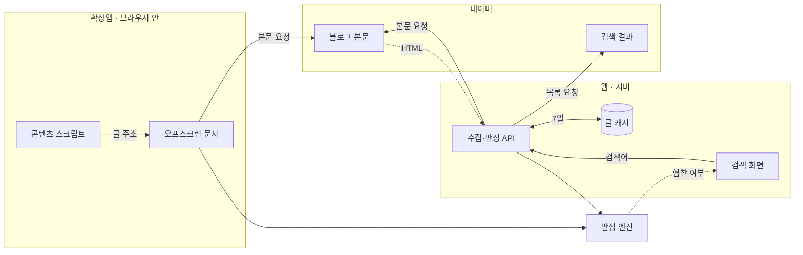

## 화면

### 검색 결과

**파일** ./screens/01-results.png
**설명** 협찬으로 확인된 글은 흐려지고 그 위에 표시가 뜬다

### 홈

**파일** ./screens/02-home.png
**설명** 검색창 하나뿐. 지역에 업종을 붙여 친다

### 업체 확인

**파일** ./screens/03-revealed.png
**설명** 눌러서 흐림을 풀면 어느 체험단 업체인지 나온다

### 협찬 숨기기

**파일** ./screens/04-hidden.png
**설명** 켜면 협찬글이 목록에서 아예 빠진다

### 더 보기

**파일** ./screens/05-more.png
**설명** 30건씩 이어 붙인다. 다 보면 몇 건을 확인했는지 알려 준다

### 웹과 폰

**파일** ./screens/06-both.png
**설명** 같은 결과가 폰에서는 한 열로 접히고 발췌문이 빠진다

## 데이터와 API

### 네이버 검색·블로그

**용도** 검색어로 블로그 글 목록을 받고, 글마다 본문을 열어 협찬 흔적을 찾는다
**방식** HTML 수집 · 목록 1회 + 글당 1회
**갱신** 7일 캐시
**링크** https://blog.naver.com
**주의** 공식 API 가 아니에요. 목록 30건이 서버 HTML 에 담겨 오는 경로를 쓰는데, 문서에 없는 길이라 네이버가 바꾸면 그대로 깨집니다
**주의** 크롤러가 되지 않게 글을 몇 건씩 끊어 받고 결과를 오래 캐시해요. 같은 검색어를 여러 사람이 쳐도 한 번만 읽습니다
**주의** 본문은 옮겨 오지 않아요. 판정과 근거만 보여 주고 읽기는 원문으로 보냅니다

## 구상

- [x] 검색 결과에서 협찬 글을 걸러내고 내돈내산 글만 남긴다
- [x] 왜 협찬으로 봤는지 근거를 같이 보여준다
- [x] 네이버 검색 결과를 걸러 자체 사이트에 목록으로 띄운다
- [ ] 협찬 배너 이미지를 지문으로 찾아낸다
- [ ] 이미지에만 박힌 표기를 OCR 로 읽는다

## 기획

**소개** 네이버에 "연남동 브런치"를 치면 블로그 글 30건을 대신 열어 보고, 체험단 업체의 흔적이 남은 글을 흐리게 덮어 주는 검색 서비스예요. 어느 업체인지도 같이 보여 줍니다
**계기** 네이버에 "건대 맛집", "건대 고기집" 이런 식으로 쳐 놓고 블로그를 쭉 훑는 게 제 검색 방식이었는데, 열에 여덟아홉이 협찬글이더라고요. 글 끝에 협찬 스티커가 붙어 있거나 소정의 원고료를 받았다고 적혀 있고요
**계기** 협찬을 받으면 아무래도 좋게 쓸 수밖에 없잖아요. 싫은 소리를 못 하게 되니까요. 그래서 진짜 내돈내산 글만 골라 보고 싶었어요
**사용자** 저처럼 지역에 업종을 붙여 검색해 놓고 블로그 목록을 빠르게 스캔해 내려가는 사람이요
**제약** 외부 LLM 도 클라우드 OCR 도 쓰지 않기로 했어요. 판정이 공짜로 끝나야 혼자 계속 굴릴 수 있으니까요
**성공 기준** 멀쩡한 글을 협찬으로 몰지 않는 것. 놓치는 건 감수하더라도 잘못 찍지는 않기로 했어요
**넣지 않은 것** 내돈내산 도장은 안 찍습니다. 협찬으로 확인된 것만 표시하고, 표시가 없다고 깨끗한 글이라고 말하지 않아요

## 유저 플로우

### 검색창에 지역과 업종을 친다

`연남동 브런치` 처럼요. 홈에는 검색창 하나뿐입니다.

### 확인이 끝나기를 기다린다

글 30건을 하나씩 열어 봅니다. 다 끝나야 목록이 한 번에 그려집니다.

**갈라짐** 처음 찾는 검색어 → 4~6초 / 누가 이미 찾은 검색어 → 1초 안

### 목록을 훑는다

협찬으로 확인된 글은 흐려져 있고, 깨끗한 글은 아무 표시 없이 평소처럼 보입니다.

### 흐린 글이 궁금하면 누른다

흐림이 풀리고 어느 업체인지 나옵니다. 다시 덮을 수도 있습니다.

**갈라짐** 그래도 읽는다 → 원문으로 / 됐다 → 다시 가리기

### 마음에 드는 글을 연다

줄 어디를 눌러도 네이버 원문으로 넘어갑니다.

## 구조

### 판정 엔진

본문과 이미지 주소, 태그를 받아 협찬 여부와 근거를 돌려주는 순수 함수 묶음이에요. 확장앱과 웹이 같은 것을 씁니다.

### 수집·판정 API

검색어로 목록 30건을 받고, 글마다 본문을 열어 엔진에 넘겨요. 네이버로 나가는 요청은 4건씩 끊습니다.

### 오프스크린 문서

확장앱이 본문을 받아 오는 자리예요. 받아온 HTML 을 파싱해 엔진에 넘기고, 결과만 돌려줍니다.

### 글 캐시

글 하나 단위로 판정 결과를 7일 보관해요. 사전이 바뀌면 버전을 올려 옛 결과를 통째로 버립니다.

### 검색 화면

목록을 그리고 흐림·해제·숨기기를 다뤄요. 판정이 다 끝난 뒤에 한 번에 그립니다.

## 개발 과정

### 1. 처음 그림은 확장앱이 아니라 검색 사이트였어요

"건대 맛집"을 검색해 놓고 블로그를 훑다 보면 열에 여덟아홉이 협찬글이에요. 스크롤을 한참 내려 마지막 줄에서 "소정의 원고료를 받아 작성했습니다"를 보고 나서야 아 이것도 광고였구나 하게 되고요.

그래서 떠올린 게 검색 사이트였습니다. 제 사이트에 검색어를 넣으면 블로그 글을 모아 와서 협찬을 걷어낸 목록만 보여 주는 거요. 그런데 사이트로 가면 목록을 제가 만들어야 하고, 검색 한 번에 글이 열댓 개씩 붙는 요청이 전부 서버 한 곳에서 나가게 됩니다.

그래서 확장앱을 1차로 먼저 냈어요. 목록은 네이버가 이미 주고 있으니 그 위에 판정만 얹으면 되고, 요청도 각 사용자의 브라우저가 자기 몫만 자기 IP 로 쏩니다. 서버가 아예 없으니 비용도 0 이고요.

**붙인 것** TypeScript

### 2. 판정 로직부터 떼어 놨어요

DOM 도 `chrome.*` 도 모르는 순수 함수로 판정부를 따로 만들었습니다. 브라우저를 안 띄우고도 픽스처 몇 개로 결과가 뒤집히는지 바로 볼 수 있어서였는데, 나중에 이 결정이 훨씬 크게 값을 했어요. 사이트를 만들 때 판정 쪽은 손댈 게 하나도 없었거든요.

**붙인 것** Vitest

### 3. 판정은 브라우저 안에서 끝내기로 했어요

처음엔 본문을 LLM 에 던지면 제일 정확하겠다 싶었는데, 검색 결과 한 페이지가 서른 개고 스크롤할 때마다 늘어나니까 호출 수가 감당이 안 되겠더라고요. 사용자가 자기 API 키를 넣게 하는 것도 이상하고요.

그래서 사전 기반으로 갔습니다. 체험단 플랫폼 이름과 공정위 표기 문구를 모으고, 감성·솔직함·구체성·광고성 사전을 따로 뒀어요. 여기에 긍정어 도배 지수를 얹어서, 단점이 한 줄도 없이 칭찬만 가득한 글도 잡아 보려고 했습니다.

키워드 매칭은 회피가 쉬워서 매칭 전에 정규화를 넣었어요. 눈에 안 보이는 문자를 지우고, 분리된 자모를 털고, 공백을 다 없앤 압축본으로 비교합니다. `소 정 의 원 고 료` 처럼 띄어 놓거나 글자 사이에 빈 문자를 끼워 넣어도 걸리게요.

### 4. 목록에서 판정하려면 본문을 미리 읽어야 했어요

검색 결과 카드에는 제목과 요약 두어 줄뿐이라 협찬 표기가 안 들어 있어요. 표기는 늘 글 맨 아래에 있고요. 결국 카드마다 본문을 미리 가져와야 했는데, 이게 브라우저 확장앱에서 어디서 받아 오느냐 하는 문제로 번졌습니다.

가져오는 게 되고 나서는 크롤러처럼 안 보이게 만드는 데 신경을 썼어요. 뷰포트에 곧 들어올 카드만, 동시 3건까지, 요청 사이 최소 간격에 랜덤 지터를 얹고 결과는 캐시합니다. 이 값들은 전부 한곳에 모아 뒀어요.

### 5. 협찬 표기를 이미지로 박아 둔 글이 많더라고요

텍스트 매칭이 돌기 시작하니까 곧바로 빈틈이 보였습니다. 표기를 이미지 배너로 넣으면 본문 텍스트에는 아무것도 안 남아요. 처음엔 배너 이미지의 지문을 떠서 대조하려고 했는데, 대조할 목록을 제가 직접 모아야 한다는 데서 막혔습니다.

대신 배너 이미지의 출처 도메인을 봤어요. 체험단 업체는 자기 도메인에 배너를 호스팅하니까, `reviewnote.cloud` 가 이미지 주소에 들어 있으면 그것만으로 확정에 가깝습니다. 네이버 이미지 프록시로 감싸인 경우도 있어서 주소를 풀어 안쪽까지 훑게 했고요.

나중에 실제 글 475건을 모아 재 봤는데, 텍스트로 걸린 게 24건인데 도메인으로 걸린 게 149건이었습니다. 사전을 키우는 것보다 업체 도메인을 채우는 게 훨씬 남는 장사였어요.

같은 맥락에서 해시태그도 따로 긁습니다. `#협찬` 을 본문 밖 태그 영역에만 달아 두는 글이 있는데, 본문만 보면 통째로 놓쳐요.

### 6. 재 보니 점수가 필요 없었어요

100점에서 감점·가점해 세 등급을 매기는 채점기를 공들여 만들어 뒀는데, 표본 475건으로 실측해 보니 **점수만으로 걸린 글이 0건**이었어요. 걸린 160건은 전부 업체 도메인이나 명시 표기 같은 확정 신호였습니다.

그래서 밖으로 나가는 건 예/아니오 하나로 줄였습니다. 신뢰도 점수도, `협찬 의심` 등급도 없앴어요. 100점 만점의 기준을 사용자가 알 길이 없으니 숫자가 판단에 도움이 안 되고, 노랑 등급은 애초에 비어 있었으니까요.

대신 놓치는 쪽을 명시했습니다. 표본에서 외부 도메인이 아예 없는 글이 198건인데, 배너를 자기 블로그에 다시 올리면 출처가 지워져 원천적으로 못 잡아요. 그래서 화면 아래에 "표시가 없다고 협찬이 아닌 것은 아닙니다"를 붙였습니다.

### 7. 결국 처음에 그렸던 검색 사이트를 만들었어요

확장앱을 쓰다 보니 한계가 분명했습니다. 맛집은 밖에서 찾는데 모바일 크롬은 확장을 아예 지원하지 않아요.

그런데 막상 손대 보니 남은 일이 적었습니다. 판정 엔진이 순수 함수라 그대로 옮겨 갔고, 오프스크린 문서가 하던 받아오기 → 파싱 → 판정 을 서버에서 하는 것도 같은 모양이었어요. 새로 짠 건 검색 결과 목록을 뽑는 파서 하나입니다. 목록을 서버 HTML 에서 30건씩 받을 수 있다는 걸 확인한 게 컸고요.

화면은 최대한 덜어냈습니다. 홈은 검색창 하나, 결과는 네이버 목록과 같은 모양에 협찬 표시만 얹었어요. 깨끗한 글에는 아무것도 안 붙입니다 — 표시는 할 말이 있을 때만 나오는 게 맞으니까요.

**붙인 것** Next.js, React, Vercel

## 시행착오

### 공들여 만든 점수 체계의 기여가 0이었어요

**증상** 감성 사전, 긍정어 도배 지수, 솔직함·구체성 가점까지 얹어 세 등급을 매기게 만들어 뒀는데, 실제로 쓰다 보니 `협찬 의심`(노랑) 등급을 본 기억이 없었습니다.

**시도** 처음엔 임계값이 잘못 잡힌 줄 알고 문턱을 낮춰 볼까 했어요. 그런데 그러면 멀쩡한 글까지 노랑이 될 것 같아서, 먼저 검색어 16개로 실제 글 475건을 모아 재 봤습니다.

**결론** 점수만으로 걸린 글이 **0건**이었습니다. 걸린 160건은 전부 업체 도메인·명시 표기 같은 확정 신호였어요. 산수를 따져 보니 당연했습니다 — 도배 지수는 최대 8점쯤 깎고 약한 단서는 건당 10점인데, 100점에서 40점 아래로 내리려면 60점이 필요합니다. 확정 신호(70점) 없이는 문턱을 넘을 수가 없었어요. 그래서 밖으로 나가는 판정을 예/아니오 하나로 줄였습니다. 점수와 등급은 내부 진단값으로만 남겼고요.

### 확정된 협찬이 '의심'으로 완화되고 있었어요

**증상** 배너 도메인까지 확인된 글인데 `협찬` 이 아니라 `협찬 의심` 으로 표시되는 게 눈에 띄었습니다.

**시도** 라벨을 붙이는 쪽 로직을 먼저 봤어요. 확정 신호가 있으면 `협찬`, 아니면 `협찬 의심` 으로 갈리게 돼 있어서 거긴 맞았습니다. 그러면 등급 자체가 잘못 나온 거였고요.

**결론** 솔직함 가점이 등급을 밀어 올리고 있었습니다. 확정 신호로 100점에서 70점을 깎아 30점이 됐는데, 단점을 언급하고 가격을 적었다는 이유로 비판 0.86 · 구체성 0.25 가 붙어 44점까지 올라갔어요. 40점 문턱을 넘은 겁니다. **협찬글을 성의 있게 썼다고 협찬이 아닌 게 되지는 않죠.** 확정 신호가 있으면 가점이 문턱을 못 넘게 뚜껑을 씌웠고, 실측에서 160건 중 94건이던 오분류가 0건이 됐습니다.

### 본문 텍스트가 계속 빈 문자열로 나왔어요

**증상** 블로그 글을 열면 콘텐츠 스크립트는 분명히 돌았는데 추출한 본문 길이가 0 이었습니다. 셀렉터를 바꿔도, 로딩을 더 기다려도 똑같았어요.

**시도** 스마트에디터 ONE 의 `.se-main-container` 를 못 잡는 줄 알고 구버전 셀렉터까지 폴백을 깔았습니다. 그래도 안 되길래 동적 로딩 문제로 보고 MutationObserver 로 컨테이너 등장을 기다리게 했는데, 타임아웃까지 가서 null 이 떨어졌어요.

**결론** 네이버 블로그는 본문이 최상위 문서가 아니라 iframe 안에 있었습니다. 최상위 프레임에서 아무리 찾아도 없는 게 당연했어요. 매니페스트에 `all_frames: true` 를 주고, 진입점에서 "지금 이 프레임에 본문 컨테이너가 있나"로 분기하게 바꿨습니다.

### fetch 와 DOMParser 를 함께 쓸 수 있는 곳이 없었어요

**증상** 검색 결과 페이지에서 각 글의 본문을 미리 받아오려는데 어느 컨텍스트에서 해도 실패했습니다.

**시도** 먼저 검색 페이지의 콘텐츠 스크립트에서 `blog.naver.com` 으로 fetch 했더니 CORS 로 막혔어요. 그럼 확장앱 특권이 있는 서비스 워커에서 하면 되겠다 싶었는데, 여기선 fetch 는 되지만 받아온 HTML 을 파싱할 방법이 없었습니다. 서비스 워커에는 DOMParser 가 없거든요. 정규식으로 본문을 긁는 것도 해봤는데 스마트에디터 마크업 앞에서 금방 포기했습니다.

**결론** 둘 다 되는 컨텍스트는 오프스크린 문서뿐이었어요. 서비스 워커가 오프스크린 문서를 하나 띄워 두고, 거기서 받아오기부터 파싱과 판정까지 돌린 뒤 결과만 돌려받는 구조가 됐습니다. 나중에 웹을 만들 때 이 구조가 서버 코드와 똑같은 모양이라 그대로 옮겨졌고요.

### 제일 많이 나온 배너의 정체를 몰랐어요

**증상** 걸러지는 비율이 열에 셋 정도라 체감(여덟아홉)과 차이가 컸습니다. 놓친 글을 뒤져 보려고 네이버 외부 도메인을 빈도순으로 뽑았더니 1위가 `d3i7y4ugnppb9p.cloudfront.net` 이었어요. CloudFront 주소라 어느 업체인지 알 수가 없었습니다.

**시도** 경로가 `/contract/track/{uuid}/banner-small.png` 라 협찬 배너인 건 분명했는데, 이름을 모르니 등록할 때 뭐라고 적을지가 문제였어요. 추측으로 적으면 근거 문구에 틀린 업체명이 뜨게 되고요.

**결론** 배너 이미지를 그냥 받아서 열어 봤습니다. 520×78 짜리 띠에 "이 글은 슈퍼멤버스 앱을 통해 본 업체에서 할인을 제공받아 작성되었습니다"라고 찍혀 있었어요. 목록에 아예 없던 업체였습니다. 같은 방법으로 포포몬도 찾았고, `강남맛집` 은 이름만 있고 도메인이 비어 있었는데 **한글 도메인이라 HTML 에는 퓨니코드(`xn--939au0g4vj8sq.net`)로 박혀 있어서** 한글 문자열로는 영원히 안 맞을 뻔했습니다. 셋을 등록하니 걸러지는 비율이 29%에서 43%로 올랐어요.

## 남은 것

- 협찬 배너를 자기 블로그에 다시 올린 글은 못 잡아요. 표본 475건 중 외부 도메인이 아예 없는 글이 198건인데, 그중 얼마가 협찬인지 알 방법이 지금은 없습니다.
- 식당이 직접 협찬하면서 표기를 그림으로만 넣은 경우도 놓쳐요. 글자로 적힌 것은 이미 잡지만, 그림 속 글씨를 읽는 건 아직 못 합니다.
- 걸러지는 비율이 아직 열에 넷쯤이에요. 업체 도메인을 하나 알아낼 때마다 올라가는데, 475건 표본에서는 더 안 나왔습니다.
- 목록이 어느 날 통째로 안 나올 수 있어요. 네이버가 검색 결과를 내주는 방식을 바꾸면 그대로 멈추고, 그때 알아차릴 방법이 지금은 없습니다.
- 가게 단위로 묶는 게 다음 목표예요. "이 집은 블로그 후기 94건 중 내돈내산 14건" 같은 숫자는 글 하나를 걸러 주는 것과 급이 다른 정보인데, 가게 목록을 어디서 얻을지부터 풀어야 합니다.
