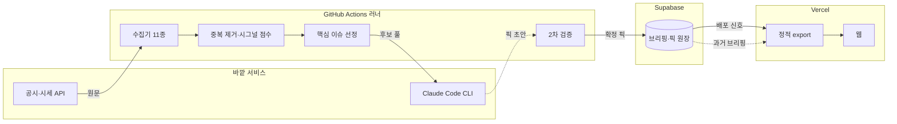

## 화면

### 국내

**파일** ./screens/01-domestic.png
**설명** 오늘 촉매가 붙은 국내 종목을 순위로 훑는다

### 해외

**파일** ./screens/02-foreign.png
**설명** 같은 형식으로 미국 종목과 관련 ETF를 본다

### 실적

**파일** ./screens/03-picks.png
**설명** 지난 픽의 진입가 대비 수익률이 날짜별로 쌓인다

### 발굴

**파일** ./screens/04-discovery.png
**설명** 사건 없이 재무만 보고 뽑은 종목을 점수순으로 본다

## 데이터와 API

### DART 전자공시

**용도** 국내 종목을 고르는 유일한 직접 촉매. 종목 지정 없이 전체 시장 공시를 받는다
**방식** REST · 전체 공시
**갱신** 매 실행마다
**링크** https://opendart.fss.or.kr/guide/main.do
**사흘치를 함께 받는 이유** 아침 6~7시엔 당일 공시가 거의 없어요. 직전 거래일까지 끌어와야 후보가 생기고, 사흘이면 2,000건대가 쌓입니다.

### SEC EDGAR

**용도** 미국 기업의 8-K·Form 4·13F 원문을 언론보다 먼저 받는다
**방식** Atom 피드 · 최신순
**갱신** 매 실행마다
**링크** https://www.sec.gov/search-filings/edgar-application-programming-interfaces
**신원을 밝혀야 열린다** 요청에 실명과 이메일을 실지 않으면 막혀요. 그 값이 비어 있으면 아예 수집을 건너뛰게 해뒀습니다.

### KRX Open API

**용도** 전종목 시세·거래대금·시가총액. 급상승 탐지와 국내 픽 시총 게이트에 쓴다
**방식** REST · 전종목 일별
**갱신** 매일
**링크** https://openapi.krx.co.kr
**응답이 느려요** 전종목을 한 번에 받으면 30초 가까이 걸려서, 기다리는 시간을 넉넉히 잡아뒀습니다.
**대안을 못 쓴 이유** KRX 내부 웹 데이터는 세션 인증 벽이고, 네이버 금융 시세는 robots.txt 가 크롤러를 통째로 막아요. 투자자별 순매수와 공매도 잔고는 이 API 범위 밖이라 포기했습니다.

### USAspending

**용도** 미국 연방정부 조달 수주를 실적 선행 지표로 본다
**방식** REST · 최근 수주
**링크** https://api.usaspending.gov

### openFDA

**용도** 신약 승인 이벤트로 바이오 종목 촉매를 잡는다
**방식** REST · 승인 목록
**링크** https://open.fda.gov/apis/

### Senate Stock Watcher

**용도** 상원의원 주식 거래 공시를 훑어 반복 매수 종목을 본다
**방식** 공개 JSON · 전량
**링크** https://github.com/timothycarambat/senate-stock-watcher-data

### 보도자료 와이어

**용도** GlobeNewswire·PR Newswire·Business Wire 원문을 언론 필터 전에 받는다
**방식** RSS · 3사
**갱신** 매 실행마다

### 네이버 금융 리서치

**용도** 증권사 리포트의 목표가와 컨센서스 방향을 참고 자료로 보여준다
**방식** 크롤링 · 하루 90건
**링크** https://finance.naver.com/research/
**아이콘** Naver
**픽에는 안 씁니다** 등급 변경은 이미 주가에 반영된 뒤에 나오는 신호예요. 모아서 보여주기만 하고 국내 픽을 고르는 입력에서는 뺐습니다.

### yfinance

**용도** 발굴 트랙 재무 수집, 픽 진입가·현재가, 티커 실존 확인
**방식** 라이브러리 · 병렬 8
**링크** https://github.com/ranaroussi/yfinance
**아이콘** Yahoo
**실패가 잦아요** 수천 종목을 한 번에 긁으면 호출 제한에 걸려 쉬어 가며 받아야 합니다. 멀쩡한 종목도 자주 실패해서 "없는 티커"와 "확인 못 한 티커"가 구분되지 않아요. 확인 실패를 탈락 근거로 쓰지 않는 이유입니다.

### Claude Code CLI

**용도** 요약·번역·핵심 이슈 선정·픽 검증·발굴 리서치를 전부 여기로 돌린다
**방식** CLI · 배치
**갱신** 매 실행마다
**링크** https://docs.claude.com/en/docs/claude-code
**아이콘** Anthropic
**과금이 갈려요** API 키가 환경에 놓여 있으면 구독 할당량 대신 API 과금으로 넘어갑니다. 경고도 안내도 뜨지 않아서, 이 프로젝트는 그 키를 아예 두지 않아요.

### Supabase

**용도** 브리핑·픽 원장·용어 사전·중복 기록을 담는 단일 원본
**방식** REST · 덮어쓰기
**갱신** 매 실행마다
**링크** https://supabase.com/docs/reference/python/introduction

## 구상

- [x] 관심 종목을 미리 정해두지 않고 전체 시장 공시를 훑어 점수 높은 것만 남긴다
- [x] 모르는 용어에 해설이 자동으로 붙어서 검색 없이 읽힌다
- [ ] 출근길에 카카오톡 챗봇이 뉴스레터처럼 브리핑을 보내준다
- [ ] 주 1회 뜨는 테마와 수혜 섹터를 리포트로 받는다
- [ ] 인포스탁 테마주 분류를 긁어 밸류체인 매핑 DB를 만든다

## 기획

**소개** 오늘 주가가 움직일 만한 종목을 아침에 골라주는 브리핑이에요. 밤사이 올라온 공시와 원문 자료를 훑어서 사건이 붙은 종목만 카드 몇 장으로 남깁니다
**소개** 기사를 모아주는 뉴스 리더는 아니에요. 오늘 국내 몇 개, 해외 몇 개 — 왜 이 종목인지, 촉매가 뭔지, 얼마나 확신하는지가 카드 한 장에 들어갑니다. 볼 만한 게 없는 날은 억지로 채우지 않고 "오늘은 강한 촉매가 있는 종목이 없어요"라고 씁니다
**계기** 요즘 주식 안 하는 사람이 없잖아요. AI 시대에 빅테크 주가가 계속 오르고, 국내에서도 SK하이닉스·삼성전자가 코스피를 전례 없는 자리까지 올려놨고요. 저도 그 FOMO 안에 있던 사람 중 하나였어요
**계기** 그러다 이상하다 싶었어요. 제가 보는 건 언론사를 거친 보도자료인데, 그건 한 발도 아니고 두 발 늦은 소식이거든요. 기대가 주가에 다 반영되고 나서야 손에 들어와요. 저는 반영되기 전에 알고 선점하고 싶었고, 그러려면 언론사가 받아 쓰는 원본이 어디서 오는지부터 알아야 했어요. 그걸 찾아보다가 시작한 프로젝트입니다
**사용자** 저 혼자 씁니다. 출근길 지하철에서 3분 정도, 폰으로 훑어요
**기간** 4월 말에 시작해서 넉 달째 붙잡고 있어요. 굴러가는 첫 버전은 며칠 만에 나왔고, 나머지는 계속 갈아엎는 시간이었습니다
**자랑** 픽이 0개인 날 화면을 비워두는 부분이요. 채우고 싶은 유혹을 참는 게 제일 어려웠는데, 그 규칙을 넣고 나서야 이 화면을 믿게 됐어요
**지금** 네, 평일 아침마다 돌고 있고 저는 그걸 보고 하루를 시작합니다

## 유저 플로우

### 아침에 알림을 받는다

평일 7시에 요약이 옵니다. 링크를 누르면 그날 브리핑으로 바로 들어가요.

### 오늘 픽이 있는지 본다

국내 탭이 먼저 열립니다. 촉매가 붙은 종목이 순위로 깔려 있어요.

**갈라짐** 픽이 있다 → 카드를 훑는다 / 0개다 → 관찰 목록과 낙수효과 레이어만 본다

### 카드를 펼쳐 확인한다

TradingView 차트가 아코디언으로 열리고 토스증권·증권플러스·네이버증권 딥링크가 붙어요. 주문 화면까지만 데려다주고 매수는 직접 합니다.

### 지난 픽 성적을 확인한다

실적 탭에 그동안 골랐던 종목의 진입가 대비 수익률이 날짜별로 쌓여 있어요.

## 구조

### GitHub Actions 러너

평일 아침에만 뜨는 실행 환경입니다. 한 번 돌면 6~9분쯤 걸려요. 같은 날짜를 두 실행이 동시에 건드리지 못하게 막아 뒀습니다.

### 수집기 11종

DART·EDGAR·KRX·RSS·거시지표·리서치·정부계약·내부자 클러스터·의회 거래·FDA·와이어를 각각 받아옵니다. 하나가 죽어도 나머지는 계속 가요.

### 중복 제거·시그널 점수

`(소스, 외부 ID)` 쌍을 원장과 대조해 처음 보는 것만 남기고, 공시 유형과 소스 신뢰도로 점수를 매깁니다.

### 핵심 이슈 선정

국내와 해외 후보 풀을 각각 한 번씩, 동시에 던져서 Top N 종목을 받습니다.

### 2차 검증

촉매가 근거 공시에 실제로 있는지 이슈 단위로 대조하고, 종목과 공시 주체가 맞물리는지 확인합니다. 티커 실존은 따로 조회해요.

### 브리핑·픽 원장

날짜별 브리핑과 픽 이력이 여기 한 곳에만 있습니다. 로컬 파일은 여기서 파생된 캐시고요.

### 정적 export

빌드 시작 전에 원장에서 그날치와 과거 브리핑을 끌어와 정적 파일로 굽습니다. 런타임에는 DB를 보지 않아요.

## 개발 과정

### 1. 언론에 실리기 전 원본을 직접 받아보기로 했어요

찾아보니 기사의 원본은 대부분 공개돼 있었어요. 국내는 DART 전자공시, 미국은 SEC EDGAR. 기자들도 여기서 받아 쓰는 거였습니다. 다만 하루에 수백 건씩 쏟아지니까 사람이 다 못 볼 뿐이었어요. 그럼 걸러내는 걸 자동화하면 되겠다 싶었습니다.

첫 버전은 아주 단순했어요. DART 공시 목록을 받고, 경제 뉴스 RSS를 받고, 공시 유형별 점수표로 걸러서 위에서부터 몇 개만 남기는 것. 중복을 막으려고 이미 본 항목을 SQLite에 적어뒀고, 같은 걸 두 번 요약하지 않게 캐시 테이블을 뒀습니다. 맥북 launchd에 아침 6시로 걸어두고 끝이었어요.

여기서 첫 갈림길이 LLM 호출 방식이었습니다. Anthropic Python SDK를 쓰면 API 과금이 붙는데 저는 이미 Claude Max를 구독 중이었거든요. `claude -p` CLI를 서브프로세스로 부르면 구독 할당량으로 청구된다는 걸 확인하고 그쪽으로 갔습니다. 그 뒤로 "`ANTHROPIC_API_KEY`를 절대 두지 않는다"가 이 프로젝트의 규칙이 됐어요. 그 변수가 있으면 CLI가 아무 표시도 없이 과금 모드로 넘어가거든요.

**붙인 것** DART Open API, Claude Code CLI, SQLite, launchd

### 2. 카카오톡 챗봇으로 보내려다 웹으로 옮겼어요

원래 그림은 이랬어요. 출근길에 카카오톡으로 브리핑이 오고, 그걸 지하철에서 읽는다. 챗봇이 뉴스레터처럼 매일 아침 던져주는 형태요. 알림을 따로 확인할 필요 없이 원래 보던 앱으로 온다는 게 좋았거든요.

막힌 건 4KB였습니다. 카카오톡 메시지 본문 길이 제한인데, 공시 열 몇 건에 요약을 붙이면 금방 넘어요. 잘라 보내자니 정작 중요한 게 잘렸고요. 그래서 카톡에는 요약 세 줄과 링크만 남기고 본문은 웹 페이지로 옮겼습니다. Next.js 정적 export로 짓고 Vercel에 올렸어요. 파이프라인은 브리핑 JSON 하나를 뱉고 프론트는 그걸 읽기만 합니다.

그러고 나니 카톡을 유지할 이유가 사라졌어요. 남은 역할은 링크 한 줄 보내는 건데, 그것 때문에 access_token이 두 달마다 만료돼서 OAuth를 다시 태워야 했거든요. 디스코드 웹훅으로 갈아탔습니다. URL 하나면 되고 만료가 없어요. 카톡 모듈은 지우지 않고 남겨뒀는데, 지금 파이프라인은 디스코드로만 쏩니다. 원래 하려던 카톡 챗봇은 아직 구상 목록에 남아 있어요.

이때 용어 해설이 부가 기능에서 핵심 기능으로 올라갔습니다. "전환사채 발행"이 무슨 신호인지 모르면 브리핑을 읽어도 남는 게 없거든요. 본문에 나오는 용어를 감지해 밑줄을 긋고, 누르면 팝오버로 설명이 뜨게 했어요. 사전에 없는 단어는 LLM이 채워서 쌓아둡니다.

UI는 처음에 흔한 대시보드 스타일로 뽑았다가 통째로 버렸어요. 뱃지와 컬러 스트립과 보더로 중요도를 표현하니까 화면만 시끄럽고 정작 뭐가 중요한지 안 보였습니다. 토스 앱을 뜯어보면서 규칙을 다시 잡았어요. 위계는 글자 크기로만, 색은 점 하나로, 카드에 보더와 그림자 금지, 카피는 "~요" 말투로. 그 규칙을 문서에 박아두고 이후 모든 화면에 적용했습니다.

**붙인 것** Next.js, Tailwind CSS, Vercel, Discord, PWA

### 3. 탭 구조를 세 번 갈아엎고 결국 다 지웠어요

처음엔 시사·경제 2탭이었어요. 그러다 아침에 종목만 빠르게 보고 싶어서 "Today's Pick" 탭을 따로 냈고, 며칠 써보니 종목을 경제 맥락과 같이 보고 싶어져서 다시 경제 탭 안 섹션으로 내렸어요. 그 자리엔 AI 뉴스 탭을 새로 넣고 기본 진입 탭으로 만들었고요.

몇 주 굴리다 깨달은 게, 저는 시사도 AI 뉴스도 거의 안 읽고 종목 카드만 본다는 거였어요. 나머지는 스크롤로 지나치는 노이즈였습니다. 그래서 뉴스 표시를 파이프라인과 화면 양쪽에서 통째로 걷어냈어요. 수집은 남겨뒀는데, 보여주려는 게 아니라 종목을 추론하는 보조 입력으로만 씁니다. 탭은 국내·해외·실적·발굴이 됐어요. 결정 로그에 이 변천사를 다 남겨뒀는데, 지금 보면 무엇을 지웠는지가 무엇을 붙였는지보다 많은 걸 말해주네요.

### 4. 소극적인 분석을 버리고 방향을 말하게 했어요

초기 방침은 "추천 금지, 시그널만 띄운다"였어요. 근데 읽어보니 "일반적으로 이런 공시는 긍정적으로 해석됩니다" 같은, 있으나 마나 한 문장만 나왔습니다. 포털 앱에서 보는 거랑 다를 게 없었어요. 어차피 혼자 쓰는 도구니까 방침을 뒤집었습니다. 매수·매도 방향, 촉매 강도 등급, 관련 ETF까지 말하게 했어요.

그랬더니 바로 다음 문제가 왔습니다. LLM이 없는 종목을 지어내기 시작한 거예요. 그럴듯한 티커에 그럴듯한 촉매를 붙여서요. 그래서 픽이 나온 뒤에 검증 단계를 하나 더 뒀습니다. 이슈 단위로 "이 촉매가 근거 공시에 실제로 있나"를 먼저 확인해서 날조된 건 이슈째 버리고, 남은 픽마다 종목과 공시 주체가 맞물리는지 대조해요. 티커 실존은 조회로 확인하는데, 확인에 실패했다고 곧바로 떨어뜨리진 않습니다. 네트워크가 한 번 튀었다고 멀쩡한 종목을 잃으면 안 되니까 `review` 표시만 달고 화면에 사유를 적어요.

품질 게이트도 세게 걸었어요. 약한 촉매로 머릿수를 채우느니 0개가 낫다는 쪽으로요. 대신 0개인 날이 너무 허전해서 관찰 목록과 낙수효과 레이어를 따로 만들었습니다. 횡령이나 감자 같은 강한 악재가 경쟁사에는 반사이익이 되는데, 이건 2차·3차 추론이라 정식 픽과 섞으면 안 되거든요. 확신도 낮은 보조 레이어로 분리하고 성과 채점에서도 빼뒀습니다.

한동안 굴려보니 국내 픽이 코스닥 초소형주로 쏠리는 게 보였어요. 점수가 제목 키워드만 보고 시총을 안 보니까, 시총 300억짜리 회사의 50억 계약이 대형주 공시보다 위로 올라오더라고요. 이미 매일 받고 있던 KRX 시세에 시가총액이 들어 있어서, 추가 호출 없이 후보 풀에 넣기 전에 3,000억 미만을 거릅니다. KRX 수집이 실패해 시총 정보가 비면 게이트를 아예 적용하지 않아요. 국내 픽이 굶는 쪽이 더 나쁘니까요.

**붙인 것** yfinance

### 5. 촉매만 쫓다 보니 사건 없이 좋은 회사를 못 봤어요

파이프라인 전체가 사건 기반이었어요. 공시나 뉴스가 떠야 후보에 들어옵니다. 그러니 무언가 발생한 종목만 잡히고, 사건은 없는데 재무가 꾸준히 좋은 회사는 영영 안 걸려요. 단발성 호재만 쫓고 있다는 걸 몇 주 만에 알았습니다.

그래서 촉매와 완전히 분리된 발굴 트랙을 새로 팠어요. 고정 유니버스를 잡고 가치·퀄리티·성장 팩터를 유니버스 안 백분위로 바꿔 가중 합성합니다. 이 랭킹 자체는 LLM 없이 결정론적이라 단위 테스트가 붙어요. 그 위에 LLM 리서치를 얹어서 투자 논리와 "왜 아직 안 알려졌나"를 씁니다. 수백 종목 재무를 긁는 무거운 작업이라 자동 스케줄에 넣지 않고, 직접 돌릴 때만 갱신되게 했어요.

처음 만든 유니버스가 S&P500 + 나스닥100에 코스피 시총 상위 85개 하드코딩이었는데, 돌릴 때마다 삼성전자·SK하이닉스가 상위권에 떴어요. 발굴하겠다면서 이미 다 아는 대형주 집합만 평가하고 있었던 겁니다. 그래서 NASDAQ Trader 심볼 디렉토리 전체와 KIND 상장회사 목록 전체로 갈아치웠어요. 미국 5,600개, 국내 2,600개. 대형주를 빼지는 않았습니다. 밸류에이션이 안 싸면 랭킹에서 알아서 밀리니까요.

**붙인 것** yfinance, NASDAQ Trader, KIND

### 6. 로컬 맥에 묶인 게 결국 발목을 잡았어요

여기까지 데이터가 전부 로컬 SQLite와 `frontend/public/` 정적 파일에 있었어요. 그런데 매일 아침 정리 작업이 오늘 것만 남기고 과거 파일을 지우니까 달력에서 지난 브리핑이 사라졌고, 성과 탭은 DB에서 읽어 누적되니까 둘이 날짜가 안 맞았습니다. 게다가 머신을 두 대 쓰기 시작하면서 어느 맥에서 만들었느냐에 따라 데이터가 갈렸어요.

그래서 Supabase를 단일 원본으로 못박았습니다. 어느 머신에서 돌리든 DB에 쓰고, 로컬 파일은 DB에서 파생된 캐시로 내렸어요. Vercel은 빌드할 때 스크립트로 DB에서 직접 끌어와 자기 정적 파일을 만듭니다. 덕분에 데이터를 git에 커밋할 필요가 없어졌고, 파이프라인은 DB에 쓴 다음 Deploy Hook으로 신호 한 번만 던지면 돼요. 런타임에 DB를 안 보니까 키 노출이나 RLS 설계도 필요 없고요.

그다음엔 실행 자체를 옮겼습니다. launchd로 돌리니 맥북 전원과 절전 상태에 종속됐어요. 기록을 세어보니 평일 60일 중 22일이 결번, 실행률 63%였습니다. GitHub Actions로 옮기면서 Max 구독 할당량은 그대로 유지했어요. `claude setup-token`으로 발급한 OAuth 토큰을 시크릿에 넣고 러너에서 CLI를 돌립니다. `.env`는 dotenvx로 암호화해 저장소에 커밋해뒀기 때문에 시크릿은 복호화 키 하나면 끝이에요. 주말은 아예 안 돌립니다. 장이 안 열리는 날 종목 전용 화면에 보여줄 게 없거든요.

**붙인 것** Supabase, GitHub Actions, dotenvx

## 시행착오

### Vercel 배포 설정이 네 번 뒤집혔어요

**증상** 프론트를 `frontend/` 하위에 두고 Vercel rootDirectory를 거기로 잡았는데, 빌드는 성공하는데 페이지가 404로 뜨거나 API rewrite가 먹지 않았어요. 고칠 때마다 다른 쪽이 깨졌습니다.

**시도** 먼저 `output: 'export'`를 빼고 서버 렌더로 돌렸어요. 배포는 되는데 정적 호스팅 전제가 무너져서 되돌렸습니다. 루트 `vercel.json`에 outputDirectory를 넣었더니 rootDirectory가 아니라 저장소 루트 기준으로 잡혀서 또 안 맞았고요. `frontend/vercel.json`을 따로 만들어봤는데 이번엔 루트 설정과 둘 다 살아 있어서 어느 쪽이 이기는지 알 수 없었습니다.

**결론** rootDirectory를 `frontend`로 두면 Vercel이 그 디렉터리를 프로젝트 루트로 취급한다는 걸 확인하고, 설정을 `frontend/vercel.json` 한 곳으로 몰았어요. `outputDirectory: "out"`은 rootDirectory 기준 상대경로고, 시세 프록시 rewrite도 여기로 옮겼습니다. 루트에는 서비스워커 캐시 헤더만 남겼어요. 나중에 로컬 `next dev`에서 rewrite가 안 먹는 문제가 또 나와서 `next.config.mjs`에 개발 전용 rewrite를 따로 넣어 맞췄습니다.

### 해외 픽 수익률이 전부 0%로 찍혔어요

**증상** 실적 탭에서 어제 고른 해외 종목의 수익률이 하나도 빠짐없이 0.00%였어요. 며칠을 봐도 어제 자만 0이고 그저께부터는 정상이었습니다.

**시도** 처음엔 시세 조회가 실패해서 값이 안 바뀌는 줄 알았어요. 실제로 로컬 `next dev`에서 시세 프록시 rewrite가 `vercel.json`에만 있어 적용되지 않는 문제가 하나 있었고, 그걸 고쳤는데도 0%가 그대로였습니다.

**결론** 원인이 두 개 겹쳐 있었어요. 진짜 원인은 진입 기준가를 추천일 당일 종가로 잡은 거였습니다. 현재가도 최신 종가라서, 다음 세션이 닫히기 전까지 둘이 같은 값이 되어 첫날은 무조건 0%가 나왔어요. 추천은 한국 아침, 그러니까 미국장 개장 전에 나오니까 그 시점에 알 수 있는 마지막 가격인 직전 거래일 종가가 실제 진입가입니다. 기준가 정의를 바꾸고, 주말과 휴장은 추천일 직전 거래일을 찾아 자동으로 보정했어요.

### 달력에서 과거 브리핑이 통째로 사라졌어요

**증상** 달력을 열면 오늘 날짜만 있고 지난 브리핑이 전부 비어 있었어요. 그런데 실적 탭의 픽 이력은 멀쩡히 누적돼 있었습니다.

**시도** 처음엔 달력 컴포넌트의 날짜 필터를 의심했어요. 보존 일수 상수가 여기저기 다른 값으로 흩어져 있길래 그걸 맞춰봤는데, 며칠 지나니 또 비었습니다.

**결론** 구조 문제였어요. 프론트는 `frontend/public/` 정적 JSON만 읽는데, 매일 아침 정리 작업이 오늘 것만 남기고 과거 브리핑 파일을 지우고 있었습니다. 픽 이력은 Supabase에서 읽어서 살아남았던 거고요. 게다가 머신을 두 대 쓰면서 어느 맥에서 만들었느냐에 따라 파일이 갈렸어요. Supabase를 단일 원본으로 못박고, 로컬 파일은 DB 파생 캐시로 내리고, 배포는 빌드할 때 DB에서 직접 끌어오게 바꿨습니다. 보존 일수도 90일로 한 군데서만 정의하게 정리했어요.

### LLM이 자꾸 타임아웃 나서 무작정 시간을 올렸어요

**증상** 핵심 이슈 선정 단계에서 `claude` CLI 호출이 자주 죽었어요. 60초로 잡았는데 안 되길래 120초, 그래도 안 되길래 180초, 300초까지 올렸습니다.

**시도** 타임아웃을 올리면서 입력도 줄였어요. 해외 후보를 60건에서 30건, 다시 15건까지 깎았습니다. 그랬더니 타임아웃은 줄었는데 후보 풀이 얕아져서 LLM이 뽑을 게 없었어요. 항목마다 요약 호출을 한 번씩 던지던 것도 누적 시간을 크게 잡아먹고 있었고요.

**결론** 방향을 두 번 틀었어요. 먼저 건별 호출을 배치로 바꿨습니다. 여러 건을 한 번에 넘기니 호출 수가 크게 줄었어요. 그다음 국내와 해외를 순차가 아니라 동시에 던졌습니다. 재보니 동시 2개도 각각 110초 정도로 단독 실행 136초와 비슷했어요. 이 규모에선 처리량 경합이 안 일어난다는 뜻이라, 동시 실행이 순차 합계 250초보다 확실히 빨랐습니다. 결국 과거 타임아웃은 동시 실행 탓이 아니라 일시적인 서버 지연이었고, 방어책은 타임아웃 420초 한 줄로 정리했어요. 입력을 15건까지 깎았던 것도 되돌렸습니다.

### 발굴 유니버스가 설계 문서를 배신하고 있었어요

**증상** 발굴 스크린을 돌릴 때마다 삼성전자·SK하이닉스 같은 이미 다 아는 대형주가 상위권에 떴어요. 발굴되지 않은 회사를 찾는다는 목적과 정반대 결과였습니다.

**시도** 처음엔 팩터 가중치 문제로 봤어요. 밸류에이션 가중을 올리고 시총 페널티를 넣으면 대형주가 밀려나겠거니 했죠. 조금 바뀌긴 했는데 여전히 이름 아는 회사들만 나왔습니다.

**결론** 랭킹이 아니라 유니버스가 문제였어요. 설계 문서엔 "발굴은 고정 유니버스가 본질"이라고 써놨는데, 실제 구현은 S&P500 + 나스닥100에 코스피 시총 상위 85종목 하드코딩이었습니다. 평가 대상 자체가 닫힌 대형주 집합이라 중소형주가 들어올 여지가 없었던 거예요. 문서와 구현이 어긋난 걸 몇 주 동안 못 봤습니다. 미국은 NASDAQ Trader 심볼 디렉토리 전체 약 5,600개, 국내는 KIND 상장회사 목록 전체 약 2,600개로 교체했어요. `pykrx`도 검토했는데 최신 버전이 KRX 로그인을 요구해서 접었고, KIND 다운로드 엔드포인트는 로그인 없이 열려 있어 그쪽을 썼습니다. 랭킹 로직은 한 줄도 안 바꿨어요. 소스만 넓히면 되는 문제였으니까요.

### 국내 후보가 관측 기간 내내 굶었어요

**증상** 국내 픽이 거의 매일 0~1개였어요. 해외는 정상인데 국내만요. 처음엔 한국 시장에 촉매가 없는 날이 많나 보다 하고 넘겼습니다.

**시도** 품질 게이트가 너무 센 줄 알고 하한을 만져볼까 했어요. 그런데 게이트를 낮추면 이번엔 분기보고서 같은 정기 공시가 실제 촉매를 밀어낼 게 뻔했습니다. 그래서 로그를 날짜별로 세어봤어요.

**결론** 국내 Tier2·Tier3 후보가 0인 날은 하루도 없었어요. 그런데 LLM에는 후보 2건만 넘어가고 있었습니다. 후보 풀 빌더가 점수 하한 75를 모든 티어에 똑같이 적용하는데, 오케스트레이터는 국내 뉴스에 40점을 고정으로 주고 있었어요. 한경·매경·연합이 100% 탈락하고 있었던 겁니다. 애초에 범주 오류였어요. Tier1인 공시·리서치는 내용 기반 점수 45~95이고, Tier2·3인 뉴스는 소스 신뢰도를 환산한 점수 42~65라 척도가 다른데 하나의 하한을 씌운 거죠. 하한을 티어별로 쪼개고 국내 뉴스 점수도 소스별로 나눴어요. Tier1 하한 75는 그대로 둬서 정기 공시가 밀고 들어오는 건 계속 막습니다. 이 하한이 다시 무너지지 않게 회귀 테스트를 붙였어요.

### 아침 브리핑이 두 주 가까이 통째로 비었어요

**증상** 어느 날 달력을 보니 7월 중순부터 2주간 브리핑이 하나도 없었어요. 코드는 멀쩡했고 직접 돌리면 잘 돌았습니다.

**시도** 처음엔 `launchd` 스케줄 설정을 의심했어요. `pmset repeat wakeorpoweron`으로 평일 아침 자동 wake를 걸고, plist에 `caffeinate`와 PATH 고정을 넣었습니다. `claude` 실행 파일을 PATH에서 못 찾아 에러도 경고도 없이 빈 브리핑이 만들어지는 사고도 있어서, 파이프라인 시작 시점에 사전 점검을 넣어 크게 로그를 남기게 했고요.

**결론** 고쳐도 결번이 계속 났어요. 기록을 세어보니 6~8월 평일 약 60일 중 22일이 비어 실행률이 63%였습니다. 맥북을 닫아두거나 여행을 가면 그날은 그냥 없는 거였어요. 로컬 스케줄러로 풀 문제가 아니었습니다. GitHub Actions로 옮겼어요. 이미 데이터 원본이 Supabase고 배포도 Deploy Hook이라 러너가 저장소에 쓸 일이 없어서, 실행 환경만 갈아끼우는 낮은 위험의 변경이었습니다. Max 구독은 `claude setup-token` OAuth 토큰으로 유지했고, `.env`는 이미 dotenvx 암호화본이라 시크릿은 복호화 키 하나로 끝났어요. launchd plist는 지우지 않고 수동 실행 경로로 남겨뒀습니다.

## 남은 것

- 공시 본문 분석이 아직 없어요. 지금은 제목 키워드로만 점수를 매기는데, 본문에서 금액과 지분율을 뽑는 설계는 끝내놓고 구현을 못 했습니다
- 시그널 점수를 백테스트한 적이 없어요. 점수표가 일반적 해석에 기댄 휴리스틱이라 실제로 알파가 있는지 확인이 안 됐습니다
- 국내 촉매 소스가 DART 하나뿐이에요. 해외는 EDGAR·정부계약·FDA·와이어로 나뉘었는데 국내는 마땅한 대안을 못 찾았습니다
- 발굴 트랙은 직접 돌려야 갱신돼요. 수천 종목 재무를 긁는 게 무거워서 자동 스케줄에 못 넣었습니다
