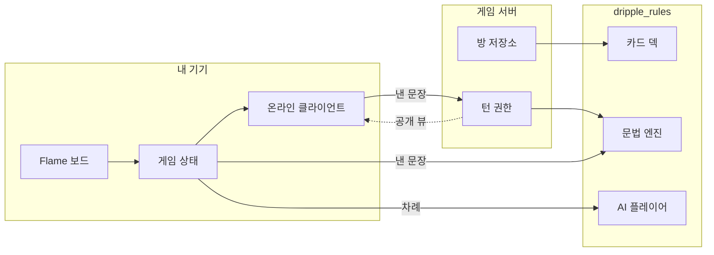

## 화면

### 홈

**파일** ./screens/01-home.png
**설명** 바로 플레이하거나, 처음이면 배우기로 갑니다

### 모드 선택

**파일** ./screens/02-mode-select.png
**설명** 혼자 할 것과 친구와 할 것을 갈라서 세웁니다

### 대전 시작

**파일** ./screens/03-battle.png
**설명** 일곱 장을 받고 덱에서 한 장 가져오며 차례가 시작됩니다

### 내 차례

**파일** ./screens/04-my-turn.png
**설명** 카드를 뽑고 나면 문장을 밀어 올릴 수 있게 됩니다

### 손패 다루기

**파일** ./screens/05-hand.mp4
**설명** 카드를 집어 옆으로 밀면 순서가 바뀌고, 위로 밀면 놓입니다

### 문장 만들기

**파일** ./screens/06-sentence.png
**설명** 손패에서 밀어 올린 카드가 그대로 문장이 됩니다

### 배우기

**파일** ./screens/07-tutorial.png
**설명** 정해진 패로 한 판을 같이 돌면서 규칙을 익힙니다

### 설정

**파일** ./screens/08-settings.png
**설명** 효과음, 배경 음악, 진동을 각각 끕니다

## 인터뷰

**소개** 영어 단어가 한 장씩 적힌 카드를 손에 들고, 어순에 맞게 늘어놓아 문장을 만드는 카드 게임이에요. 손에 든 카드를 먼저 다 털어낸 사람이 이깁니다.

**계기** 어렸을 적 다니던 영어학원에서 이 카드 게임을 했어요. 그때는 보드지를 잘라 만든 카드를 보드게임처럼 돌렸습니다. 그게 재밌었던 기억이 남아 있어서, 앱으로 만들어 보고 싶었어요.

**사용자** 연령 구분 없이 영어를 배우는 사람 모두예요. 처음에는 6~10세 아이만 생각하고 만들다가, 도중에 어른 학습자까지 넓혔습니다.

**배운 것** 답안 판정 로직이 제일 빡셌어요. 문장이 맞았는지 틀렸는지를 무엇으로 가를지, 그 한 줄을 정하는 데 제일 오래 걸렸습니다.

## 구상

- 단어 카드를 손에 들고 어순에 맞게 늘어놓는다
- 늘어놓은 문장이 맞는지 그 자리에서 판정해 준다
- 혼자서도 AI 상대와 붙을 수 있다
- 특수 카드로 상대를 방해한다
- 나중에는 친구와 온라인으로 붙는다

## 유저 플로우

### 모드를 고른다

혼자 배울지, AI와 붙을지, 친구를 부를지 정합니다.

**갈라짐** 처음이다 → 배우기 / 해봤다 → AI 대전이나 방 만들기

### 카드를 한 장 가져온다

덱 맨 위나 버림 더미 맨 위에서 한 장을 뽑습니다. 뽑기 전에는 아무것도 할 수 없어요.

### 손패에서 문장을 짠다

카드를 옆으로 밀면 손패 안에서 순서가 바뀌고, 위로 밀면 테이블에 놓입니다.

### 문장을 완성한다

버튼을 누르면 문법 엔진이 판정합니다.

**갈라짐** 맞았다 → 카드가 손에서 영영 빠진다 / 틀렸다 → 카드가 손으로 돌아오고 차례는 그대로

### 손패를 다 턴다

먼저 비운 사람이 이깁니다.

## 구조

### Flame 보드

카드를 그리고 손가락을 받습니다. 손패는 겹쳐 부채꼴로 눕고, 테이블에 올라간 카드는 겹치지 않습니다.

### 게임 상태

지금 누구 차례이고 누가 무엇을 들고 있는지를 들고 있습니다. 오프라인 게임에서는 이쪽이 곧 심판이에요.

### dripple_rules

Flutter를 모르는 순수 Dart 패키지입니다. 문법 엔진, AI, 카드 덱이 여기 들어 있고 앱과 서버가 같은 걸 가져다 씁니다.

### 게임 서버

온라인 방을 소유합니다. 덱을 섞고, 손패를 나눠주고, 지금 낸 문장이 낼 차례인 사람 것인지 봅니다. 요청 사이에 아무것도 기억하지 않고, 방을 읽어 한 동작을 적용하고 다시 씁니다.

## 개발 과정

### 1. 보드지 카드를 화면에 옮기는 것부터

보드지를 잘라 쓰던 그 카드를 그대로 화면에 옮기는 게 출발이었어요. Flutter로 앱 껍데기를 세우고, 카드를 끌어 옮기는 부분은 Flame에 맡겼습니다. 문법 판정은 처음엔 문장 템플릿 목록을 두고 손패가 그중 하나에 맞는지 보는 방식이었어요. 캐릭터 리액션, 이모트, 효과음 21종, 진동까지 붙여서 한 바퀴는 돌렸습니다.

**붙인 것** Flutter, Flame, Riverpod

### 2. 게임이 아니라 문제집이 돼 있었어요

한 바퀴 돌려 보니 규칙에 큰 구멍이 있었습니다. 최소 다섯 장짜리 문장만 인정했는데, 무작위로 받은 일곱 장에서 다섯 장짜리 문장이 나오는 일이 거의 없었어요. AI는 매 턴 카드만 뽑고, 사람도 마찬가지고, 게임이 93턴쯤 돌다가 덱이 떨어져서 끝났습니다.

그래서 규칙을 러미로 갈아엎었어요. 한 장 뽑고 → 한 가지 동작. 버림 더미를 두고, 덱이 떨어지면 버림 더미를 섞어 되넣고. 최소 길이 제한은 없앴습니다. 긴 문장일수록 손이 빨리 비니까, 규칙으로 강제하지 않아도 구조가 알아서 긴 문장을 보상하더라고요.

여기서 카드를 버리는 걸 의무로 두면 안 된다는 것도 알게 됐어요. 턴을 끝내려면 반드시 버려야 한다면, 한 장 뽑고 한 장 버리는 사람은 손패 크기가 영원히 그대로라 절대 못 이깁니다. 그래서 패스를 진짜 선택지로 넣었어요.

### 3. 템플릿을 버리고 파서를 썼어요

템플릿 목록은 늘려도 늘려도 부족했습니다. 문장 하나를 더 받아주려고 목록에 한 줄 더 넣는 짓을 반복하다가, 그냥 영문법 책에 있는 대로 재귀 청크 파서를 짰어요. 명사구, 형용사구, 전치사구, 동사구를 각각 정의하고 문장은 그 조합으로 봅니다.

그 위에 규칙을 다섯 개 얹었어요. 관사 일치, 수 일치, 주어-동사 일치, 형용사 어순, 그리고 동사 자릿수(valency)요. 자릿수를 넣고 나서야 `apples run a friend` 같은 게 걸리기 시작했습니다. `run`은 목적어를 못 받는다는 건 의미가 아니라 문법이니까요.

### 4. 카드가 카드처럼 보여야 했어요

기능은 되는데 화면이 학습 앱처럼 생겼더라고요. 디자인 토큰을 따로 패키지로 빼고 전부 다시 그렸습니다. 종이는 브랜드 색을, 가구(테이블·레일)는 크림색을 갖는 걸로 재료를 두 개만 뒀어요.

처음엔 초록 펠트에 황동 테두리를 둘렀는데, 황동이 화면의 모든 선에 노란 물을 들이더라고요. 황동을 빼고 크림으로 바꿨습니다. 그런데 초록 테이블에 스포트라이트가 남아 있으니 여전히 카지노처럼 보였어요. 결국 초록도 빼고 색이 아예 없는 `#15181C` 바닥으로 갔습니다. 화면에 색이 있는 건 카드에 인쇄된 것뿐이 됐어요.

카드 앞면도 다시 잡았습니다. 단어를 가운데에 놓으면 손패가 겹쳤을 때 맨 위 한 장만 읽혀요. 그래서 전부 왼쪽에 붙였습니다. 겹친 카드가 보여주는 건 왼쪽 끝이니까, 그렇게 하면 일곱 장이 다 읽혀요. 이걸 하고 나니 인쇄된 테두리도, 양쪽 구석의 인덱스도, 단어와 뜻 사이의 줄도 전부 필요가 없어져서 지웠습니다.

여는 화면도 손봤어요. 마크가 카드 두 장이라 카드가 나타나면서 동시에 갈라졌는데, 그러면 이 게임이 무슨 이야기인지 보여줄 첫 장면이 그냥 지나가 버립니다. 한 장이 260ms 동안 놓이고, 180ms 아무 일도 안 일어나고, 그다음에 두 번째가 갈라져 나오게 했어요. 그 멈춤이 애니메이션에 얹은 장식이 아니라 첫 상태를 읽히게 하는 유일한 장치입니다. 이름은 앱에서 유일하게 Pretendard가 아닌 글자예요. UI 서체로 쓰면 "Dripple이라고 적힌 제목"으로 읽히지 로고로 안 읽히더라고요.

### 5. 배우기는 실전 위에 얹으면 안 되더라고요

처음엔 진짜 게임 위에 코치 마크를 띄우려고 했어요. 그런데 손패는 무작위로 나오니까, "문장을 만들어 보세요"라고 시켰는데 그 손에 만들 수 있는 문장이 없을 수 있습니다. 그러면 배우는 사람이 얻는 건 "이 게임 고장났네"뿐이에요.

그래서 배우기를 아예 다른 모드로 뺐습니다. `the cat runs`가 나오게 짜인 손패와, 덱 맨 위에 `big`을 올려둔 1인용 판을 따로 돌려요. 모든 지시를 실제로 따를 수 있게요. 코치 마크는 가리킬 게 있을 때만 화면을 덮고, 손을 요구하는 단계에서는 목표에 테두리만 두르고 아무것도 안 가립니다.

### 6. 덱을 아무도 못 갖게 만들었어요

온라인을 붙이려는데, Realtime DB는 저장은 해도 코드를 돌리진 않습니다. 그러면 셔플을 누군가의 폰에서 해야 하는데, 한 사람이 덱과 남의 손패를 다 쥐고 있는 건 카드 게임이 아니죠.

그래서 서버를 세웠어요. Dart로요. 문법 엔진을 두 번 구현하면 언젠가 둘이 어긋나는 날이 오고 그날은 못 고칩니다. 그래서 규칙을 `dripple_rules` 패키지로 뽑아 앱과 서버가 같은 코드를 보게 했어요.

내보내는 모양도 둘로 갈랐습니다. 서버가 들고 있는 진짜 상태와, 테이블에서 보여도 되는 공개 뷰요. 남의 손패가 새지 않는다는 걸 테스트로 못 박아 뒀습니다. 대신 문장을 짜고 손패 순서를 바꾸는 건 전부 기기에서 해요. 그건 남이 볼 수 없는 일이라 보낼 이유가 없고, 완성된 문장만 서버로 갑니다.

**붙인 것** GitHub Actions

## 시행착오

### 판정 기준을 한 줄로 못 세워서 두 번 뒤집었어요

**증상** `the flower reads`가 통과했습니다. 꽃은 글을 못 읽으니까 틀린 문장 같은데, 문법만 보면 흠이 없어요. 그래서 주어의 생물성(animacy)을 검사해서 무생물 주어가 사람 동사를 못 받게 막았습니다.

**시도** 막고 나니 이번엔 게임이 안 돌아갔어요. 카드는 무작위로 나오는데 의미까지 맞아야 하면 낼 수 있는 문장이 거의 없습니다. 게다가 기준이 애매해져서, 어디까지가 "말이 되는" 문장인지 규칙마다 답이 달랐어요. 중간에 카드 아트 작업이 이 커밋을 덮어써서 되살리는 커밋을 또 짰는데, 되살리고 나서도 문제는 그대로였습니다.

**결론** 생물성 검사를 통째로 걷어냈어요. 기준을 "문장의 구성이 맞으면 맞는 문장이다, 의미는 보지 않는다" 한 줄로 고정했습니다. 그러니까 `the flower reads`는 통과하고, `apples run a friend`는 여전히 막혀요. `run`이 목적어를 못 받는 건 의미가 아니라 문법이니까요. 반쪽짜리 의미 검사는 아예 없는 것만 못하더라고요.

### AI가 한 판 내내 카드만 뽑았어요

**증상** AI 상대로 돌리면 세 명 다 매 턴 카드만 뽑고 문장을 한 번도 안 냈습니다. 덱이 다 떨어질 때까지요.

**시도** 처음엔 AI 전략이 너무 소극적인 줄 알고 판단 기준을 손봤어요. 그래도 안 냈습니다. 로그를 보니 문장 후보를 아예 못 찾고 있었어요.

**결론** AI의 문장 탐색이 네 장까지만 조합을 만들고 있었는데, 그때 최소 문장 길이는 다섯 장이었습니다. 애초에 통과할 수 있는 후보를 만들 수 없었던 거예요. 탐색을 순열 검색으로 다시 짜고, 판정은 사람과 똑같이 문법 엔진에 물어보게 바꿨습니다. AI가 사람과 다른 규칙을 갖는 순간 그건 상대가 아니니까요.

### 패스를 자유롭게 풀었더니 게임이 안 끝났어요

**증상** AI에게도 패스를 허용했더니 판이 늘어지기 시작했습니다. 손패를 비워서 끝나는 게 아니라 덱이 말라서 끝나는 판이 늘었어요.

**시도** AI끼리 60판을 돌려서 재봤습니다. 패스를 막았을 때 60판 중 59판이 손패를 비워서 끝났는데, 자유롭게 풀었더니 41판으로 떨어졌어요. 패스한 카드는 버림 더미를 거치지 않고 덱에서 사라지니까, 되섞어도 안 돌아옵니다.

**결론** 패스에 조건을 걸었어요. 버리려던 카드가 정작 자기한테 필요한 카드일 때만, 손패가 난이도별 한도(쉬움 6·보통 5·어려움 4) 아래일 때만, 그리고 덱에 아직 한 판 나눠줄 만큼 남아 있을 때만 패스합니다. 이 규칙으로 다시 60판을 돌리니 48판이 손패를 비워서 끝났어요.

### 손패를 읽는 제스처를 만들었다가 지웠어요

**증상** 손패가 겹쳐 있으니 가려진 카드를 못 읽는 게 문제였어요. 그래서 카드를 누르면 손패가 "읽기 상태"로 바뀌고, 레일을 따라 손가락을 밀면 카드가 차례로 떠오르는 걸 만들었습니다. 카드를 집어 드는 건 위로 16px 당겼을 때만 되게 했고요.

**시도** 만들고 나니 옆으로 미는 게 더 이상 드래그가 아니게 됐어요. 손패 순서를 바꾸려면 카드를 일단 부채꼴 밖으로 뽑아내야 했고, 나가는 길이 위쪽이라는 걸 화면에서 알려주는 것도 없었습니다.

**결론** 제스처가 아니라 카드 앞면이 문제였어요. 단어를 왼쪽 끝에 붙이고 나니 가려진 카드도 읽히고, 그러자 이 제스처를 살 이유가 사라졌습니다. 통째로 지우고 직접적인 쪽으로 돌아갔어요. 누르면 들리고, 옆으로 밀면 순서가 바뀌고, 위로 밀면 낸다. 8월 26일에 넣었다가 9월 3일에 뺐습니다.

## 남은 것

- 온라인은 폴링으로 방을 다시 읽어와요. 상대가 낸 문장이 바로 뜨지 않고 한 박자 늦습니다.
- 친구 목록도 랜덤 매칭도 없어요. 방 코드를 직접 알려줘야 같이 할 수 있습니다.
- 문장이 틀렸을 때 나오는 이유가 영어로만 나와요. 카드에 붙는 뜻은 앱 언어를 따라가는데, 판정 이유는 아직 그러지 않습니다.
- 판정 결과에 반응하는 캐릭터가 아직 판에 안 올라가 있어요. 이기고 지는 순간이 조용합니다.
- 카드가 그려지는 판을 화면 낭독기가 읽지 못해요. 게임 보드가 캔버스라서 그렇습니다.
