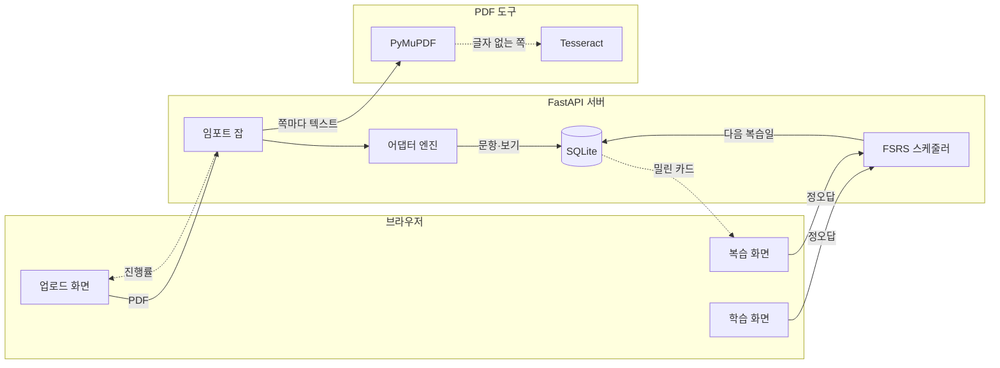

## 화면

### 홈

**파일** ./screens/01-home.png
**설명** PDF에서 뽑은 725문항이 세션 하나가 되고, 어디까지 풀었는지가 남는다

### 업로드

**파일** ./screens/02-upload.png
**설명** PDF를 얹고 세션 이름만 붙이면 준비 끝

### 문제 풀이

**파일** ./screens/04-study.png
**설명** 한 문제와 보기 네 개만 남기고 나머지는 치운다

### 채점

**파일** ./screens/06-wrong.png
**설명** 내가 고른 보기는 빨강, 정답은 초록으로 같이 켜진다

### 복습

**파일** ./screens/07-review.png
**설명** 오늘 밀린 분량과 오답·북마크·건너뛴 문제를 세션별로 모은다

### 복습 채점

**파일** ./screens/09-review-graded.png
**설명** 다음에 이 문제를 언제 다시 볼지 그 자리에서 알려준다

## 구상

- [x] PDF를 올리면 문항이 알아서 뽑힌다
- [x] 한 문제씩 카드로 풀고 그 자리에서 정답을 본다
- [x] 어디까지 풀었는지가 남아서 다음에 이어 푼다
- [x] 틀린 문제와 북마크만 모아 다시 푼다
- [ ] 스캔본 PDF도 OCR로 읽어 낸다

## 기획

**소개** 자격증 덤프 PDF를 올리면 문항·보기·정답을 뽑아 한 문제씩 풀게 해주고, 틀린 문제를 망각 곡선에 맞춰 다시 물어보는 웹앱이에요
**계기** 자격증 덤프는 PDF로만 있는데, 폰으로 확대해서 보기도 불편하고 내가 어디까지 봤는지도 모르겠더라고요. 마침 OCR도 궁금해서 파이프라인을 직접 만들어 봤습니다
**사용자** 덤프 PDF로 자격증을 준비하는 사람이요. 사실은 저 혼자 쓰려고 만든 도구예요
**넣지 않은 것** 로그인을 안 넣었어요. 혼자 쓰는 도구라 계정이 붙는 순간 만들 게 두 배가 됩니다

## 유저 플로우

### PDF 문제집을 올린다

드래그해서 얹으면 파일 이름과 크기만 확인하고 끝이에요.

### 세션 이름을 붙이고 분석을 건다

이름이 나중에 목록에서 이 문제집을 부르는 이름이 됩니다.

**갈라짐** 잠긴 PDF → 비밀번호를 넣고 다시 / 안 잠긴 PDF → 바로 추출

### 앞에서부터 한 문제씩 푼다

보기를 고르고 제출하면 그 화면에서 바로 채점돼요. 숫자키와 Enter로만 끝까지 갈 수 있습니다.

**갈라짐** 맞았다 → 다음 문제 / 틀렸다 → 정답을 보고 다음 문제 / 지금 안 풀겠다 → 건너뛰기

### 다음에 들어와 밀린 복습부터 한다

홈에 "복습 3"처럼 떠 있고, 누르면 오늘 몫만 큐로 나옵니다.

### 복습에서 다시 만난다

맞히면 간격이 벌어지고 틀리면 다음에 열 때 맨 앞으로 돌아옵니다.

## 구조

### 임포트 잡

업로드된 PDF 하나를 맡아 텍스트 추출부터 저장까지 끌고 가고, 그 사이 진행률과 단계 문구를 계속 갱신한다. 화면은 2초마다 이 잡의 상태를 물어본다.

### 어댑터 엔진

문제집 형식마다 다른 규칙을 파일로 들고 있다가, 텍스트에 가장 잘 맞는 어댑터를 점수로 골라 문항·보기·정답으로 자른다.

### FSRS 스케줄러

문제를 맞혔는지 틀렸는지만 받아서 그 문제의 안정성·난이도를 갱신하고 다음 복습일을 돌려준다. 세션×문제마다 카드 한 장을 들고 있다.

### 복습 화면

밀린 카드를 큐로 받아 하나씩 내주고, 이번에 푼 문제 번호를 들고 있다가 다음 요청에 실어 보낸다. 한자리에서 같은 문제를 두 번 만나지 않게 하는 장치다.

## 개발 과정

### 1. 덤프 PDF를 열어 보는 것부터

처음엔 파서를 어떻게 만들지보다 화면이 궁금했어요. FastAPI에 문제·세션·시도 모델을 잡고, 더미 문제를 심어서 푸는 화면부터 세웠습니다. PDF는 아직 안 붙었는데도 한 문제씩 넘기는 감각이 나오니까 만들 맛이 나더라고요.

**붙인 것** FastAPI, Next.js, SQLModel

### 2. 업로드를 붙이고 텍스트부터 긁었다

PDF를 올리면 서버가 받아서 쪽마다 글자를 뽑게 했어요. 처음부터 OCR을 돌릴 생각은 없었고, 글자층이 있는 PDF는 PyMuPDF로 긁고 글자가 거의 안 나오는 쪽만 Tesseract로 넘기는 식으로 갈랐습니다. 덤프처럼 텍스트가 살아 있는 파일은 OCR을 아예 안 타니까 훨씬 빨랐고요.

**붙인 것** PyMuPDF, Tesseract

### 3. 문제집마다 다른 번호 매기기를 규칙 파일로 뺐다

문제집마다 번호를 매기는 방식이 제각각이에요. "1.", "문제 1)", "Q1"... 이걸 파서 안에 계속 넣다 보니 문제집 하나 늘 때마다 파서를 뜯게 되더라고요. 그래서 규칙을 바깥 파일로 빼고, 텍스트를 보고 어느 규칙이 제일 잘 맞는지 점수로 고르게 바꿨습니다. ExamTopics 덤프는 형식이 워낙 일정해서 전용 규칙을 따로 하나 뒀어요.

### 4. 잠긴 PDF에서 한 번 막혔다

받아 둔 덤프 중에 열람 암호가 걸린 게 있었어요. 비밀번호를 받아서 임시로 풀고, 끝나면 그 임시 파일을 덮어쓰고 지우게 했습니다. 비밀번호는 어디에도 저장하지 않고 그 요청 안에서만 씁니다.

### 5. 세션을 넣고 이어 풀게 했다

문제만 쌓아 두니까 정작 "내가 어디까지 봤는지"가 없더라고요. 업로드 한 건이 곧 학습 세션 하나가 되게 만들고, 세션이 현재 문제 번호를 들고 있게 했습니다. 그때부터 화면이 목록 → 세션 → 문제로 정리됐어요.

### 6. 화면을 걷어냈다

카드가 여기저기 흩어져 있고, 그라디언트에 색 점에 설명문까지 붙어서 정작 문제가 안 읽혔어요. 홈을 세로 한 줄기로 다시 짜고 장식을 다 뺐습니다. 그러면서 알게 된 게, 화면에 있던 북마크·스킵·단축키 안내가 **아무 데도 연결돼 있지 않았다**는 거였어요. 눌러도 아무 일이 없는 버튼이었습니다. 지울지 붙일지 정해야 했고, 붙이는 쪽으로 갔습니다.

### 7. 그냥 푸는 앱으로는 부족했다

앞에서 뒤로 훑고 나면 그걸로 끝이더라고요. 한 번 푼 문제는 다시 안 나오니까 사흘 뒤엔 기억에 없고요. 그래서 문제마다 다음 복습일을 들고 있는 카드를 두고, 정오답을 넣으면 다음 날짜를 돌려주는 스케줄러를 붙였습니다. SM-2로 갈지 고민했는데 Anki도 넘어간 FSRS를 골랐어요. 파이썬 구현이 있어서 구현량이 오히려 적었고, 필수 의존성이 하나뿐이라 서버가 무거워지지도 않았습니다.

**붙인 것** FSRS

### 8. 난이도를 매번 묻지 않기로 했다

FSRS는 원래 사용자가 "쉬움/보통/어려움"을 눌러 주는 걸 전제합니다. 그런데 이건 객관식이라 맞았는지 틀렸는지를 앱이 이미 압니다. 그래서 정답이면 Good, 오답이면 Again으로 자동 매핑하고 버튼을 아예 없앴어요. 조절하고 싶은 사람을 위해 "어려웠음" 하나만 선택으로 남겼습니다.

### 9. 어디에든 올릴 수 있게 싸 뒀다

로컬에서만 도는 물건으로 두기는 아까워서, 백엔드를 컨테이너 하나로 띄울 수 있게 정리했어요. 어디에 올릴지는 아직 안 정했지만, 정하면 바로 올릴 수 있는 상태까지는 만들어 뒀습니다.

**붙인 것** Docker

## 시행착오

### 정답 문자와 보기 기호가 안 맞았다

**증상** 725문항이 다 들어왔는데 정답이 붙은 문항이 하나도 없었어요. 화면에서는 어떤 보기를 골라도 채점이 안 됐고요.

**시도** 정답을 찾는 규칙(`Answer: A`)은 잘 잡히고 있었습니다. 문제는 그다음이었어요.

**결론** 규칙이 뽑아 주는 값은 `A`인데 보기 기호 목록은 `A.`, `B.` 처럼 점이 붙은 형태라, 목록에서 못 찾고 그대로 비어 버렸습니다. 기호에서 문장부호를 떼고 맞춰 보게 고치니 725문항 중 627문항에 정답이 붙었어요.

### 틀린 문제가 1분 뒤에 다시 나왔다

**증상** 복습을 붙이자마자 틀린 문제가 1분 뒤로 예약됐어요. 앉아서 오래 푸는 사람에게는 맞지만, 출퇴근길에 5분 쓰는 사람에게는 방금 틀린 게 곧바로 또 나오는 셈이었습니다.

**시도** 아예 일 단위로만 돌릴까 했어요. 그러면 틀린 문제도 최소 하루 뒤가 됩니다.

**결론** 시뮬레이션을 돌려 보니 하루에 한 번 여는 사람에게는 두 방식의 결과가 똑같았어요. 밀린 카드는 사라지지 않고 다음에 열 때 큐 맨 앞에 있기 때문입니다. 오히려 하루를 넘겨 맞히면 FSRS가 안정성을 훨씬 크게 올려 주고요(1.89 대 0.25). 그래서 학습 단계를 10분 하나로 줄이고, 대신 한자리에서 방금 푼 문제는 큐에서 빼는 쪽으로 갔습니다.

### 잠긴 PDF 검사가 두 벌로 남았다

**증상** 암호가 걸린 PDF를 올렸을 때 어떤 경로로 들어오느냐에 따라 메시지가 달랐어요.

**시도** 처음엔 pikepdf로 암호화 여부를 보고 임시로 푸는 쪽을 따로 만들었습니다. 그런데 업로드를 받는 쪽에는 PyMuPDF로 보는 검사도 같이 들어가 있었어요.

**결론** 의존성 목록에 pikepdf가 없어서 그쪽은 "모듈 없음"으로 떨어지고, 실제 판정은 전부 PyMuPDF가 하고 있었습니다. 에러도 경고도 없이 한쪽만 도는 상태였어요. 지금도 검사가 두 벌 남아 있어서 한쪽으로 몰아야 합니다.

## 남은 것

- 정답이 안 붙은 문항이 98개 남아 있어요. 덤프 안에 정답 줄이 아예 없거나 형식이 다른 문항들입니다.
- 풀이가 아직 쓸 만하지 않아요. 해설 자리를 잘라 오는데 덤프에서는 그 뒤로 문장이 흩어져 있어서, 엉뚱한 줄이 딸려 옵니다.
- 마음만 먹으면 정답을 미리 볼 수 있어요. 채점은 서버에서 하는데, 문제를 내려줄 때 정답과 풀이가 같이 실려 갑니다.
- 복습 간격이 아직 남의 평균값이에요. 내가 푼 기록으로 다시 맞추면 더 잘 맞을 텐데, 그걸 돌리는 자리가 없습니다.
- 복습 화면이 숫자 네 개뿐이에요. 앞으로 며칠에 몇 개가 밀려 있는지 보여야 계획이 섭니다.
