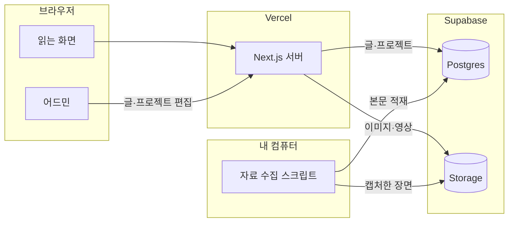

## 화면

### 홈

**파일** ./screens/01-home.png
**설명** 최근 글이 카테고리·태그와 함께 한 줄씩 깔린다

### 글 상세

**파일** ./screens/02-post.png
**설명** 커버 위에 제목이 얹히고 목차가 본문을 따라 붙는다

### 아카이브

**파일** ./screens/03-archive.png
**설명** 쌓인 글 전부를 카테고리로 좁혀 가며 본다

### 실험실

**파일** ./screens/04-lab.png
**설명** 만든 프로젝트를 화면 표본처럼 네 장씩 늘어놓는다

### 프로젝트 상세

**파일** ./screens/05-lab-detail.png
**설명** 원고 한 장이 섹션별 전용 화면으로 펼쳐진다

### 글 관리

**파일** ./screens/07-admin-posts.png
**설명** 작성중인 글을 위에 두고 상태별로 훑는다

### 에디터

**파일** ./screens/08-admin-editor.png
**설명** 왼쪽에 마크다운, 오른쪽에 발행 화면과 똑같은 미리보기

### 실험실 관리

**파일** ./screens/09-admin-projects.png
**설명** 프로젝트를 발행 전에 감춰 두고 미리 본다

### 통계

**파일** ./screens/10-admin-stats.png
**설명** 어떤 글이 실제로 읽히는지 글별로 센다

## 데이터와 API

### Supabase

**용도** 글·프로젝트·조회수를 담고, 올린 이미지와 영상을 보관한다
**방식** Postgres · REST
**갱신** 자동
**링크** https://supabase.com/docs
**주의** 무료 플랜은 일정 기간 요청이 없으면 프로젝트를 재운다. 그래서 GitHub Actions가 주기적으로 한 번씩 두드려 깨어 있게 한다

### YouTube

**용도** 영상 글을 쓸 때 소제목마다 그 장면을 캡처해 본문에 넣는다
**방식** yt-dlp · ffmpeg
**아이콘** YouTube
**링크** https://github.com/yt-dlp/yt-dlp
**주의** 같은 영상을 구간별로 여러 번 받으면 속도 제한에 걸린다. 저해상도로 통째 한 번만 받고 프레임은 로컬에서 뽑는다

### Vercel Analytics

**용도** 어디서 들어와 어떤 기기로 보는지, 화면이 얼마나 빨리 뜨는지 본다
**방식** 스크립트 삽입
**갱신** 자동
**링크** https://vercel.com/docs/analytics
**주의** 글별 조회수는 이쪽을 쓰지 않고 직접 센다. 유입 경로와 Core Web Vitals만 여기서 본다

## 구상

- [x] 디자인 시안 아홉 장을 실제로 도는 화면으로 옮긴다
- [x] 글을 DB에 두고 어드민에서 쓰고 고친다
- [x] 영상·문서에서 인용할 자료와 장면을 모아 오는 일을 자동화한다
- [x] RSS·사이트맵·OG 이미지가 알아서 나온다
- [x] 검색과 방문자 통계를 붙인다
- [ ] 글을 영어로 자동 번역해 `/en` 으로도 낸다

## 기획

**소개** 제가 보고 읽은 걸 요약해 쌓아 두는 개인 기록 블로그예요. 읽는 화면부터 어드민·에디터·통계까지 필요한 걸 직접 만들어 붙였습니다
**계기** 처음엔 그냥 기록용 블로그가 갖고 싶었어요. 그런데 기존 블로그 플랫폼은 커뮤니티 기능이 대부분이라 저한테는 필요가 없더라고요. 어차피 안 쓸 기능에 화면을 맞추느니, 원하는 걸 원하는 대로 붙일 수 있는 사이트를 직접 세우는 게 낫겠다 싶었습니다
**사용자** 저 혼자 씁니다. 읽는 쪽은 검색으로 들어오는 사람들이고, 쓰는 쪽 화면은 전부 제 것이에요
**넣지 않은 것** 회원가입도 좋아요도 댓글도 없어요. 읽고 가는 자리라 그쪽은 아직 안 켰습니다
**배운 것** 글의 결을 잡아 주는 건 코드가 아니라 규약 문서였어요. 제목·문단·인용을 어떻게 쓸지 `POSTING.md` 한 장에 못 박아 두니, 편마다 흔들리던 결이 잡혔습니다. 지금도 코드보다 이 문서를 더 자주 고쳐요
**지금** 네, 계속 쓰고 계속 고치는 중입니다

## 유저 플로우

### 읽다가 링크를 붙여 넣는다

영상이든 글이든, 남겨두고 싶은 게 보이면 주소만 복사해 둡니다.

**갈라짐** 폰이나 태블릿 → 어드민 화면 / 노트북 앞 → 바로 에디터

### 인용할 자료를 뽑는다

영상이면 소제목마다 그 시점의 장면을, 문서면 인용할 대목을 미리 챙겨 둡니다.

### 에디터에서 쓴다

왼쪽에서 마크다운을 고치면 오른쪽 미리보기가 발행 화면 그대로 따라옵니다.

**갈라짐** 한 번에 끝난다 → 제목·태그만 다듬는다 / 더 손볼 게 남았다 → 작성중으로 두고 다시 온다

### 발행한다

카테고리와 작성일을 정하고 내보냅니다.

## 구조

### 어드민

글과 프로젝트를 쓰고 고치는 화면입니다. 마크다운을 왼쪽에 두고 발행 화면과 같은 미리보기를 오른쪽에 띄웁니다.

### Next.js 서버

읽는 화면을 그리고, 어드민이 누른 것을 DB와 Storage에 적습니다.

### Postgres

글·프로젝트·카테고리·조회수가 여기 있습니다. 화면이 읽는 것도, 스크립트가 적재하는 것도 전부 같은 테이블이에요.

### 자료 수집 스크립트

제 컴퓨터에서 도는 CLI입니다. 영상에서 장면을 뽑아 Storage에 올리고, 정리한 원고를 DB에 적재해요. 밖에서 들어오는 접속은 받지 않고 Supabase 쪽으로 나가기만 합니다.

## 개발 과정

### 1. 화면부터 아홉 장 만들었어요

디자인 시안을 아홉 장 먼저 잡아 놓고, 그걸 Next.js로 그대로 옮기는 것부터 했습니다. 데이터는 전부 파일에 박아 둔 가짜였어요. 어차피 나중에 갈아 끼울 거라, 초반엔 화면이 어떻게 생겼는지만 확정하고 싶었거든요.

**붙인 것** Next.js, Tailwind CSS

### 2. 가짜 데이터를 걷어내고 DB를 뒀어요

글을 하나 고치겠다고 배포를 다시 하는 게 말이 안 됐어요. 파일 기반으로 갈까 하다가, 결국 폰에서도 글을 쓰고 싶어질 게 뻔해서 서버에 상태를 두기로 했습니다. 여기서부터 어드민이 생겼고, 마크다운 본문·이미지 업로드·카테고리 트리가 차례로 붙었어요.

**붙인 것** Supabase, Vercel

### 3. 오래 걸리는 작업을 화면에서 떼어냈어요

글에 넣을 자료를 모으는 일 — 영상에서 장면을 뽑고, 이미지를 받아 다시 올리고 — 이 한 번에 몇 분씩 걸렸어요. 처음엔 어드민이 요청을 받은 자리에서 그대로 처리하게 했는데, 그동안 화면이 멈춰 있었습니다. 응답 시간 제한에도 걸렸고요.

그래서 어드민은 작업 줄에 한 칸 적어 두기만 하고, 제 컴퓨터에서 도는 워커가 그 줄을 가져가 처리하도록 나눴습니다. 폰에서는 던져 놓고 닫아도 되고, 워커는 밖으로 나가는 접속만 쓰니 포트를 열 일도 없었어요. 작업 상태는 같은 테이블에 적히니, 어드민은 목록에서 진행중 표시만 보면 됐습니다.

### 4. 글이 쌓이니 읽는 쪽 장치가 필요했어요

스무 편쯤 넘어가니까 제가 쓴 글을 제가 못 찾겠더라고요. 검색·태그·시리즈·연관 글 추천을 붙이고, 글별 조회수도 직접 세기 시작했습니다. 이 무렵 영어 자동 번역과 `/en` 라우팅도 만들어 뒀는데, 관리할 게 두 배로 늘어서 노출만 걷어내고 배선은 남겨 뒀어요.

### 5. 글쓰기 규약을 문서 한 장으로 못 박았어요

편마다 결이 달랐어요. 어떤 편은 개조식이고 어떤 편은 번역투고, 소제목을 어디서 끊는지도 그때그때 달랐습니다. 제목·문단 길이·인용 표기·이미지 배치를 그때그때 감으로 정하니 그랬던 거였어요. 그래서 규약을 통째로 `POSTING.md` 한 장으로 빼 두고, 글을 쓸 때마다 그걸 기준으로 삼았습니다. 적재 스크립트도 같은 문서를 근거로 슬러그·메타를 검사하게 했어요. 지금은 코드보다 이 문서를 훨씬 자주 고칩니다.

### 6. 실험실을 포트폴리오 판으로 갈아엎었어요

원래 실험실은 프로젝트 카드 몇 장이 전부였어요. 다른 레포에서 만든 것들을 여기 모으려니 매번 상세 화면을 새로 짜게 되더라고요. 그래서 원고 한 장의 `##` 제목이 곧 렌더러가 되게 규약을 정했습니다. `## 화면`이면 폰 목업 갤러리, `## 구조`면 다이어그램 밴드, `## 시행착오`면 스크롤 따라 펼쳐지는 부검 카드로요. 원고를 넘기면 화면이 알아서 나오니, 프로젝트를 하나 더 얹는 게 마크다운 한 장 쓰는 일이 됐어요.

### 7. 마지막에 검색 노출과 계측을 붙였어요

만들어 두고 아무도 안 들어오면 의미가 없으니, 사이트맵·구조화 데이터·canonical을 정리하고 서치콘솔에 물렸습니다. 태그 표기가 대소문자·공백 때문에 갈라져 있던 것도 이때 하나로 합치고 옛 주소는 301로 넘겼어요.

**붙인 것** Vercel, GitHub Actions

## 시행착오

### 본문 그림을 이미지로 굽다가 되돌린 일

**증상** 다이어그램 말고 단계 카드나 수치 카드 같은 정보 그림을 본문에 넣고 싶었는데, 마크다운으로는 표현할 방법이 없었어요.

**시도** 카드를 HTML/CSS로 만들어 두고, 글을 저장할 때 Playwright로 그 화면을 열어 PNG로 구운 뒤 이미지 주소로 바꿔치기했습니다. 처음엔 잘 돌았어요. 그런데 확대하면 글씨가 흐렸고, 다크 모드로 바꿔도 카드만 밝은 채로 남았고, 폰에서는 넓은 카드가 그대로 줄어들어 읽히지 않았습니다. 카드 스타일을 한 줄 고칠 때마다 이미 발행된 글의 그림을 전부 다시 구워야 하는 것도 문제였고요.

**결론** 이미지로 만들 이유가 애초에 없었어요. 본문 렌더러가 이미 mermaid 블록을 컴포넌트로 그리고 있었으니, 카드도 같은 자리에서 React 컴포넌트로 그리면 됐습니다. 굽는 파이프라인과 Playwright 의존성, 렌더 전용 라우트를 전부 걷어냈어요. 지금은 카드 스타일을 고치면 옛날 글까지 같이 바뀝니다.

### 커버 사진 위 제목이 안 보이던 일

**증상** 글 상세 맨 위에 커버 사진을 깔고 그 위에 제목을 얹었는데, 사진에 따라 제목이 아예 안 읽혔어요.

**시도** 제목을 흰 글씨로 고정했더니 밝은 사진에서 사라졌습니다. 그래서 사진 위에 어두운 막을 한 겹 깔았는데, 이번엔 원본이 어두운 사진들이 죄다 시커멓게 뭉갰어요. 막의 농도를 중간쯤으로 맞춰 보려 했지만, 밝은 사진과 어두운 사진을 한 값으로 만족시킬 수가 없었습니다.

**결론** 화면에서 판단할 게 아니라 올릴 때 재 두면 되는 일이었어요. 이미지를 업로드할 때 sharp로 평균 휘도를 구해 글과 함께 저장하고, 그 값이 기준을 넘으면 어두운 글씨에 막을 걷고, 아니면 흰 글씨에 막을 씌웁니다. 판단이 한 번만 일어나니 화면에서는 값을 읽어 쓰기만 해요.

### 한글 슬러그가 404 나던 일

**증상** 제목을 그대로 주소로 만들었더니, 어떤 글은 열리고 어떤 글은 404가 났어요. 어드민 목록에는 멀쩡히 있는데요.

**시도** 라우팅 설정과 대소문자를 먼저 의심했습니다. 그런데 같은 주소를 어떤 경로로 여느냐에 따라 결과가 갈렸어요. 한글이 주소에 들어가면서 인코딩된 형태가 곳곳에서 달라졌던 거였습니다.

**결론** 주소에 한글을 아예 안 넣기로 했어요. 슬러그를 만들 때 ASCII만 남기고, 적재 스크립트에서 ASCII가 아닌 슬러그는 아예 거부합니다. 제목 규약에도 같이 적어 뒀어요. 주소를 예쁘게 만드는 것보다 안 깨지는 게 먼저였습니다.

### 영상 장면 캡처가 자꾸 끊기던 일

**증상** 영상 글을 쓸 때 소제목마다 그 시점의 장면을 넣으려고 했는데, 몇 장 뽑다 보면 다운로드가 멈췄어요.

**시도** 영상 전체를 받는 건 낭비 같아서, 필요한 시점 앞뒤 몇 초씩만 골라 받게 만들었습니다. 소제목이 여덟 개면 여덟 번 받는 거죠. 그런데 짧은 시간에 같은 영상을 여러 번 요청하니 속도 제한에 걸렸고, 뒤쪽 구간은 아예 못 받았어요. 간격을 두고 천천히 받게도 해 봤지만 이번엔 캡처 한 번에 몇 분씩 걸렸습니다.

**결론** 요청 횟수가 문제지 용량이 문제가 아니었어요. 어차피 프레임 몇 장 뽑으려는 거라 화질이 좋을 필요도 없었고요. 제일 낮은 화질로 통째 한 번만 받고 프레임은 로컬에서 뽑게 바꿨더니, 요청이 한 번으로 줄면서 끊기지 않았습니다.

## 남은 것

- 검색이 아직 안 돌아가요. 예전에 붙였던 영어 번역을 걷어내면서 검색 쪽이 같이 정리되지 않은 채로 남았습니다.
- 자료 수집 워커가 제 컴퓨터에 묶여 있어요. 컴퓨터가 꺼져 있으면 작업은 줄에 걸리기만 하고 처리되지 않습니다.
- 사용자 화면에서 발행일을 임시로 내려 뒀어요. 옛 글들의 작성일이 실제 시점과 어긋나 있어서, 정리한 뒤에 다시 올릴 생각입니다.
- 백업이 수동이에요. 스냅샷을 남기려면 제가 명령을 직접 돌려야 합니다.
