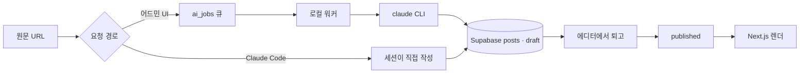

## 제품 소개

글을 쓰는 곳이자 글 쓰는 과정을 자동화하는 실험장이다. 겉으로는 평범한 개인 블로그지만,
안쪽은 초안을 사람이 아니라 AI 세션이 만들어 넣는 구조로 되어 있다.

원문 URL 하나를 던지면 초안이 나온다. 어드민 화면에서 URL 을 넣으면 큐에 작업이 쌓이고
로컬 워커가 집어가고, 컴퓨터 앞이라면 Claude Code 세션에 바로 시켜서 큐를 건너뛴다.
어느 쪽이든 결과물은 같은 자리, Supabase `posts` 테이블의 draft 로 떨어진다.

발행 권한은 사람이 쥔다. 초안은 어디까지나 초안이고, 에디터에서 문체와 사실관계를 손본
다음에야 published 로 넘어간다. 자동화가 손대는 구간과 사람이 책임지는 구간을 일부러
갈라놨다.

## 요구사항

- [x] 원문 URL → 초안 자동 생성
- [x] 폰·태블릿에서도 초안 요청 (큐 + 로컬 워커)
- [x] 발행 전 사람이 반드시 손보는 draft/published 분리
- [x] 다크모드 깜빡임 없는 테마 전환
- [x] 글 커버 이미지를 본문 상단 히어로로
- [x] 마크다운 안에서 쓰는 시각자료 블록 세트
- [ ] 영어 번역본 자동 생성 파이프라인
- [ ] 실험실 프로젝트 포트폴리오 개편

## 기술 선정

| 기술 | 고른 이유 |
|---|---|
| Supabase | 폰에서 초안을 요청하려면 서버 상태가 필요했다. 파일은 로컬에 묶인다 |
| Next.js | 어드민이 동적 화면이라 정적 생성만으로는 부족했다 |
| Vercel | Next.js 기본 배포 경로라 손댈 게 없다 |
| claude CLI | 이미 구독 중이라 API 를 직접 부르는 것보다 과금이 없다 |

## 데이터와 API

### Supabase

**제공처** Supabase
**방식** JS 클라이언트. 읽기는 published 만, 쓰기는 로컬 어드민에서만
**적재** 글은 초안 생성 시점에 draft 로 들어가고, 발행에서 published 로 바뀐다
**주의** 공개 사이트에는 쓰기 경로가 없다. RLS 로 공개 읽기만 열어 뒀다

### Anthropic (claude CLI)

**제공처** Anthropic
**방식** 로컬 워커가 subprocess 로 CLI 를 띄운다. HTTP 를 직접 부르지 않는다
**적재** 결과는 곧바로 posts 테이블의 draft 행이 된다
**주의** 워커가 로컬에서만 돈다. 컴퓨터가 꺼져 있으면 큐가 밀린다

## 구조

### 두 갈래 요청

초안 요청은 두 경로로 들어온다. 어드민 화면은 `ai_jobs` 테이블에 행을 하나 넣고 끝낸다.
폰에서도 되는 대신, 집 컴퓨터에서 워커가 돌고 있어야 결과가 나온다.

### 워커

`npm run ai:worker` 가 큐를 폴링하다 대기 중인 작업을 잡아 `claude` CLI 를 띄운다.
CLI 가 원문을 읽고 규약대로 글을 써서 `posts` 에 draft 로 넣는다.

### 세션 직행

컴퓨터 앞이면 큐가 군더더기다. Claude Code 세션에 URL 을 주면 그 세션이 곧 작성자가 되고,
`npm run draft -- push` 로 같은 테이블에 바로 적재한다.

### 발행

에디터에서 고친 뒤 published 로 바꾸면 그때부터 사이트에 뜬다. 렌더는 Next.js 가 맡는다.

## 시행착오

### 한글 슬러그가 배포 환경에서만 404

**증상** — 로컬에서 잘 열리던 글이 Vercel 에 올리면 404 였다. 제목이 한국어인 글만
그랬다. 슬러그에 한글이 그대로 들어간 경우다.

**시도** — 처음엔 인코딩 문제로 보고 `encodeURIComponent` 를 앞뒤로 붙여봤다. 안 됐다.
다음엔 `generateStaticParams` 가 뱉는 값과 실제 요청 경로를 찍어 비교했다. 문자열은
같아 보이는데 매칭이 안 됐다.

**결론** — 정적 prerender 경로 매칭에서 퍼센트 인코딩된 한글이 어긋나는 문제였다.
인코딩을 맞추는 대신 슬러그를 ASCII 로 제한했다. 제목이 한국어뿐이면 slugify 결과가
빈 문자열이 되므로, 그 경우엔 프런트매터에 슬러그를 직접 적도록 에러를 던진다.
근본 원인을 우회했지만 슬러그가 짧아지는 부수 효과가 오히려 좋았다.

### 영상 캡처가 매번 중간에 멈춤

**증상** — 글에 넣을 유튜브 장면을 뽑는 스크립트가 몇 번 돌다 실패했다. 소제목마다
필요한 구간만 잘라 받는 방식이었다.

**시도** — 재시도 로직을 넣었다. 실패 지점만 밀릴 뿐 여전히 멈췄다. 요청 간격을
벌려도 마찬가지였다.

**결론** — 구간마다 별도 요청을 날리는 게 원인이었다. 짧은 시간에 요청이 몰리면서
throttle 에 걸렸다. 저해상도로 전체를 한 번만 받아두고 그 파일에서 프레임을 뽑는
방식으로 바꿨다. 요청이 1회로 줄었고 화질은 캡처 용도엔 충분했다.

### 테마 전환 때 흰 화면이 번쩍임

**증상** — 다크모드로 들어와도 첫 프레임이 흰색으로 한 번 깜빡였다.

**시도** — 저장된 테마를 읽어 `html` 에 클래스를 붙이는 스크립트를 `<head>` 에
직접 넣었다. 깜빡임은 잡혔는데 React 19 에서 경고가 떴다.

**결론** — `useServerInsertedHTML` 로 같은 스크립트를 주입하도록 바꿨다. 스크립트가
서버 렌더 결과에 실려 나가 하이드레이션 전에 실행되고, 경고도 사라졌다.

## 남은 것

- 영어 번역본 자동 생성이 스키마만 있고 파이프라인이 비어 있다
- 실험실 상세 화면이 아직 블로그 글 레이아웃을 그대로 쓴다
- 워커가 로컬에서만 돈다. 집 컴퓨터가 꺼져 있으면 큐가 밀린다

