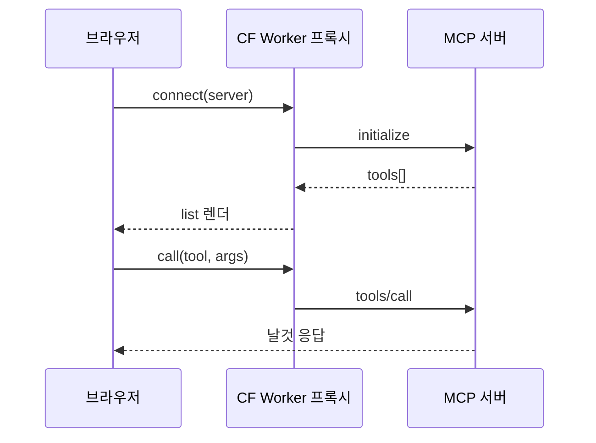

## 제품 소개

MCP 스펙을 세 번 읽었는데도 서버를 못 붙였다. 문서로는 안 되는 게 있었다.

그래서 읽기를 멈추고 만지는 도구를 만들었다. 서버 주소를 넣으면 연결하고, 노출된 도구를
나열하고, 하나 골라 호출하고, 날것의 응답을 본다. 한 화면에서.

단계마다 무엇이 오갔는지 페이로드를 숨기지 않는다. 실패하면 실패한 자리에서 에러를 그대로
보여준다. "왜 안 되지"를 추측하지 않게 하는 게 목표였다. 새 MCP 서버를 만들 때 제일 먼저
여기 붙여본다. 통과 못 하면 클라이언트를 붙이기 전이라 다행인 거다.

## 요구사항

- [x] 서버 주소만 넣으면 바로 연결
- [x] 노출된 도구를 그대로 나열
- [x] 도구를 골라 호출하고 날것의 응답 확인
- [x] stdio 와 sse 를 같은 화면에서 번갈아 시험
- [x] 실패한 자리에서 에러를 그대로 노출

## 기술 선정

| 기술 | 고른 이유 |
|---|---|
| Cloudflare Workers | 브라우저는 stdio 를 못 붙는다. 전송을 대신 열어줄 곳이 필요했다 |
| MCP SDK | 스펙 구현을 직접 쓰면 검증 대상과 검증 도구가 같은 버그를 공유한다 |
| TypeScript | 서버마다 다른 응답 모양을 타입으로 좁혀 두면 실패 지점이 빨리 드러난다 |

## 구조

### connect

주소를 받아 연결을 연다. 브라우저가 못 여는 전송은 Worker 가 대신 연다.

### list

initialize 응답에 실려 온 도구 목록을 그대로 화면에 쌓는다. 가공하지 않는다.

### call

도구 하나를 골라 인자를 넣고 호출한다. 돌아온 응답을 손대지 않고 그대로 보여준다.

## 시행착오

### 같은 스펙인데 서버마다 응답이 달랐다

**증상** 어떤 서버는 붙고 어떤 서버는 같은 호출에서 실패했다. 스펙대로 보냈는데도 그랬다.

**시도** 클라이언트 쪽 요청을 스펙 예제와 한 글자씩 맞춰봤다. 요청은 같았다.

**결론** 스펙에 SHOULD 로 적힌 부분을 서버마다 다르게 구현하고 있었다. 문서만 봤으면
영영 몰랐을 차이다. 두 전송으로 같은 서버를 번갈아 때려보면서 확인했다.

## 남은 것

- 새 서버를 붙일 때마다 수동으로 확인한다. 회귀 검사로 굳히면 좋겠다
