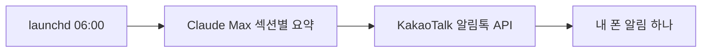

## 제품 소개

아침 6시, 알림 하나가 온다. 시사 다섯 줄, 경제 네 줄, 테크 세 줄. 그게 끝이다.

뉴스 앱을 지웠다. 타임라인을 보다 보면 30분이 사라졌고, 정작 뭘 읽었는지 기억이 안 났다.
필요한 건 무한 스크롤이 아니라 "오늘 이건 알아야 한다" 한 묶음이었다.

기능을 더하는 대신 빼는 쪽으로 갔다. 알림은 하루 한 번, 06:00 KST 고정. 푸시도 뱃지도 없다.
읽는 데 5분을 넘기지 않는 분량으로 자른다. 제약이 곧 설계였다.

## 요구사항

- [x] 하루 한 번, 06:00 KST 고정 발송
- [x] 읽는 데 5분을 넘기지 않는 분량
- [x] 섹션 개수를 고정해 늘어나지 않게
- [x] 푸시·뱃지 없이 알림 하나로 끝
- [ ] 섹션을 그날그날 끄고 켜기

## 기술 선정

| 기술 | 고른 이유 |
|---|---|
| launchd | 구독자가 한 명이면 인프라도 한 명치면 된다. 서버를 띄우지 않았다 |
| Claude Max | 이미 구독 중이라 요약에 별도 과금이 붙지 않는다 |
| 카카오 알림톡 | 하루에 몇 번씩 여는 앱이라 따로 확인하러 갈 필요가 없다 |

## 데이터와 API

### 카카오 알림톡

**제공처** 카카오 비즈니스
**방식** REST API, 발송 시점에만 1회 호출
**적재** 저장하는 데이터가 없다. 요약을 만들어 바로 보내고 끝낸다
**주의** 템플릿을 사전 등록해야 발송된다. 자유 문구는 못 보낸다

### Anthropic API

**제공처** Anthropic
**방식** 섹션 단위로 나눠 호출. 하루 한 번, 06:00 KST
**주의** 맥이 꺼져 있으면 호출 자체가 일어나지 않는다

## 구조

### launchd 가 깨운다

크론은 서버가 아니라 그냥 내 맥에서 돈다. launchd 가 정해진 시각에 작업을 띄운다.

### 섹션별로 요약한다

Claude 가 섹션 단위로 나눠 요약한다. 섹션이 고정돼 있어 분량도 같이 고정된다.

### 알림톡으로 나한테만

카카오 알림톡 API 로 나에게만 보낸다. 구독자 목록도 발송 큐도 없다.

## 남은 것

- 섹션을 그날그날 끄고 켜는 기능
- 맥이 꺼져 있으면 그날은 안 온다. 그 정도 결함은 안고 가기로 했다
