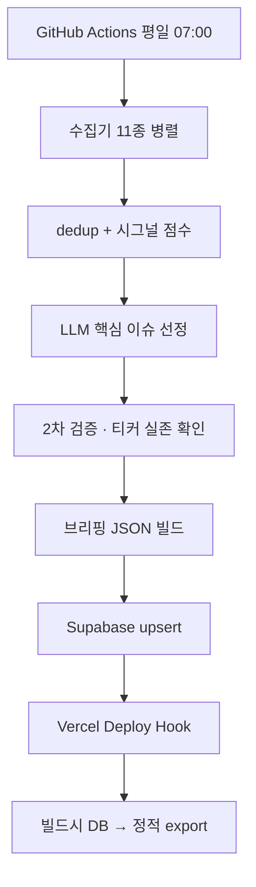

## 제품 소개

평일 아침 7시에 혼자 돌아가는 파이프라인이 하나 있어요. 밤사이 올라온 DART 공시, SEC EDGAR 8-K·Form 4, 미국 정부 조달 계약, FDA 승인, 의회 의원 주식 거래, 보도자료 와이어 같은 걸 한꺼번에 긁어서 중복을 걸러내고, 점수를 매기고, 그중 진짜 촉매가 있는 것만 남겨서 종목 카드로 만듭니다. 결과는 웹 한 페이지에 올라가고 디스코드로 알림이 날아와요.

핵심은 "뉴스 리더"가 아니라는 겁니다. 기사를 나열하지 않아요. 오늘 사건이 붙은 종목이 국내 몇 개, 해외 몇 개 — 그게 전부예요. 왜 이 종목인지, 촉매가 뭔지, 확신도는 어느 정도인지가 카드 한 장에 들어갑니다. 강한 촉매가 없는 날은 억지로 채우지 않고 화면을 비웁니다. "오늘은 강한 촉매가 있는 종목이 없어요"라고 쓰고 관찰 목록만 보여줘요.

여기에 추천한 종목의 성적을 계속 추적하는 실적 탭, 사건과 무관하게 전 상장종목을 재무 지표로 훑는 발굴 탭이 붙어 있습니다. 하루 한 번 돌고 끝나는 배치라서 장중 알림도, 실시간 시세도, 자동 매매도 없어요.

## 화면

### 국내

**파일** ./screens/01-domestic.png
**설명** 오늘 촉매가 붙은 국내 종목을 순위로 훑는다

### 해외

**파일** ./screens/02-foreign.png
**설명** 같은 형식으로 미국 종목과 관련 ETF를 본다

### 실적

**파일** ./screens/03-picks.png
**설명** 지난 픽의 진입가 대비 수익률이 날짜별로 쌓인다

### 발굴

**파일** ./screens/04-discovery.png
**설명** 사건 없이 재무만 보고 뽑은 종목을 점수순으로 본다

## 기획

**문제** 아침마다 DART 열고, 한경 열고, 야후 파이낸스 열고, 텔레그램 채널 훑고 — 앱 대여섯 개를 돌아야 오늘 뭐가 있었는지 알 수 있었어요
**사용자** 본인 한 명. 출근길 지하철에서 3분, 폰으로 훑어요
**넣지 않은 것** 자동 매매. 시그널 품질이 검증 안 된 상태에서 주문까지 자동으로 내보내는 건 동전 던지기라서요
**넣지 않은 것** 장중 실시간 폴링. 아침 배치 브리핑이 본질이고, 속보 도구가 되면 하루 종일 화면을 보게 돼요
**넣지 않은 것** 로그인·계정. 배포된 페이지는 누구나 읽을 수 있지만 읽기 전용이고, 개인화는 없어요
**제약** LLM 비용 0원. 이미 구독 중인 Claude Max 플랜 할당량 안에서만 해결하기로 했어요

## 구상

- [x] 관심 종목을 정해두지 않고 전체 시장 공시를 훑어 점수 높은 것만 남긴다
- [x] 모르는 용어에 해설이 자동으로 붙어서 검색 없이 읽힌다
- [ ] 아침 6시에 카카오톡으로 브리핑이 온다
- [ ] 주 1회 뜨는 테마와 수혜 섹터를 리포트로 받는다
- [ ] 인포스탁 테마주 분류를 긁어 밸류체인 매핑 DB를 만든다

## 유저 플로우

### 아침에 알림을 받는다

평일 7시에 디스코드로 요약이 옵니다. 링크를 누르면 그날 브리핑으로 바로 들어가요.

### 오늘 픽이 있는지 본다

국내 탭이 먼저 열립니다. 촉매가 붙은 종목이 순위로 깔려 있어요.

**갈라짐** 픽이 있다 → 카드를 훑는다 / 0개다 → 관찰 목록과 낙수효과 레이어만 본다

### 카드를 펼쳐 확인한다

TradingView 차트가 아코디언으로 열리고, 토스증권·증권플러스·네이버증권 딥링크가 붙어요. 주문 화면까지만 데려다주고 체결은 손으로 합니다.

### 지난 픽 성적을 확인한다

실적 탭에서 그동안 추천한 종목의 진입가 대비 수익률이 날짜별로 쌓여 있어요.

## 개발 과정

### 1. 앱 대여섯 개를 돌던 걸 하나로 줄이고 싶었어요

처음 만든 건 아주 단순했어요. DART 공시 목록 API 를 긁고, 경제 뉴스 RSS 를 받고, 공시 유형별로 점수표를 만들어 점수 높은 것만 남기고, 카카오톡 "나에게 보내기"로 쏘는 것. 중복 알림을 막으려고 SQLite 에 본 항목을 기록하고, LLM 요약은 같은 걸 두 번 부르지 않도록 캐시 테이블을 뒀습니다. 맥북 launchd 에 6시로 걸어두고 끝.

LLM 을 어떻게 부를지가 첫 갈림길이었어요. Anthropic Python SDK 를 쓰면 API 과금이 붙는데, 이미 Max 플랜을 구독 중이었거든요. `claude -p` CLI 를 서브프로세스로 부르면 Max 할당량으로 청구된다는 걸 확인하고 그쪽으로 갔습니다. 그 뒤로 "`ANTHROPIC_API_KEY` 를 절대 설정하지 않는다"가 이 프로젝트의 규칙이 됐어요. 있으면 CLI 가 조용히 API 과금 모드로 넘어가거든요.

**붙인 것** DART Open API, Claude Code CLI, SQLite, launchd

### 2. 카톡 4KB 벽에 부딪혀서 웹으로 넘어갔어요

카카오톡 메시지는 4KB 제한이 있어요. 공시 열 몇 건에 요약을 붙이면 금방 넘습니다. 잘라 보내자니 정작 중요한 게 잘리고요. 그래서 카톡은 "요약 세 줄 + 링크"로 줄이고, 본문은 웹 페이지로 옮겼습니다. Next.js 정적 export 로 짓고 Vercel 에 올렸어요. 파이프라인은 브리핑 JSON 하나를 뱉고, 프론트는 그걸 읽기만 합니다.

그러고 나니 카톡을 유지할 이유가 사라졌어요. 알림은 링크 한 줄이면 되는데 access_token 이 두 달마다 만료돼서 OAuth 를 다시 태워야 했거든요. 디스코드 웹훅으로 갈아탔습니다. URL 하나면 끝이고 만료가 없어요. 카톡 모듈은 지우지 않고 남겨뒀는데, 지금 파이프라인은 디스코드로만 쏩니다.

여기서 용어 해설이 부가 기능에서 핵심 기능으로 올라갔어요. "전환사채 발행"이 무슨 신호인지 모르면 브리핑을 읽어도 남는 게 없거든요. 본문에 등장하는 용어를 감지해서 밑줄을 긋고, 누르면 팝오버로 설명이 뜨게 했습니다. 시드 사전에 없는 단어는 LLM 이 채워서 DB 에 쌓아둬요.

UI 는 처음에 흔한 대시보드 스타일로 뽑았다가 통째로 버렸습니다. 뱃지랑 컬러 스트립이랑 보더로 중요도를 표현하니까 화면이 시끄럽기만 하고 정작 뭐가 중요한지 안 보였어요. 토스 앱을 뜯어보면서 규칙을 다시 잡았어요 — 위계는 타이포로만, 색은 점 하나로, 카드에 보더·그림자 금지, 카피는 "~요" 말투로. 그 규칙을 문서에 박아두고 이후 모든 컴포넌트에 적용했습니다.

**붙인 것** Next.js, Tailwind CSS, Vercel, Discord, PWA

### 3. 탭 구조를 세 번 갈아엎고 결국 다 지웠어요

처음엔 시사·경제 2탭이었어요. 그러다 아침에 종목만 빠르게 스캔하고 싶어서 "Today's Pick" 탭을 따로 냈고, 며칠 써보니 종목을 경제 맥락과 같이 보고 싶어져서 다시 경제 탭 안 섹션으로 격하시켰어요. 그 자리에 AI 뉴스 탭을 새로 넣고 기본 진입 탭으로 만들었고요.

그렇게 몇 주를 굴리다 깨달은 게, 저는 시사도 AI 뉴스도 거의 안 읽고 종목 카드만 본다는 거였어요. 나머지는 스크롤로 지나치는 노이즈였습니다. 그래서 뉴스 표시를 파이프라인 JSON 과 UI 양쪽에서 통째로 걷어냈어요. 뉴스 수집은 남겨뒀는데, 표시용이 아니라 종목을 추론하는 보조 입력으로만 씁니다. 탭은 국내·해외·실적·발굴이 됐고요. 결정 로그에 이 변천사를 전부 남겨뒀는데, 지금 보면 "무엇을 지웠나"가 무엇을 붙였나보다 더 많은 걸 말해주네요.

### 4. 소극적인 분석을 버리고 방향을 말하게 했어요

초기 방침은 "추천 금지, 시그널만 띄운다"였어요. 근데 실제로 읽어보니 "일반적으로 이런 공시는 긍정적으로 해석됩니다" 수준의 하나 마나 한 문장만 나오더라고요. 포털 앱에서 보는 거랑 다를 게 없었어요. 어차피 혼자 쓰는 시스템이고 외부 배포도 없으니, 방향성 있는 판단을 내놓게 방침을 뒤집었습니다. 매수·매도 방향, 촉매 강도 등급, 관련 ETF까지 말하게 했어요.

그랬더니 바로 다음 문제가 왔어요. LLM 이 없는 종목을 지어내기 시작한 겁니다. 그럴듯한 티커에 그럴듯한 촉매를 붙여서요. 그래서 픽이 나온 뒤에 2차 검증 단계를 하나 더 뒀습니다. 이슈 단위로 "이 촉매가 근거 공시에 실제로 있나"를 먼저 확인해서 날조된 촉매는 이슈째 버리고, 남은 픽마다 종목과 공시 주체가 맞물리는지 대조해요. 티커 실존은 yfinance 와 자체 DB 로 확인하는데, 확인 실패를 곧바로 탈락시키진 않습니다 — 네트워크 한 번 튀었다고 멀쩡한 종목을 잃으면 안 되니까 `review` 플래그만 달고 화면에 사유를 노출해요.

그리고 품질 게이트를 세게 걸었어요. 약한 촉매로 머릿수를 채우느니 0개가 낫다는 쪽으로요. 대신 0개인 날이 너무 허전해서 관찰 목록과 낙수효과 레이어를 따로 만들었습니다. 횡령·감자 같은 강한 악재가 경쟁사에는 반사이익이 되는데, 이건 2·3차 추론이라 정식 픽과 섞으면 안 되거든요. 낮은 확신도 보조 레이어로 분리하고 성과 채점에서도 빼뒀습니다.

한동안 굴려보니 국내 픽이 코스닥 초소형주로 쏠리는 게 눈에 띄었어요. 점수가 제목 키워드만 보고 시총을 안 보니까, 시총 300억짜리 회사의 50억 계약이 대형주 공시보다 위로 올라오더라고요. 이미 매일 받고 있던 KRX 시세 스냅샷에 시가총액이 들어 있어서, 추가 호출 없이 후보 풀 진입 전에 3,000억 미만을 걸러냅니다. KRX 수집이 실패해 맵이 비면 게이트를 아예 적용하지 않아요 — 국내 픽이 굶는 쪽이 더 나쁘니까요.

**붙인 것** yfinance

### 5. 촉매만 쫓다 보니 조용히 좋은 회사를 못 봤어요

파이프라인 전체가 이벤트 구동이었어요. 공시나 뉴스가 떠야만 후보 풀에 들어옵니다. 그러니까 "무언가 발생한" 종목만 잡히고, 사건은 없는데 재무가 조용히 좋은 회사는 영영 안 걸려요. 단발성 호재만 쫓고 있다는 걸 몇 주 만에 알았습니다.

그래서 촉매와 완전히 분리된 발굴 트랙을 새로 팠어요. 고정 유니버스를 잡고, 가치·퀄리티·성장 팩터를 유니버스 내 백분위로 만들어 가중 합성합니다. 이 랭킹 자체는 LLM 없이 결정론적이라 단위 테스트가 가능해요. 그 위에 LLM 심층 리서치를 얹어서 thesis 와 "왜 아직 발굴되지 않았나"를 씁니다. 수백 종목 재무 수집이라 무거워서 자동 스케줄에 안 넣고, 손으로 `screen` 을 돌릴 때만 갱신되게 했어요.

처음 만든 유니버스가 S&P500 + 나스닥100 에 코스피 시총 상위 85개 하드코딩이었는데, 돌릴 때마다 삼성전자·SK하이닉스가 상위권에 뜨더라고요. 발굴하겠다면서 이미 다 아는 대형주 닫힌 집합을 평가하고 있었던 겁니다. 그래서 유니버스를 NASDAQ Trader 심볼 디렉토리 전체와 KIND 상장회사 목록 전체로 갈아치웠어요. 미국 5,600개, 국내 2,600개. 대형주를 빼진 않았습니다 — 밸류에이션이 안 싸면 랭킹에서 알아서 밀리니까요.

**붙인 것** yfinance, NASDAQ Trader, KIND

### 6. 로컬 맥에 묶인 게 결국 발목을 잡았어요

여기까지 데이터가 전부 로컬 SQLite 와 `frontend/public/` 정적 파일에 있었어요. 그런데 매일 아침 cleanup 이 "오늘 것"만 남기고 과거 파일을 지우니까 달력에서 지난 브리핑이 사라졌고, 성과 탭은 DB 에서 읽어 누적되니까 둘이 날짜가 안 맞았습니다. 게다가 머신을 두 대 쓰기 시작하면서 어느 맥에서 생성했느냐에 따라 데이터가 갈렸어요.

그래서 Supabase 를 단일 원본으로 못박았습니다. 어느 머신에서 돌리든 DB 에 upsert 하고, 로컬 파일은 DB 에서 파생된 캐시로 격하했어요. Vercel 은 빌드할 때 prebuild 스크립트로 DB 에서 직접 끌어와 자기 정적 파일을 만듭니다. 그러니까 데이터를 git 에 커밋할 필요가 없어졌고, 파이프라인은 DB 에 쓴 다음 Deploy Hook 으로 POST 한 번만 던지면 돼요. 런타임 DB 의존이 없으니 anon key 노출이나 RLS 설계도 필요 없고요.

그다음엔 실행 자체를 옮겼습니다. launchd 로 돌리니까 맥북 전원·절전 상태에 종속돼서, DB 를 세어보니 평일 60일 중 22일이 결번이었어요. 실행률 63%. 2주 가까이 연속으로 빈 구간도 있었습니다. GitHub Actions 로 옮기면서 Max 플랜 할당량은 그대로 유지했어요 — `claude setup-token` 으로 발급한 OAuth 토큰을 시크릿에 넣고 러너에서 CLI 를 돌립니다. `.env` 는 dotenvx 로 암호화해서 저장소에 커밋해뒀기 때문에 시크릿은 복호화 개인키 하나면 끝이에요. 주말은 아예 안 돌립니다. 장이 안 열리는 날 종목 전용 화면에 보여줄 게 없거든요.

**붙인 것** Supabase, GitHub Actions, dotenvx

## 데이터와 API

### DART 전자공시

**제공처** 금융감독원 전자공시시스템
**링크** https://opendart.fss.or.kr/api/list.json
**방식** REST API, 하루 1회 배치. 종목 지정 없이 전체 시장 공시 목록을 받는다
**적재** 룩백 3일 윈도우로 받아 `seen` 테이블 dedup 후 신규분만 점수 산정
**갱신** 매 실행마다 새로 조회. 국내 픽의 유일한 직접 촉매 소스다
**주의** 아침 6~7시엔 당일 공시가 거의 없어 직전 거래일을 포함시키는 룩백이 필수. 룩백 3일이면 공시가 2,000건대로 쌓인다(실측 2,179건). `.env` 값에 따옴표를 붙이면 인증키 오류가 난다

### SEC EDGAR

**제공처** 미국 증권거래위원회
**링크** https://www.sec.gov/cgi-bin/browse-edgar
**방식** Atom 피드. 8-K, Form 4, 13F 를 각각 최신 N건 롤링으로 받는다
**갱신** 매 실행마다 최신분 조회
**주의** User-Agent 에 실명과 이메일을 넣어야 한다. 없으면 수집을 통째로 스킵하게 막아뒀다. `getcurrent` 액션이라야 전체 피드가 온다

### KRX Open API

**제공처** 한국거래소
**링크** https://openapi.krx.co.kr (엔드포인트 `data-dbg.krx.co.kr/svc/apis/sto`)
**방식** REST API, `AUTH_KEY` 헤더 인증. 유가증권·코스닥 전종목 일별 시세·거래대금
**적재** 확정된 과거 거래일은 `data/krx_cache/{날짜}.json` 로 영구 캐시
**갱신** 매일 신규 거래일 하나만 새로 받는다
**주의** 전종목 응답이 요청당 26~30초 걸려 타임아웃을 90초로 올렸다. 투자자별 순매수·공매도 잔고는 이 API 범위 밖이라 미제공으로 확정. `data.krx.co.kr` 내부 JSON 은 세션 인증 벽이고, 네이버 금융 시세는 robots.txt 가 일반 UA 에 `Disallow: /` 라 둘 다 배제했다

### USAspending

**제공처** 미국 연방정부 조달 데이터
**링크** https://api.usaspending.gov/api/v2
**방식** REST API. 정부 계약 수주를 선행 지표로 쓴다
**주의** 실패해도 파이프라인이 멈추지 않게 개별 try 로 감쌌다

### openFDA

**제공처** 미국 식품의약국
**링크** https://api.fda.gov/drug/drugsfda.json
**방식** REST API. 신약 승인 이벤트

### Senate Stock Watcher

**제공처** 커뮤니티가 관리하는 상원의원 주식 거래 공시 데이터셋
**링크** https://github.com/timothycarambat/senate-stock-watcher-data
**방식** GitHub raw JSON 전량 다운로드

### 보도자료 와이어

**제공처** GlobeNewswire, PR Newswire, Business Wire
**방식** RSS. 기업 발표 원문을 언론 필터 전에 받는다

### 네이버 금융 리서치

**제공처** 네이버 금융 증권사 리포트
**링크** https://finance.naver.com
**방식** 크롤링, 하루 ~90건
**주의** 등급 변경은 이미 주가에 반영된 늦은 신호라 국내 픽 직접 입력에서 뺐다. 수집과 표시만 유지한다

### yfinance

**제공처** Yahoo Finance
**방식** 라이브러리. 발굴 트랙 재무 수집, 픽 진입가·현재가, 티커 실존 확인
**주의** 수천 종목을 한 번에 긁으면 레이트리밋에 걸린다. `ThreadPoolExecutor(8)` 병렬 + 백오프로 대응. 정상 종목도 자주 실패해서 "없는 티커"와 "확인 불가"를 구분하지 못한다 — 확인 실패를 탈락 근거로 쓰지 않는 이유다

### Claude Code CLI

**제공처** Anthropic
**방식** `subprocess.run(["claude", "-p", ...])`. 요약·번역·핵심 이슈 선정·픽 검증·발굴 리서치·낙수효과 추론
**주의** Max 플랜 할당량으로 청구된다. `ANTHROPIC_API_KEY` 가 환경에 있으면 조용히 API 과금으로 넘어가므로 절대 설정하지 않는다. 응답은 `llm_cache` 테이블에 캐시

### Supabase

**제공처** Supabase
**방식** REST API (supabase-py). 브리핑·픽 원장·용어 사전·seen·캐시 전부
**적재** SQLite 에서 마이그레이션. 처음엔 psycopg2 직결이었다가 REST 로 전환
**갱신** 어느 머신에서 실행하든 upsert. 배포는 빌드시 여기서 정적 파일을 뽑는다

## 구조

### GitHub Actions 평일 07:00

`cron: '0 22 * * 0-4'` 로 UTC 전날 22시에 뜹니다. 실측 실행 시간이 6~9분이라 타임아웃은 30분, 같은 날짜를 두 프로세스가 건드리지 않도록 concurrency 그룹을 걸어뒀어요.

### 수집기 11종 병렬

DART·RSS·EDGAR·거시지표·리서치·KRX ETF·급상승·정부계약·내부자 클러스터·13F·의회거래·FDA·와이어. 각각 try 로 감싸서 하나가 죽어도 나머지가 계속 갑니다.

### dedup + 시그널 점수

`(source, ext_id)` 쌍을 DB 와 배치 대조해 처음 보는 것만 남깁니다. dry-run 일 땐 seen 을 기록하지 않아요 — 기록하면 재실행 때 방금 본 걸 전부 걸러내서 풀이 굶습니다.

### LLM 핵심 이슈 선정

국내와 해외를 동시에 두 호출로 던집니다. 촉매 후보 풀을 티어별 점수 하한으로 거른 뒤 Top N 종목을 뽑게 해요.

### 2차 검증 · 티커 실존 확인

촉매가 근거 공시에 실제로 있는지 이슈 단위로 그라운딩하고, 종목과 공시 주체를 대조합니다. 실패해도 원본 픽을 보존해서 파이프라인이 멈추지 않아요.

### 브리핑 JSON 빌드

픽·관찰·급상승·용어 맵을 한 덩어리 JSON 으로 만듭니다. 프론트가 읽는 유일한 형식이에요.

### Supabase upsert

날짜별 브리핑 행과 픽 원장을 씁니다. 여기가 단일 원본이고, cleanup 은 이 테이블을 건드리지 않아 사실상 무기한 누적돼요.

### Vercel Deploy Hook

DB 에 쓴 뒤 POST 한 번. 어느 머신에서 생성하든 신호만 보내면 배포본이 최신화됩니다.

### 빌드시 DB → 정적 export

prebuild 스크립트가 Supabase 에서 끌어와 `public/` 정적 파일을 만들고, Next.js 가 static export 로 굽습니다. 런타임 DB 의존이 없어요.

## 시행착오

### Vercel 배포 설정이 네 번 뒤집혔어요

**증상** 프론트를 `frontend/` 서브디렉터리에 두고 Vercel rootDirectory 를 거기로 잡았는데, 빌드는 성공하는데 페이지가 404 로 뜨거나 API rewrite 가 먹지 않았어요. 고칠 때마다 다른 쪽이 깨졌습니다.

**시도** 먼저 `output: 'export'` 를 빼고 서버 렌더로 돌렸어요. 그랬더니 배포는 되는데 정적 호스팅 전제가 무너져서 되돌렸고, 루트 `vercel.json` 에 outputDirectory 를 넣었더니 rootDirectory 기준이 아니라 저장소 루트 기준으로 잡혀서 또 안 맞았어요. `frontend/vercel.json` 을 따로 만들어봤는데 이번엔 루트 설정과 둘 다 살아 있어서 어느 쪽이 이기는지가 불투명했습니다.

**결론** rootDirectory 를 `frontend` 로 두면 Vercel 이 그 디렉터리를 프로젝트 루트로 취급한다는 걸 확인하고, 설정을 `frontend/vercel.json` 한 곳으로 몰았어요. `outputDirectory: "out"` 은 rootDirectory 기준 상대경로고, 시세 프록시 rewrite 도 여기로 옮겼습니다. 루트 `vercel.json` 에는 서비스워커 캐시 헤더만 남겼어요. 나중에 로컬 `next dev` 에서 rewrite 가 안 먹는 문제가 또 나와서 `next.config.mjs` 에 dev 전용 rewrite 를 따로 넣어 패리티를 맞췄습니다.

### 해외 픽 수익률이 전부 0% 로 찍혔어요

**증상** 실적 탭에서 어제 추천한 해외 종목의 수익률이 하나도 빠짐없이 0.00% 였어요. 며칠을 봐도 어제 자만 0 이고 그저께부터는 정상이었습니다.

**시도** 처음엔 시세 조회가 실패해서 정적 값에 묶인 줄 알았어요. 실제로 로컬 `next dev` 에서 시세 프록시 rewrite 가 `vercel.json` 에만 있어 적용되지 않는 문제가 하나 있었고, 그걸 고쳤는데도 0% 가 그대로였습니다.

**결론** 원인이 두 개 겹쳐 있었어요. 진짜 원인은 진입 기준가를 **추천일 당일 종가**로 잡은 거였습니다. 현재가도 최신 종가라서, 다음 세션이 닫히기 전까지 둘이 같은 값이 되어 첫날은 무조건 0% 가 나왔어요. 추천은 한국 아침 — 미국장 개장 전에 나오니까, 그 시점에 알 수 있는 마지막 가격인 **직전 거래일 종가**가 실제 진입가입니다. `fetch_prev_close` 로 정의를 바꾸고, 주말·휴장은 추천일 exclusive 로 두고 마지막 행을 취해 자동 보정했어요.

### 달력에서 과거 브리핑이 통째로 사라졌어요

**증상** 달력을 열면 오늘 날짜만 있고 지난 브리핑이 전부 비어 있었어요. 그런데 실적 탭의 픽 히스토리는 멀쩡히 누적돼 있었습니다.

**시도** 처음엔 달력 컴포넌트의 날짜 필터 버그를 의심했어요. 보존 일수 상수가 여기저기 다른 값으로 흩어져 있길래 그걸 맞춰봤는데, 며칠 지나니 또 비었습니다.

**결론** 구조 문제였어요. 프론트는 `frontend/public/` 정적 JSON 만 읽는데 매일 아침 cleanup 이 "오늘 것"만 남기고 로컬 브리핑 파일을 지우고 있었습니다. 픽 히스토리는 Supabase 에서 읽어서 살아남았던 거고요. 게다가 머신을 두 대 쓰기 시작하면서 어느 맥에서 생성했느냐에 따라 파일이 갈렸어요. Supabase 를 단일 원본으로 못박고, 로컬 파일은 DB 파생 캐시로 격하하고, 배포는 빌드시 DB 에서 직접 끌어오게 바꿨습니다. 보존 일수도 90일로 한 군데서만 정의하게 일원화했어요.

### LLM 이 자꾸 타임아웃 나서 무작정 시간을 올렸어요

**증상** 핵심 이슈 선정 단계에서 `claude` CLI 호출이 자주 죽었어요. 60초로 잡았는데 안 되길래 120초, 그래도 안 되길래 180초, 300초까지 올렸습니다.

**시도** 타임아웃을 올리는 동시에 입력을 줄였어요. 해외 후보를 60건에서 30건, 다시 15건까지 깎았습니다. 그랬더니 타임아웃은 줄었는데 후보 풀이 너무 얕아져서 LLM 이 뽑을 게 없었어요. 항목마다 요약 호출을 한 번씩 던지던 것도 누적 시간을 크게 잡아먹고 있었고요.

**결론** 방향을 두 번 틀었어요. 첫째로 건별 호출을 배치 처리로 바꿨습니다 — `summarize_batch`, `translate_batch` 로 여러 건을 한 번에 넘기니 호출 수가 급감했어요. 둘째로 국내·해외를 순차가 아니라 병렬로 던졌습니다. 통제 측정해보니 동시 2개도 각각 ~110초로 단독 실행(~136초)과 비슷했어요. 처리량 경합이 이 규모에선 안 일어난다는 뜻이라 병렬이 순차(합 ~250초)보다 확실히 빨랐습니다. 결국 과거 타임아웃은 병렬 탓이 아니라 일시적 서버 지연과 thinking 변동성이었고, 방어책은 타임아웃 420초 한 줄로 정리했어요. 입력을 15건까지 깎았던 것도 되돌렸습니다.

### 발굴 유니버스가 설계 문서를 배신하고 있었어요

**증상** 발굴 스크린을 돌릴 때마다 삼성전자·SK하이닉스 같은 이미 다 아는 대형주가 계속 상위권에 떴어요. "발굴되지 않은 회사를 찾는다"는 목적과 정반대 결과였습니다.

**시도** 처음엔 팩터 가중치 문제로 봤어요. 밸류에이션 가중을 올리고 시총 페널티를 넣어보면 대형주가 밀려나겠거니 했죠. 조금 바뀌긴 했는데 여전히 이름 아는 회사들만 나왔습니다.

**결론** 랭킹이 아니라 유니버스가 문제였어요. 설계 문서엔 "발굴은 고정 유니버스가 본질"이라고 써놨는데, 실제 구현은 S&P500 + 나스닥100 에 코스피 시총 상위 85종목 하드코딩이었습니다. 애초에 평가 대상 풀이 닫힌 대형주 집합이라 중소형주가 들어올 여지가 없었던 거예요. 문서와 구현이 어긋난 걸 몇 주 동안 못 본 셈입니다. 미국은 NASDAQ Trader 심볼 디렉토리 전체(약 5,600), 국내는 KIND 상장회사 목록 전체(약 2,600)로 교체했어요. `pykrx` 도 검토했는데 최신 버전이 KRX 로그인을 요구해서 접었고, KIND 다운로드 엔드포인트는 로그인 없이 열려 있어 그쪽을 썼습니다. 랭킹 로직은 한 줄도 안 바꿨어요 — 소스만 넓히면 되는 문제였으니까요.

### 국내 후보가 관측 기간 내내 굶었어요

**증상** 국내 픽이 거의 매일 0~1개였어요. 해외는 정상인데 국내만요. 처음엔 "한국 시장에 촉매가 없는 날이 많나 보다" 하고 넘겼습니다.

**시도** 품질 게이트가 너무 센 줄 알고 하한을 만져볼까 했어요. 그런데 게이트를 낮추면 이번엔 분기보고서 같은 정기 공시가 실제 촉매를 밀어낼 게 뻔했습니다. 그래서 로그를 날짜별로 세어봤어요.

**결론** 로그를 보니 국내 Tier2·Tier3 후보가 0 이 아닌 날이 하루도 없었어요. 그런데 LLM 에는 후보 2건만 넘어가고 있었습니다. 후보 풀 빌더가 `score_floor=75` 를 전 티어에 공통 적용하는데, 오케스트레이터가 국내 뉴스에 40점을 고정 부여하고 있었어요. 한경·매경·연합이 100% 탈락하고 있었던 겁니다. 애초에 범주 오류였어요 — Tier1(공시·리서치)은 내용 기반 점수(45~95)고 Tier2·3(뉴스)은 소스 신뢰도를 환산한 점수(42~65)라 척도가 다른데 하나의 하한을 씌운 거죠. 하한을 `tier1_floor` / `tier23_floor` 로 쪼개고(국내 75/40), 국내 뉴스 점수도 소스별로 나눴어요(한경·매경·연합 50, Google News 42). Tier1 하한 75 는 그대로 둬서 정기 공시가 밀고 들어오는 건 계속 막습니다. 이 하한이 다시 무너지지 않게 회귀 테스트를 붙였어요.

### 아침 브리핑이 두 주 가까이 통째로 비었어요

**증상** 어느 날 달력을 보니 7월 중순부터 2주간 브리핑이 하나도 없었어요. 코드는 멀쩡했고 손으로 돌리면 잘 돌았습니다.

**시도** 처음엔 `launchd` 스케줄 설정을 의심했어요. `pmset repeat wakeorpoweron` 으로 평일 아침 자동 wake 를 걸고, plist 에 `caffeinate` 와 PATH 고정을 추가했습니다. `claude` 실행 파일을 PATH 에서 못 찾아 조용히 빈 브리핑이 만들어지는 사고도 있어서, 파이프라인 시작 시점에 preflight 체크를 넣어 크게 로그를 남기게 했고요.

**결론** 고쳐도 결번이 계속 났어요. Supabase 기록을 세어보니 6~8월 평일 약 60일 중 22일이 비어 실행률이 63% 였습니다. 맥북을 닫아두거나 여행을 가면 그날은 그냥 없는 거였어요 — 로컬 스케줄러로 푸는 문제가 아니었습니다. GitHub Actions 로 옮겼어요. 이미 데이터 원본이 Supabase 이고 배포도 Deploy Hook 이라 러너가 저장소에 쓸 일이 없어서, 실행 환경만 갈아끼우는 낮은 위험의 변경이었습니다. Max 플랜은 `claude setup-token` OAuth 토큰으로 유지했고, `.env` 는 이미 dotenvx 암호화본이라 시크릿은 복호화 개인키 하나로 끝났어요. launchd plist 는 지우지 않고 로컬 수동 실행 경로로 남겨뒀습니다.

## 남은 것

- 공시 본문 분석 — 지금은 제목 키워드로만 점수를 매긴다. 본문에서 금액·지분율 같은 숫자를 뽑는 설계는 끝냈는데 아직 구현 전이다
- 시그널 점수 백테스트 — 점수표가 "일반적 해석" 기반 휴리스틱이라 실제 알파가 있는지 검증된 적이 없다. 자동 매매를 재검토하려면 이게 선결 조건이다
- 국내 촉매 소스가 DART 하나뿐이다. 해외는 EDGAR·정부계약·FDA·와이어로 다변화됐는데 국내는 대안이 마땅치 않다
- 발굴 트랙이 온디맨드라 손으로 돌려야 갱신된다. 수천 종목 재무 수집이 무거워서 자동 스케줄에 못 넣었다
