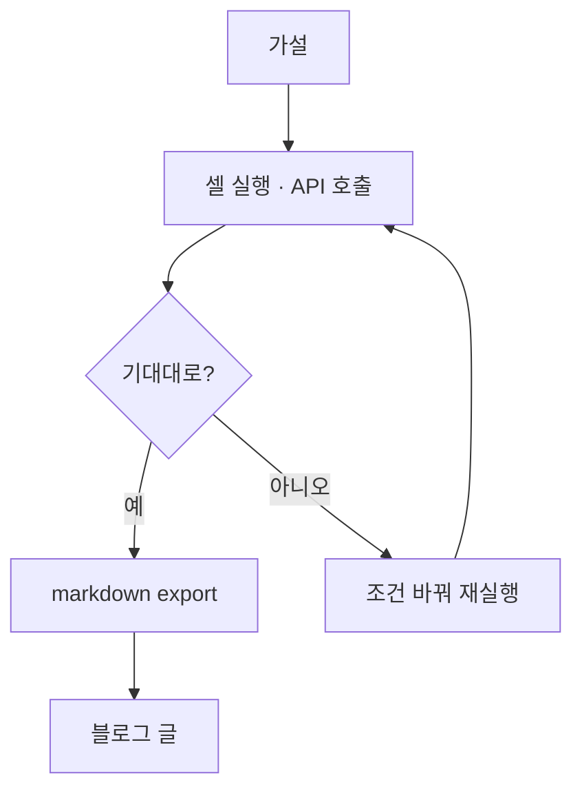

## 제품 소개

"이거 된다"와 "스펙에 된다고 적혀 있다"는 다른 문장이다. 그 간극을 줄이려고 만들었다.

Claude Routines 로 뭘 할 수 있는지 알아보려는데, 문서만으로는 경계가 안 보였다. 되는 줄
알았던 게 안 되고, 안 될 줄 알았던 게 됐다. 그래서 가설을 하나씩 때려보는 작업장을 차렸다.

주피터 같은 셀 구조다. 셀 하나가 가설 하나다. Routines 설정을 바꿔 가며 API 를 직접
호출하고, 결과를 그 자리에 남긴다. 통과한 셀만 markdown 으로 빼낸다. 노트북은 지저분해도
되고, 글은 깨끗해야 한다. 더러운 작업은 여기서 끝낸다.

## 요구사항

- [x] 셀 하나에 가설 하나
- [x] 설정을 바꿔 가며 API 를 직접 호출
- [x] 실행 결과를 셀 자리에 그대로 남김
- [x] 통과한 셀만 markdown 으로 추출
- [x] 검증 안 된 내용은 글로 옮기지 않음

## 구조

### 가설을 셀로 적는다

무엇이 될 거라고 생각하는지 먼저 적는다. 적지 않으면 결과를 보고 말을 바꾸게 된다.

### 실행하고 결과를 남긴다

Routines 설정을 바꿔 가며 Anthropic API 를 직접 호출한다. 응답을 셀 자리에 그대로 붙인다.

### 통과한 것만 빼낸다

기대대로 나온 셀만 markdown 으로 추출한다. 어긋나면 조건을 바꿔 다시 돌린다.

## 남은 것

- 여기서 통과한 패턴이 블로그의 Routines 글이 된다. 그 연결이 아직 수동이다
- 스펙과 현실이 또 어긋나면 셀을 하나 더 추가하는 게 전부다. 회귀 검사가 없다
