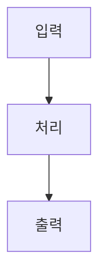

# 포트폴리오 원고 작성

이 레포의 프로젝트를 블로그 실험실(`/lab`)에 올릴 원고 한 장으로 정리한다.
결과물은 레포 루트의 `portfolio.md` 파일 하나다. 사용자가 그 파일을 블로그 레포로
옮겨 적재한다. 이 세션은 파일을 만드는 데까지만 책임진다.

## 절차

1. **레포를 읽는다** — README, 매니페스트(`package.json` 등), 진입점, 디렉터리 구조.
   이 프로젝트가 무엇을 하는 물건인지 먼저 잡는다.
2. **근거를 모은다** — `git log --oneline -100`, 되돌린 커밋, 이슈, 이 세션의 메모리.
   특히 시행착오는 여기서만 나온다.
3. **초안을 쓴다** — 아래 템플릿을 그대로 채운다.
4. **`portfolio.md` 로 저장한다.**
5. **보고한다** — 채우지 못한 필드와 그 이유를 목록으로 알린다.

## 출력 형식

프런트매터 + 본문 마크다운. 파일명은 `portfolio.md`.

```yaml
---
slug: mcp-probe            # 필수. ASCII 소문자 케밥. 블로그 URL 이 된다
name: MCP Probe            # 필수. 카드에 뜨는 이름
tagline: MCP 서버를 붙여보고 응답을 날것으로 보는 도구   # 필수. 40자 이내 한 줄
year: "2026"               # 필수. 만든 해
logo_emoji: 🔌             # 필수. 로고 이미지가 없을 때 쓰는 대체 아이콘
logo_bg: "#1F6FEB"         # 필수. 로고 타일 배경 단색
logo_file: ./logo.png      # 선택. 로고 이미지가 있으면 이모지보다 우선한다
stack: [Next.js, Cloudflare Workers, TypeScript]   # 실제로 쓴 것만
url: https://mcp-probe.pages.dev   # 스킴 포함 절대 URL. 배포 안 했으면 빈 값
host: cloudflare           # vercel | cloudflare | local | none
status: 운영중              # 운영중 | 실험중 | 중단
capture: true              # 공개 URL 자동 스크린샷 촬영을 허용하는지
---
```

`logo_bg` 는 로고나 이모지가 배경에 묻히지 않는 색으로 고른다. 밝으면 어두운 배경,
어두우면 중간 채도의 컬러가 무난하다.

### 로고 이미지

레포에 로고·아이콘 파일이 있으면 `portfolio.md` 옆에 복사해 두고 `logo_file` 에
**원고 파일 기준 상대경로**로 적는다. 블로그 쪽 적재 스크립트가 그 파일을 스토리지에
올려 카드 썸네일로 박는다. png · webp · svg · jpg 를 받는다.

- 정사각에 가까운 아이콘이 가장 잘 맞는다. 여백이 넓은 로고는 타일 안에서 작아 보인다
- 배경이 투명한 png·svg 를 우선한다. `logo_bg` 색 위에 얹히기 때문이다
- 파일이 없으면 `logo_file` 을 아예 적지 않는다. 그러면 `logo_emoji` 가 쓰인다
- 없는 파일을 적으면 적재가 실패한다. 추측 경로를 적지 않는다

## 본문 템플릿

`##` 제목은 **글자 그대로** 지킨다. 블로그 UI 가 이 제목으로 섹션을 갈라
전용 화면을 고르기 때문에, 하나라도 다르면 그 섹션은 밋밋한 글로 떨어진다.
해당하는 내용이 없는 섹션은 통째로 뺀다 — 빈 제목만 남기지 않는다.

````markdown
## 제품 소개

뭐 하는 물건인지. 처음 보는 사람 기준으로 2~3 문단.
기능을 나열하지 말고, 무엇을 대신해 주는 물건인지를 쓴다.

## 요구사항

- [x] 완료한 것은 체크
- [x] 항목당 한 줄, 명사가 아니라 동작으로
- [ ] 아직 못 한 것은 빈 체크

## 기술 선정

| 기술 | 고른 이유 |
| --- | --- |
| Next.js | 어드민이 동적 화면이라 정적 생성만으로는 부족했다 |
| Supabase | 폰에서 요청하려면 서버 상태가 필요했다 |

실제로 쓴 것만 적는다. 후보를 늘어놓지 말고, 왜 그걸 골랐는지 한 문장으로 쓴다.
첫 열이 기술 이름이다. 순서를 바꾸지 않는다.

## 데이터와 API

### 붙인 서비스 이름

**제공처** 어디서 주는 것인지
**링크** https://…
**방식** REST API · GraphQL · 웹훅 · 파일 다운로드 중 무엇인지, 호출 주기
**적재** 초기 데이터를 어떻게 넣었는지 (API 로 긁었는지, 파일로 받아 벌크 insert 했는지)
**갱신** 이후 어떻게 최신 상태를 유지하는지
**주의** 호출 제한, 키 발급 절차, 데이터 품질 문제

### 다음 서비스 이름

**제공처** …
**방식** …

## 시연

### 장면 이름

**파일** ./demo/flow.mp4
**설명** 이 장면에서 무엇이 일어나는지 한 문장

## 구조



### 첫 단계 제목

무슨 일이 일어나는지 한두 문장.

### 다음 단계 제목

무슨 일이 일어나는지 한두 문장.

## 시행착오

### 케이스 제목 — 증상을 한 줄로

**증상** 무엇이 어떻게 잘못됐는지. 관찰된 사실만.

**시도** 먼저 뭘 해봤고 왜 안 됐는지.

**결론** 실제 원인과 최종 해법.

### 다음 케이스 제목

**증상** …

**시도** …

**결론** …

## 남은 것

- 다음에 할 작업
- 알려진 한계
````

`## 구조` 의 `### 단계` 순서는 mermaid 노드 순서와 맞춘다. 블로그에서 다이어그램이
고정된 채로 단계를 스크롤하면 해당 노드가 순서대로 켜지기 때문이다.

`## 시행착오` 의 `**증상**` `**시도**` `**결론**` 은 각각 한 문단이다. 이 세 라벨이
없으면 케이스 전체가 증상 한 덩어리로 붙는다.

## 시연 영상

**화면이 실제로 도는 걸 보여주는 짧은 영상이 글 열 줄보다 강하다.** 앱을 켜서 핵심 흐름
하나를 끝까지 수행하는 장면을 화면 녹화로 남긴다.

- 장면 하나에 흐름 하나. 10~20초. 처음부터 끝까지 한 번에
- 파일은 `portfolio.md` 옆에 두고 `**파일** ./demo/flow.mp4` 로 **상대경로**를 적는다.
  블로그 적재 스크립트가 올려서 URL 로 바꿔 준다
- mp4 · webm 을 받는다. 소리는 안 나간다 — 자막이 필요하면 녹화에 넣는다
- 커서 움직임이 보이게 찍는다. 무엇을 눌렀는지 안 보이면 흐름이 안 읽힌다
- 파일 크기 50MB 를 넘기지 않는다. 넘으면 해상도를 낮춘다
- **영상이 없으면 `## 시연` 섹션을 통째로 뺀다.** 빈 플레이어보다 없는 게 낫다

정지 이미지만 있으면 같은 자리에 `**파일** ./demo/screen.png` 로 적어도 된다.

## 데이터와 API 를 채우는 법

**이 섹션이 포트폴리오에서 가장 무겁게 읽힌다.** 화면은 누구나 만들지만, 어떤 데이터를
어디서 어떻게 가져와 붙였는지는 실제로 해본 사람만 쓸 수 있다. 읽는 사람이 이 프로젝트의
숫자를 믿을지 말지도 여기서 갈린다. 성의 없이 이름만 나열하지 않는다.

`### 이름` 아래에 `**라벨** 값` 줄을 쌓는다. 라벨은 고정이 아니다. 필요한 것만 쓴다.

**꼭 적을 것**
- 데이터를 실제로 어디서 받았는지. 공공데이터면 **어느 포털의 어느 데이터셋인지**까지
- 그 데이터셋으로 바로 갈 수 있는 링크. 포털 첫 화면이 아니라 해당 데이터 페이지
- 초기 데이터를 넣은 방법과 이후 갱신 방법을 **갈라서**. 처음엔 CSV 를 받아 벌크로 넣고
  이후 증분만 API 로 받는 식이면 그렇게 적는다. 이 구분이 실무 감각을 드러낸다
- 무료 한도, 호출 제한, 키 발급에 걸린 시간 같은 실제로 부딪힌 제약

**여기 넣는 것**
- 공공데이터·오픈API·크롤링 대상
- 결제·인증·알림 같은 외부 SaaS
- LLM API, 지도, 검색 등 호출해서 쓰는 모든 것
- 직접 만든 데이터셋이면 어떻게 모았는지

**넣지 않는 것**
- 그냥 설치한 라이브러리 (그건 `## 기술 선정`)
- 자기 서비스 내부 엔드포인트

붙인 외부 서비스가 하나도 없으면 이 섹션을 통째로 뺀다.
링크·한도·주기를 모르면 **지어내지 말고** 그 줄을 비운 뒤 보고에 적는다.

## 시행착오 선별 기준

여기가 이 원고의 핵심이다. 아무거나 넣으면 섹션이 쓰레기통이 된다.

**넣는다**
- 해결까지 **방향을 두 번 이상 튼** 문제
- 처음 생각한 원인이 틀렸던 문제
- 문서·스펙과 실제 동작이 달랐던 문제
- 되돌린 커밋(revert)이 남아 있는 문제

**뺀다**
- 오타·단순 컴파일 에러
- 한 번에 고친 버그
- 라이브러리 설치·설정 같은 정형 작업

케이스가 하나도 없으면 `## 시행착오` 섹션을 통째로 뺀다. 억지로 만들지 않는다.

## 문체

블로그 본문에 그대로 실린다. 다른 프로젝트 원고와 톤이 어긋나면 눈에 띈다.

- **짧은 호흡.** 한 문장에 한 가지만. 접속사로 문장을 잇지 않는다.
- **다체 중심.** "~했다", "~이다". 필요할 때만 "~해요"를 섞는다.
- **첫 문장은 사실 직진.** "이 프로젝트에 대해 설명하자면" 같은 도입을 쓰지 않는다.
- **번역투 금지.** "~을 통해", "~에 대한", "~되어진", "가장 ~한 것 중 하나".
- **영어권 인물명은 원표기 그대로.** 한글 음차를 쓰지 않는다.
- **한글 용어에 영어를 괄호로 병기하지 않는다.**
- 과장 금지. "혁신적인", "강력한", "완벽한" 같은 말을 쓰지 않는다.

## 지어내지 않는다

근거를 찾지 못한 필드는 비워 두고 보고에 적는다. 특히:

- `year` 를 모르면 첫 커밋 날짜에서 가져온다. 그것도 없으면 사용자에게 묻는다.
- `url` 은 실제로 배포된 주소만 적는다. 추측한 주소를 적지 않는다.
- API 링크·호출 제한·갱신 주기는 코드나 문서에서 확인한 것만 적는다. 기억으로 쓰지 않는다.
- 시행착오는 커밋·이슈·메모리에 흔적이 있는 것만 쓴다.

## 마지막 보고

파일을 저장한 뒤 이렇게 알린다.

- 채운 섹션과 각 분량
- 비워 둔 필드와 이유
- 시행착오로 넣은 케이스 수와, 후보였지만 뺀 것들
