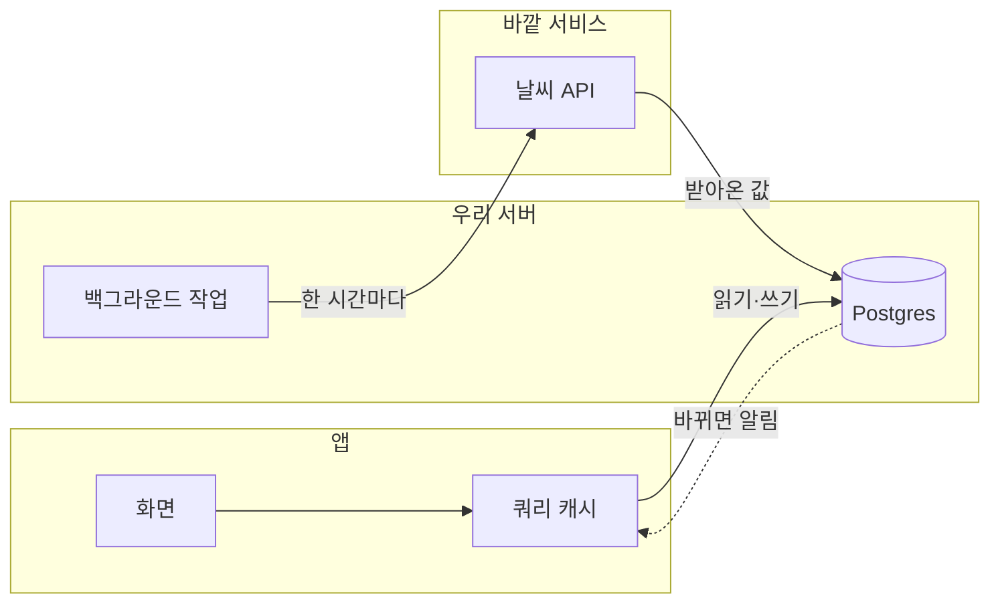

# 포트폴리오 원고 작성

이 레포의 프로젝트를 블로그 실험실(`/lab`)에 올릴 원고 한 장으로 정리한다.
이 세션은 결과물을 만드는 데까지만 책임진다. 적재는 사용자가 블로그 레포에서 한다.

## 결과물은 한 폴더에

**레포 루트의 `portfolio/` 폴더 하나가 결과물 전부다.** 사용자가 그 폴더를 통째로
집어 옮길 수 있어야 한다. 원고 따로 이미지 따로 흩어 놓지 않는다.

```
portfolio/
  portfolio.md      ← 원고
  logo.png          ← 레포에 로고가 있으면 여기로 복사
  screens/          ← 화면 (사용자가 넣거나 capture-screens.mjs 로 찍은 것)
    01-home.png
    02-posts.png
    _section.md     ← 붙여넣기용 사본. 원고에 옮겨 담았으면 지워도 된다
```

경로는 전부 **원고 파일 기준 상대경로**다. `portfolio.md` 가 이 폴더 안에 있으므로
`logo_file: ./logo.png`, `**파일** ./screens/01-home.png` 이 된다.

**이 구조를 지키면 사용자가 경로를 한 줄도 안 고친다.** 블로그 레포에서 이 폴더를
`projects/<slug>/` 로 옮기면 상대경로가 그대로 맞아떨어지기 때문이다.
루트에 흩뿌리면 저쪽에서 일일이 다시 써야 한다.

`portfolio/` 가 이미 있으면 덮어쓴다. 지난번 화면이 남아 헷갈리는 것보다 낫다.

## 이 원고가 답해야 하는 것

읽는 사람이 궁금한 건 "무슨 기술을 썼나"가 아니다. **어쩌다 이걸 만들 생각을 했고,
어디서 막혔고, 그래서 무엇을 붙였고, 그 다음에 어떻게 더 밀어붙였나**다.
기능 목록은 누구나 쓴다. 그 사이의 판단이 이 사람이 개발자로서 어떤지를 보여준다.

그래서 이 원고의 뼈대는 세 개다.

- **기획** — 누구의 어떤 문제를, 어디까지만 풀기로 했는지
- **개발 과정** — 생각이 흘러간 순서. 막힌 지점과 그때 붙인 것
- **시행착오** — 그중에서도 유난히 헤맸던 개별 사건의 부검

나머지 섹션은 이 셋을 뒷받침하는 자료다.

## 절차

1. **레포를 읽는다** — README, 매니페스트(`package.json` 등), 진입점, 디렉터리 구조.
   이 프로젝트가 무엇을 하는 물건인지 먼저 잡는다.
2. **시간 순으로 훑는다** — `git log --oneline --reverse`. 첫 커밋부터 읽으면
   기능이 붙은 순서가 그대로 개발 과정의 골격이 된다. 되돌린 커밋·이슈·세션 메모리도 본다.
3. **사용자에게 묻는다** — 기획 의도는 코드에 안 남는다. 왜 만들었는지, 누구를 생각했는지,
   무엇을 일부러 안 넣었는지는 레포에서 못 캐면 **그냥 물어본다.** 지어내지 않는다.
4. **화면을 구한다** — 사용자에게 3~5 장을 부탁하는 게 기본이다. 로그인 없이 열리는
   웹 앱이면 `capture-screens.mjs` 로 한 번 시도해 봐도 된다. **막히면 바로 접고 부탁한다.**
5. **초안을 쓴다** — 아래 템플릿을 그대로 채운다.
6. **`portfolio/portfolio.md` 로 저장한다.** 로고가 있으면 그 폴더로 복사한다.
7. **보고한다** — 채우지 못한 필드와 그 이유를 목록으로 알린다.

## 출력 형식

프런트매터 + 본문 마크다운. 파일은 `portfolio/portfolio.md`.

```yaml
---
slug: mcp-probe            # 필수. ASCII 소문자 케밥. 블로그 URL 이 된다
name: MCP Probe            # 필수. 카드에 뜨는 이름
tagline: MCP 서버를 붙여보고 응답을 날것으로 보는 도구   # 필수. 40자 이내 한 줄
year: "2026"               # 필수. 만든 해 — 어드민 목록에서만 쓴다(공개 화면에 안 뜬다)
logo_bg: "#1F6FEB"         # 필수. 로고 타일 배경 단색
logo_file: ./logo.png      # 선택. 로고 이미지 파일 (원고 기준 상대경로)
stack: [Next.js, Cloudflare Workers, TypeScript]   # 실제로 쓴 것만
url: https://mcp-probe.pages.dev   # 스킴 포함 절대 URL. 배포 안 했으면 빈 값
host: cloudflare           # vercel | cloudflare | local | none
status: 운영중              # 운영중 | 실험중 | 중단 — 어드민 목록용. 공개 화면에 안 뜬다
capture: true              # 공개 URL 자동 스크린샷 촬영을 허용하는지
---
```

`logo_bg` 는 로고가 배경에 묻히지 않는 색으로 고른다. 프로젝트 성격에 맞는 단색이면 된다.

`year` 와 `status` 는 **공개 화면에 나오지 않는다.** 어드민 목록에서 프로젝트를 알아보는
용도라 한 번 적고 잊으면 된다. 특히 `status` 로 운영 규모를 부풀리지 않는다 —
혼자 만들어 띄워 둔 것과 실사용자를 받는 서비스는 다르고, 그 구분은 `## 기획` 과
`## 개발 과정` 이 이야기로 드러낸다.

### 기술 스택은 `stack` 하나로 끝난다

**본문에 기술 섹션을 쓰지 않는다.** 프런트매터 `stack` 배열이 유일한 소스다.
블로그가 이 배열을 받아 브랜드 아이콘이 박힌 칩으로 **`## 화면` 바로 뒤에** 그린다.
본문은 화면으로 열고, 무엇으로 만들었는지가 바로 받는다. `## 데이터와 API` 는
그 칩 바로 다음 자리라, 무엇으로 만들었는지에서 무엇을 끌어다 썼는지로 이어진다.

- **공식 표기 그대로 적는다.** `Next.js`, `Node.js`, `Tailwind CSS`, `PostgreSQL`.
  아이콘을 이름으로 찾기 때문에 표기가 어긋나면 아이콘이 안 붙는다
- 아이콘이 없는 것(`launchd` 같은 OS 기능, 사내 도구)은 첫 글자 타일로 떨어진다. 그대로 둔다
- **고른 이유는 여기 쓰지 않는다.** 그건 `## 개발 과정` 에서 이야기로 나온다
- 실제로 쓴 것만. 후보로 검토만 하고 안 쓴 건 빼거나 개발 과정에서 언급한다

### 로고 이미지

**이모지를 쓰지 않는다.** 로고가 없으면 블로그가 프로젝트 이름 첫 글자를 대신 넣는다.

목록 카드의 큰 그림은 로고가 아니라 `## 화면` 의 첫 장이다. 로고는 그 위에 얹히는
작은 배지라, 화면이 비슷비슷한 프로젝트끼리 구분하는 표식 정도로 쓰인다.

레포에 로고·아이콘 파일이 있으면 `portfolio/` 안에 복사해 두고 `logo_file` 에
**원고 파일 기준 상대경로**로 적는다. 적재 스크립트가 스토리지에 올려 준다.
png · webp · svg · jpg 를 받는다.

- 정사각에 가까운 아이콘이 가장 잘 맞는다. 여백이 넓은 로고는 타일 안에서 작아 보인다
- 배경이 투명한 png·svg 를 우선한다. `logo_bg` 색 위에 얹히기 때문이다
- 파일이 없으면 `logo_file` 을 아예 적지 않는다. 첫 글자 모노그램으로 떨어진다
- 없는 파일을 적으면 적재가 실패한다. 추측 경로를 적지 않는다

## 본문 템플릿

`##` 제목은 **글자 그대로** 지킨다. 블로그 UI 가 이 제목으로 섹션을 갈라
전용 화면을 고르기 때문에, 하나라도 다르면 그 섹션은 밋밋한 글로 떨어진다.
해당하는 내용이 없는 섹션은 통째로 뺀다 — 빈 제목만 남기지 않는다.

**순서도 규약이다.** 화면은 원고에 적힌 차례대로 그린다. 아래 템플릿 순서를 지킨다.

`제품 소개`(표지 아래 리드) → `화면` → **`기술 스택`(프런트매터 `stack` 이 자동으로
끼어드는 자리)** → `데이터와 API` → `구상` → `기획` → `유저 플로우` → `구조` →
`개발 과정` → `시행착오` → `남은 것`

- **본문은 `화면` 으로 연다.** 이게 어떻게 생긴 물건인지가 먼저다
- 그 뒤 `기술 스택` 과 `데이터와 API` 가 받는다. 무엇으로 만들었고 무엇을 끌어다 썼는지다
- `구상` 이 `기획` 보다 앞이다. 무엇을 만들기로 했는지를 보여주고 왜 만들려 했는지가 받는다
- `구조` 는 `유저 플로우` 바로 뒤다. 사람이 움직이는 길을 본 다음에 데이터가 흐르는
  길을 보는 순서라, 같은 그림을 두 번 보는 셈이 된다
- `개발 과정` 과 `시행착오` 는 붙여서 뒤쪽에 둔다. 둘 다 길어서, 앞에 오면 읽는 사람이
  물건의 얼개를 보기도 전에 지친다

````markdown
## 제품 소개

뭐 하는 물건인지. 처음 보는 사람 기준으로 2~3 문단.
기능을 나열하지 말고, 무엇을 대신해 주는 물건인지를 씁니다.

## 화면

### 글 목록

**파일** ./screens/list.png
**설명** 쌓인 초안과 발행 글을 한 줄씩 훑는다

### 초안 요청

**파일** ./screens/request.png
**설명** URL 을 붙여 넣으면 초안이 큐에 걸린다

## 데이터와 API

### 네이버 검색 API

**용도** 매장별 블로그 후기를 모아 발췌와 링크로 보여준다
**방식** REST · 상호로 질의
**갱신** 수동 실행
**링크** https://…
**주의** 무료 쿼터가 하루 25,000 콜

### 카카오 로컬

**용도** 좌표가 비어 있는 주소를 지도에 찍을 수 있게 채운다
**방식** REST · 결측 행에만 폴백 호출
**아이콘** Kakao

## 구상

- [x] 폰에서 URL 하나 던지면 초안이 나온다
- [x] 나온 초안을 같은 화면에서 본다
- [ ] 마음에 안 들면 그 자리에서 고쳐쓴다

## 기획

**문제** 맥북 앞에 없을 때 글감이 떠오르면 그냥 놓쳐요
**사용자** 혼자 블로그를 굴리는 개발자. 하루에 두어 번, 짧게 들어와요
**넣지 않은 것** 댓글이랑 구독. 읽는 사람이 아직 없어서 만들 이유가 없었어요

## 유저 플로우

### 폰에서 URL 을 붙인다

어디서 봤든 공유 버튼 하나로 끝나요.

### 초안을 요청한다

큐에 들어가고 로컬 워커가 가져갑니다.

### 결과를 확인한다

같은 화면에서 바로 봐요.

**갈라짐** 괜찮다 → 발행 / 아쉽다 → 다시 요청

## 구조



### 화면

무엇을 그리고 무엇은 안 하는지 한두 문장.

### 쿼리 캐시

무엇을 들고 있고 누구와 주고받는지 한두 문장.

### 우리 서버

계층 하나를 통째로 설명해도 된다.

## 개발 과정

### 1. 폰에서도 글을 쓰고 싶었어요

맥북 앞에 없을 때 글감이 오면 그대로 날아갔어요. 메모앱에 적어두면
나중에 왜 적었는지 기억이 안 나고요. 파일 기반으로 만들었더니 로컬에
묶여서, 서버에 상태를 둬야겠다고 마음을 바꿨습니다.

**붙인 것** Supabase, Vercel

### 2. 워커를 따로 뒀어요

어드민에서 바로 글을 생성하려니 요청이 너무 오래 걸렸어요. 큐에 넣고
로컬 워커가 가져가는 구조로 바꿨더니, 폰에서는 던지기만 하면 됐습니다.

**붙인 것** Claude Code

### 3. 그 다음엔 초안 말고 개선까지

한 번 굴려보니 초안보다 고쳐쓰는 데 시간이 더 들더라고요. 같은 큐에
개선 작업을 얹어서, 발행된 글도 피드백만 주면 다시 다듬게 만들었어요.

## 시행착오

### 케이스 제목 — 증상을 한 줄로

**증상** 무엇이 어떻게 잘못됐는지. 관찰한 사실만.

**시도** 먼저 뭘 해봤고 왜 안 됐는지.

**결론** 실제 원인과 최종 해법.

### 다음 케이스 제목

**증상** …

**시도** …

**결론** …

## 남은 것

- 온도 제보가 0건이에요. 제보 동선을 다시 설계하지 않으면 임계치를 못 넘습니다.
- 보강 크롤이 전부 수동 실행이에요. 자동화하려면 차단 내성이 더 필요합니다.
- 매장 소개문 자동 생성이 일부에만 적용돼 있어요.
````

`## 남은 것` 은 불릿 목록이다. 한 줄에 **사실 한 문장, 이유 한 문장**을 두면
블로그가 앞 문장을 굵게 세우고 뒤 문장을 흐리게 받쳐 준다. 한 문장이어도 된다.
문단으로 풀어 쓰면 목록으로 안 잡히고 줄글로 떨어진다.

`## 유저 플로우` 와 `## 구조` 는 다른 그림이다. 앞은 **사람이 움직이는 길**,
뒤는 **데이터가 흐르는 길**이다. 같은 내용을 두 번 넣지 않는다.
mermaid 는 `## 구조` 에서만 쓴다.

### `## 구조` 를 그리는 법

**한 줄기로 내려가는 사슬을 그리지 않는다.** `A --> B --> C` 는 구조가 아니라 순서고,
그건 `## 개발 과정` 이 이미 맡고 있다. 여기서 보여줄 건 **지금 돌아가는 물건이 어떤
덩어리로 나뉘어 있고, 그 사이로 무엇이 오가는가**다.

- **먼저 경계를 긋는다.** `subgraph` 로 2~4 덩어리를 만든다. 보통은 사용자 기기에서
  도는 것 / 우리가 돌리는 것 / 남이 돌리는 것으로 갈린다. 상자가 하나도 없으면
  구조를 안 그린 것이다.
- **화살표에 무엇이 흐르는지 적는다.** `A -->|사진 원본| B` 처럼 라벨을 단다.
  이름 없는 화살표는 "관련 있음" 이상을 말하지 못한다.
- **돌아오는 흐름을 빠뜨리지 않는다.** 응답·알림·구독처럼 거꾸로 오는 것이 있으면
  점선(`-.->`)으로 그린다. 사슬처럼 보이는 그림은 대개 이걸 안 그려서 그렇다.
- **노드는 실제로 돌아가는 조각의 이름**을 쓴다. `처리`, `로직` 같은 총칭은 안 된다.
- **가로로 그린다 — `flowchart LR`.** 블로그가 구조도를 본문 폭을 다 쓰는 가로 밴드에
  올린다. 세로(`TD`)로 그리면 높이에 걸려 통째로 축소돼 글자가 뭉갠다.
  상자 안쪽만 `direction TB` 로 세워 덩어리를 위아래로 쌓는다.
- **노드는 열 개 안쪽으로.** 다 넣으면 아무것도 안 읽힌다. 덩어리로 묶어 줄인다.
- **화살표 라벨은 한두 단어.** 그림의 가로폭을 정하는 건 노드가 아니라 라벨이다.
  길어질수록 그림이 옆으로 늘어나고, 판에 맞추느라 통째로 축소돼 글자가 뭉갠다.
  ✗ `-->|트리거가 만든 알림 행|` ○ `-->|알림 행|`
  당연한 화살표(`화면 --> 캐시`)는 라벨을 아예 붙이지 않는다.

`### 제목` 은 **다이어그램에 있는 노드나 상자의 이름과 글자 그대로 같게** 쓴다.
블로그가 이름으로 짝을 찾아, 그 단계를 읽는 동안 해당 조각을 켜 준다. 부연을 붙이려면
`### 쿼리 캐시 — 오프라인 저장소를 겸한다` 처럼 `—` 뒤에 둔다. 개수는 안 맞아도 되고,
설명할 값어치가 있는 것만 고르면 된다.

**여기서는 "왜"를 쓰지 않는다.** 무엇이 무엇과 무엇을 주고받는지, 현재형으로만 쓴다.
그렇게 정한 이유는 `## 개발 과정`, 그러다 데인 것은 `## 시행착오` 자리다. 세 섹션에
같은 이야기가 나뉘어 실리면 독자는 같은 글을 세 번 읽는다.

`## 시행착오` 의 `**증상**` `**시도**` `**결론**` 은 각각 한 문단이다. 이 세 라벨이
없으면 케이스 전체가 증상 한 덩어리로 붙는다.

## 제품 소개를 쓰는 법

**이 섹션은 본문에 들어가지 않는다.** 블로그가 떼어내 표지(히어로) 바로 아래
리드 문단으로 깐다. 번호도 아이콘도 안 붙고 섹션 목록에도 안 뜬다.
그래서 **원고에서 처음 쓰는 섹션은 `## 기획`** 이다 — 이 물건이 뭔지는 표지에서 끝내고,
글은 "어쩌다 이걸 만들었나"부터 시작한다.
(본문은 `## 화면` 으로 시작하고, 그 뒤에 `기술 스택` 이 자동으로 한 칸 끼워진다.
스택은 프런트매터가 소스라 원고에 쓸 필요가 없다.)

**지금 이게 뭔지를 쓴다. 현재형이다.** 다 만들어져서 돌아가고 있는 물건을, 처음 보는
사람 앞에 놓고 설명하는 자리다. 2~3 문단.

읽고 나면 화면을 안 봐도 **무엇을 넣으면 무엇이 나오는 물건인지** 그림이 그려져야 한다.
기능을 나열하지 말고, 사람이 원래 하던 무슨 일을 이게 대신하는지로 쓴다.

**`## 기획` 과 겹치지 않게 하는 법**

이 둘은 가만두면 반드시 겹친다. 소개에서 "무엇을 대신해 주나"를 쓰다 보면 자연스럽게
"원래 뭐가 불편했나"로 흘러가는데, 그게 정확히 기획의 `**문제**` 자리이기 때문이다.
**시제로 가른다.**

- `## 제품 소개` — **지금 무엇인가.** 완성된 물건의 설명. 현재형
- `## 기획` — **그때 왜 시작했나.** 만들기 전의 판단 기록. 과거형

그래서 소개에서는 **불편했던 상황을 한 문장 넘게 끌지 않는다.** 한 번 스치고 바로
"그래서 이건 이런 걸 한다"로 넘어간다. 그 한 문장조차 기획의 `**문제**` 줄과 같은
말이면 소개 쪽을 지운다. **문제 서술의 정본은 `## 기획` 이다.**

- 소개에 만든 동기·계기를 쓰지 않는다. 전부 `## 기획` 과 `## 개발 과정` 의 몫이다
- 소개에 사용자층을 따로 설명하지 않는다. 그건 기획의 `**사용자**` 줄이다
- 소개에 안 만든 기능을 언급하지 않는다. 그건 기획의 `**넣지 않은 것**` 이다
- 소개에 기술 이름을 늘어놓지 않는다. 프런트매터 `stack` 이 그린다

한 문단을 쓰고 나서 "이건 기획에 있어야 하나?" 싶으면 대개 맞다. 옮긴다.

## 구상을 채우는 법

제목은 `## 구상` 이다. **`## 요구사항` 은 옛 이름이라 쓰지 않는다.**
받아온 스펙이 아니라 혼자 떠올린 그림이라서 이 이름으로 바꿨다.

`## 기획` 바로 앞에 온다. 무엇을 만들기로 했는지를 먼저 보여주고 왜 만들려 했는지가
뒤에서 받는 자리라, 둘을 떼어 놓으면 구상만 붕 뜬다.

**이건 누가 시켜서 받은 스펙이 아니다.** 대개 "이런 게 있으면 좋겠는데" 하고 혼자
시작한 것이고, 그때 머릿속에 있던 건 프로토타입 한 덩어리다. 그 얇은 상태를 얇은
그대로 적는다. 그럴듯하게 부풀리지 않는다.

**기획 시점에서 얼린다.** 원고를 쓰는 지금은 다 만들어 본 뒤라 무엇이 필요했는지
전부 알지만, 그걸 적으면 안 된다. **첫 커밋 즈음에 알고 있던 것만** 남긴다.
개발하다 떠오른 기능을 여기 끼워 넣으면, 처음부터 다 계획했던 사람처럼 보인다.
실제로는 만들면서 알게 된 건데도.

- **3~6줄.** 그걸 넘으면 회고적으로 채운 것이다. 줄여라
- 체크박스는 진척도가 아니라 **처음 구상이 실현됐는지**다.
  `[x]` 생각한 대로 됐다 / `[ ]` 처음부터 생각했는데 아직 못 했다
- 항목은 명사가 아니라 **동작**으로. `초안 생성 기능`(X) → `URL 을 던지면 초안이 나온다`(O)
- **처음 구상과 실제 결과가 어긋났으면 어긋난 대로 둔다.** 그 간극이 `## 개발 과정` 의
  재료다. 결과에 맞춰 구상을 고쳐 쓰면 이야기가 사라진다

**여기 넣지 않는다**

- 개발 도중에 필요해서 붙인 기능 → `## 개발 과정`.
  "쓰다 보니 이게 필요하더라"로 나오는 편이 훨씬 낫다
- 버그·성능 문제와 그 해결 → `## 시행착오`
- 무엇이 왜 어려웠는지, 어떻게 돌아갔는지 → `## 시행착오`
- 기술 선택, 라이브러리 도입, 리팩터링 → 프런트매터 `stack` 또는 `## 개발 과정`
- 앞으로 하고 싶은 일 → `## 남은 것`

**`## 남은 것` 과의 경계**
구상의 `[ ]` 는 **처음에 생각했는데 못 한 것**이다. `## 남은 것` 은 **지금 시점에서
다음에 할 일**이다. 같은 항목이 양쪽에 있으면 구상 쪽을 남기고 남은 것에서 뺀다.

구상이랄 게 정말 없었으면 — 손 가는 대로 만든 습작이면 — 이 섹션을 통째로 뺀다.
억지로 세 줄을 지어내지 않는다.

## 기획을 채우는 법

**만들기 전으로 돌아가서 쓴다.** 제품이 지금 무엇인지는 `## 제품 소개` 가 이미 말했다.
여기는 그 물건이 왜 시작됐고 무엇을 일부러 안 했는지, **결정만** 남기는 자리다.

**라벨은 화면에서 인터뷰 질문으로 바뀐다.** `문제` 는 "어떤 불편에서 출발했나요?",
`넣지 않은 것` 은 "일부러 넣지 않은 것도 있나요?" 처럼 기자가 묻는 투로 그려진다.
그래서 아래 표준 라벨을 쓰는 게 좋다 — 모르는 라벨은 물음을 지어내지 않고
라벨 그대로 세운다.

**답은 인터뷰에 답하듯 쓴다.** 명사로 끊지 말고 문장으로. 질문이 존댓말이라
답이 개조식이면 대화가 안 된다.

`**라벨** 값` 한 줄씩 쌓는다. **같은 라벨을 여러 번 써도 된다** — 문제가 셋이면 세 줄이다.
블로그가 같은 라벨을 하나로 묶어 값만 아래로 쌓아 그린다. 억지로 한 줄에 몰아넣지 않는다.

아래 셋은 되도록 넣는다.

- **문제** — 무엇이 불편했는지. 기능이 아니라 상황으로 쓴다.
  "초안 자동화가 필요했다"(X) → "맥북 앞에 없을 때 글감을 놓친다"(O)
- **사용자** — 누가 언제 쓰는지. 혼자 쓰는 도구면 그렇게 쓴다. 있지도 않은
  페르소나를 만들지 않는다
- **넣지 않은 것** — **이 줄이 제일 중요하다.** 무엇을 포기했는지가 판단력을 보여준다.
  안 만든 이유까지 한 마디로 붙인다

필요하면 라벨을 더 써도 된다. `가설`, `성공 기준`, `제약`, `기간` 같은 것들.
다만 지어내서 채우지는 않는다. 근거가 없으면 그 줄을 빼고 보고에 적는다.

## 화면을 고르는 법

**폰 모양 판을 깔아 두는 자리다. 본문이 여기서 시작한다.** 표지를 지나자마자
"이게 어떻게 생긴 물건인지"를 먼저 보여주고, 그다음에 왜 만들었는지로 들어간다.
`### 화면 이름` + `**파일**` + `**설명**` 세 줄이 한 장이다.

**`**설명**` 을 한 줄 붙인다.** 이름표 아래에 그대로 나온다. 목업만 늘어놓으면
"화면 전시"가 되고 독자는 무엇을 보고 있는지 모른다. 그 화면이 **무엇을 하는
자리인지** 한 문장으로 적는다 — 40자 안쪽, 마침표 없이 끝내도 된다.
○ `**설명**` 위치를 켜면 주변 사우나가 거리순으로 깔린다
✗ `**설명**` 홈 화면입니다 (제목을 되풀이하는 설명)
✗ 두세 문장짜리 해설 — 왜 그렇게 만들었는지는 `## 개발 과정` 이 다룬다

- **3~5 장.** 이 물건을 설명하는 데 꼭 필요한 화면만. 전 화면을 늘어놓지 않는다
- 제목은 **화면 이름**이다. `글 목록`, `초안 요청`, `설정`. 라우트나 컴포넌트명이 아니다.
  한두 단어로 짧게 — 이름표 자리가 좁다
- **첫 장이 목록 카드의 대표 화면이 된다.** 홈이나 메인 화면을 맨 앞에 둔다
- 로그인 화면·빈 상태·에러 화면은 넣지 않는다. 이 물건이 뭔지 알려주지 않는다
- 개인 정보·실제 데이터가 찍혀 있으면 가리거나 다시 찍는다
- 폰 앱이면 세로 화면 그대로 넣는다. 비율대로 들어간다
- **화면이 없으면 이 섹션을 통째로 뺀다.** 표지 이미지 하나로도 글은 성립한다

### 움직이는 화면을 넣고 싶다면

`**파일**` 에 짧은 영상을 걸어도 된다. 정지 화면과 같은 자리에 무음으로 반복 재생된다.
다만 대부분은 정지 화면으로 충분하다 — 화면을 여러 장 깔아 두면 흐름이 읽히기 때문에,
영상은 정지 화면으로 도저히 안 보이는 동작(끌어 옮기기, 애니메이션)에만 쓴다.

- **mp4 를 쓴다.** gif 는 색을 256개까지만 담아 UI 녹화에서 글씨가 뭉갠다.
  같은 길이에서 파일도 5~10배 무겁다
- 폰 기본 화면 녹화를 그대로 넣으면 된다. 편집도 회전도 필요 없다.
  아이폰의 `.mov` 는 적재 스크립트가 mp4 로 다시 담아 준다 (무손실, 1초쯤)
- 3~10초. 한 동작만 담고 끊는다
- 알림·개인 정보가 찍히지 않았는지 올리기 전에 본다
- 15MB 를 넘으면 적재할 때 경고가 뜬다. 720p 로 줄이면 대개 몇 MB 로 떨어진다

### 화면은 사용자에게 받는다

**기본은 사용자에게 부탁하는 것이다.** 어떤 화면이 이 물건을 잘 보여주는지는
만든 사람이 제일 잘 안다. 3~5 장을 `portfolio/screens/` 에 넣어 달라고 하고,
받으면 이름과 설명만 붙인다.

자동 캡처가 통하는 경우는 생각보다 좁다. **로그인 뒤 화면, 위치·알림 권한을 묻는 화면,
네이티브 모바일 앱은 거의 안 된다.** 흥미로운 화면일수록 그 뒤에 있다.
데이터가 비어 있으면 빈 목록이 찍히는데, 그건 규약상 넣지 않는 화면이다.

### 자동 캡처는 조건이 맞을 때만

**로그인 없이 열리는 웹 앱**이고 개발 서버가 바로 뜨면, 물어보기 전에 한 번 시도해도 된다.

```
node ~/.claude/skills/portfolio/capture-screens.mjs \
  --cmd "npm run dev" --base http://localhost:3000 \
  /:홈 /posts:글목록
```

앱을 띄우고, 찍고, 서버를 정리한 뒤 `## 화면` 블록을 찍어 준다. 그 블록을 원고에 붙이고
`### 이름` 만 사람이 읽을 말로 다듬는다 (`posts` → `글 목록`). 스크립트가 `**설명**` 줄을
비워 두고 내보내면 그 줄은 지운다 — 화면 갤러리는 이름표만 그린다.
결과는 `portfolio/screens/` 로 떨어진다.

**한 번 해보고 안 되면 바로 접는다.** 서버가 안 뜨거나, 빈 화면이 찍히거나,
로그인으로 튕기면 거기서 멈추고 사용자에게 부탁한다. `.env` 를 채우거나 시드를 넣거나
`storageState` 를 만드는 쪽으로 파고들지 않는다 — 그게 원고 쓰는 시간을 다 잡아먹는다.

옵션: `--mobile` (폰 뷰포트) · `--full` (전체 페이지) · `--dark` · `--wait 2000` ·
`--auth ./auth.json` (사용자가 storageState 를 만들어 줬을 때만).
Flutter 는 `flutter run -d chrome` 으로 웹에 띄우면 `--mobile` 로 찍히기도 한다.
안 되면 미련 없이 사용자에게 녹화를 부탁한다.

## 유저 플로우를 그리는 법

**여기에 mermaid 를 쓰지 않는다.** `### 단계` 만 순서대로 쓰면 블로그가 카드 레일로 그린다.
그림을 원고가 그리지 않기 때문에 프로젝트마다 결이 어긋나지 않는다.

- **주인공은 사람이다.** 단계 제목에 함수명·테이블명·서비스명을 쓰지 않는다.
  `POST /api/jobs`(X) → `초안을 요청한다`(O)
- 제목은 사용자가 하는 동작으로. 설명은 한두 문장이면 충분하다
- 갈림길은 그 단계 아래에 `**갈라짐** 조건 → 결과 / 조건 → 결과` 한 줄로 적는다.
  화살표는 `→` 나 `->`, 갈래 구분은 `/` 다
- 갈림길을 최소 하나는 만든다. 없으면 그건 플로우가 아니라 목록이다
- 단계 6개를 넘기지 않는다. 넘으면 흐름 하나만 남기고 나머지는 뺀다
- 화면이 하나뿐인 도구라 동선이랄 게 없으면 이 섹션을 통째로 뺀다

## 개발 과정을 쓰는 법

**이 섹션이 원고의 중심이다.** 여기서 사람 냄새가 나야 한다.

`### 1. 제목` 으로 단계를 끊고, 그 아래에 그때 무슨 생각을 했는지 문단으로 쓴다.
그 단계에서 새로 붙인 서비스·API 가 있으면 `**붙인 것** 이름, 이름` 한 줄을 덧붙인다.
블로그가 그 줄을 떼어 아이콘 칩으로 그린다.

**단계를 나누는 기준**

- 기능 단위가 아니라 **생각이 바뀐 지점**으로 끊는다.
  "로그인 구현"(X) → "그냥 나만 쓸 건데 로그인이 필요한가 싶었어요"(O)
- 3~7 단계가 적당하다. 두 개면 이야기가 안 되고, 열 개면 커밋 로그가 된다
- 순서는 시간순이다. `git log --reverse` 가 대체로 그 순서다

**한 단계에 들어갈 것**

- 왜 그걸 하려고 했는지 (생각의 출발)
- 하다가 뭐가 걸렸는지 (막힌 지점)
- 그래서 뭘 붙이거나 만들었는지 (선택)
- 처음 버전 이후에 어떻게 더 밀어붙였는지 (고도화)

넷을 라벨로 나누지 않는다. **그냥 이어서 이야기한다.** 라벨은 `**붙인 것**` 하나뿐이다.

**고도화를 빼먹지 않는다.** "만들었다"에서 끝나는 단계만 늘어놓으면 습작으로 읽힌다.
처음엔 이렇게 했는데 써보니 이래서 저렇게 바꿨다 — 이 대목이 있어야 운영해 본 사람의 글이 된다.

**`## 시행착오` 와의 경계**
개발 과정은 프로젝트 전체의 줄거리다. 시행착오는 그중 한 사건을 확대한 부검이다.
같은 이야기를 양쪽에 쓰지 않는다. 개발 과정에서 한 줄로 스치고, 시행착오에서 파고든다.

## 데이터와 API 를 채우는 법

화면은 누구나 만들지만, 어떤 데이터를 어디서 가져와 붙였는지는 실제로 해본 사람만
쓸 수 있다. 다만 **여기는 사양서가 아니라 목록이다.** 카드 하나를 훑는 데 3초면
충분해야 하고, 읽는 사람이 알고 싶은 건 "이건 뭐에 쓰는 거지"다.

`### 이름` 아래에 `**라벨** 값` 줄을 쌓는다. 자리마다 쓰임이 다르다.

| 라벨 | 자리 | 규칙 |
|---|---|---|
| `**용도**` | 카드 본문 한 줄 | **필수.** 이 서비스로 무엇을 하는지. 한 문장, 40자 안팎 |
| `**방식**` | 아래 작은 칩 | `REST · 검색할 때만` 처럼 **명사 몇 개, 12자 안팎**. 문장으로 쓰지 않는다 — 길면 칩 안에서 잘린다 |
| `**갱신**` | 아래 작은 칩 | `자동` `수동 실행` 수준으로 짧게 |
| `**링크**` | 카드 안에 주소가 그대로 | **되도록 채운다.** 공식 문서·개발자센터의 해당 페이지. 포털 첫 화면이나 회사 홈이 아니라, 그 API 를 설명하는 문서 |
| `**아이콘**` | 로고 타일 | 이름에서 브랜드를 못 찾을 때만. `Naver` `Kakao` `Google Cloud` 처럼 공식 표기 |
| 그 밖의 라벨 | **접혀 있다가 "자세히"** | 호출 한도·키 발급·데이터 품질처럼 부딪힌 제약. 한 항목에 한두 줄 |

**링크가 이 섹션의 신뢰다.** 어느 문서를 보고 붙였는지가 카드에 주소로 남는다.
비공식 경로라 문서가 없으면 그 서비스의 대표 주소라도 적고, 정말 없으면 비운다.

**코드 레벨 이야기를 쓰지 않는다.** 이 섹션이 길어지는 건 거의 항상 이것 때문이다.
스크립트·명령어 이름, 함수·필드·파라미터 이름, 파싱 방법, 내부 처리 순서는 전부 뺀다.
읽는 사람은 이 프로젝트의 코드를 모른다.

✗ `**적재** pnpm crawl:naver 가 상호로 검색해 SSR HTML 의 __APOLLO_STATE__ 를 파싱한다`
○ `**용도** 매장별 후기를 모아 발췌와 링크로 보여준다`

정말 남길 만한 코드 레벨 삽질이면 그건 이 섹션이 아니라 `## 시행착오` 의 케이스다.

**여기 넣는 것**
- 공공데이터·오픈API·크롤링 대상
- 결제·인증·알림 같은 외부 SaaS
- LLM API, 지도, 검색 등 호출해서 쓰는 모든 것
- 직접 만든 데이터셋이면 한 줄로 어떻게 모았는지

**넣지 않는 것**
- 그냥 설치한 라이브러리 (그건 프런트매터 `stack`)
- 자기 서비스 내부 엔드포인트
- 같은 브랜드의 API 를 쓰임새별로 쪼갠 카드 여러 장 — 하나로 합치고 용도를 묶어 쓴다

붙인 외부 서비스가 하나도 없으면 이 섹션을 통째로 뺀다.
링크·한도를 모르면 **지어내지 말고** 그 줄을 비운 뒤 보고에 적는다.

## 시행착오 선별 기준

아무거나 넣으면 섹션이 쓰레기통이 된다.

**넣는다**
- 해결까지 **방향을 두 번 이상 튼** 문제
- 처음 생각한 원인이 틀렸던 문제
- 문서·스펙과 실제 동작이 달랐던 문제
- 되돌린 커밋(revert)이 남아 있는 문제

**뺀다**
- 오타·단순 컴파일 에러
- 한 번에 고친 버그
- 라이브러리 설치·설정 같은 정형 작업

케이스가 하나도 없으면 `## 시행착오` 섹션을 통째로 뺀다. 억지로 만들지 않는다.

## 문체

**개발 일지를 쓰듯이 쓴다.** 회고록이다. 기술 문서가 아니다.
한 사람이 자기가 만든 걸 옆에서 이야기해 주는 톤이어야 한다.

- **해요체를 기본으로 쓴다.** "~했어요", "~하더라고요", "~인데요".
  문단 리듬이 처지면 "~합니다"를 섞는다. 둘을 오가는 게 자연스럽다
- **"~했다" 로 끝나는 문장만 이어붙이지 않는다.** 그게 딱딱한 AI 글의 첫 신호다
- 주저리주저리 해도 된다. 왜 그렇게 생각했는지, 뭐가 짜증났는지 그대로 쓴다.
  "서버 상태가 필요했다"보다 "메모앱에 적어두면 나중에 왜 적었는지 기억이 안 나요"가 낫다
- **첫 문장은 사실 직진.** "이 프로젝트에 대해 설명하자면" 같은 도입은 안 쓴다
- **번역투 금지.** "~을 통해", "~에 대한", "~되어진", "가장 ~한 것 중 하나"
- **영어 부사를 한 단어로 옮기지 않는다.** 특히 `조용히`(silently) — 한국어에서
  실패·무시·삭제를 꾸미는 말이 아니다. 정황을 문장으로 편다.
  ✗ "cron이 조용히 실패했어요" / "라이브러리가 스타일을 조용히 버렸어요"
  ○ "cron이 실패했는데 어디에도 표시가 안 났어요" / "에러도 경고도 없이 버렸어요"
  `우아하게`(gracefully)·`공격적으로`(aggressively)·`무겁게`(heavily)도 같다
- **한글 용어에 영어를 괄호로 병기하지 않는다.** 영어권 인물명은 원표기 그대로
- 과장 금지. "혁신적인", "강력한", "완벽한" 같은 말은 쓰지 않는다
- 감탄사·이모지로 친근한 척하지 않는다. 톤은 편하되 내용은 정확해야 한다

**예외** — `**라벨** 값` 형태의 줄(데이터와 API, 시행착오)은 짧게 끊는다.
기획은 인터뷰 답이라 예외가 아니다 — 문장으로 쓴다.
여기는 읽는 글이 아니라 훑는 표라서, 문장이 길면 오히려 안 읽힌다.

## 지어내지 않는다

근거를 찾지 못한 필드는 비워 두고 보고에 적는다. 특히:

- `year` 를 모르면 첫 커밋 날짜에서 가져온다. 그것도 없으면 사용자에게 묻는다
- `url` 은 실제로 배포된 주소만 적는다. 추측한 주소를 적지 않는다
- **기획 의도와 사용자는 코드에 없다.** 커밋에서 못 읽으면 사용자에게 묻는다
- API 링크·호출 제한·갱신 주기는 코드나 문서에서 확인한 것만 적는다. 기억으로 쓰지 않는다
- 시행착오는 커밋·이슈·메모리에 흔적이 있는 것만 쓴다

## 마지막 보고

파일을 저장한 뒤 이렇게 알린다.

- 채운 섹션과 각 분량
- 비워 둔 필드와 이유
- 구상 항목 수와, 개발 중에 붙은 것을 걸러냈는지
- 화면을 어떻게 구했는지. 자동 캡처를 시도했다면 되고 안 된 것, 사용자에게 부탁할 화면
- **`portfolio/` 폴더를 통째로 블로그 레포로 옮기면 된다**는 것 (경로는 손댈 필요 없다)
- 개발 과정의 단계 수와, 각 단계에서 `**붙인 것**` 을 붙였는지
- 시행착오로 넣은 케이스 수와, 후보였지만 뺀 것들
- 사용자에게 물어야 채워지는 것 (기획 의도 등)
