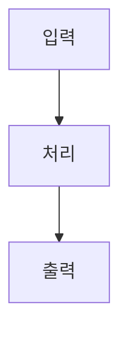

# 포트폴리오 원고 작성

이 레포의 프로젝트를 블로그 실험실(`/lab`)에 올릴 원고 한 장으로 정리한다.
결과물은 레포 루트의 `portfolio.md` 파일 하나다. 사용자가 그 파일을 블로그 레포로
옮겨 적재한다. 이 세션은 파일을 만드는 데까지만 책임진다.

## 이 원고가 답해야 하는 것

읽는 사람이 궁금한 건 "무슨 기술을 썼나"가 아니다. **어쩌다 이걸 만들 생각을 했고,
어디서 막혔고, 그래서 무엇을 붙였고, 그 다음에 어떻게 더 밀어붙였나**다.
기능 목록은 누구나 쓴다. 그 사이의 판단이 이 사람이 개발자로서 어떤지를 보여준다.

그래서 이 원고의 뼈대는 세 개다.

- **기획** — 누구의 어떤 문제를, 어디까지만 풀기로 했는지
- **개발 과정** — 생각이 흘러간 순서. 막힌 지점과 그때 붙인 것
- **시행착오** — 그중에서도 유난히 헤맸던 개별 사건의 부검

나머지 섹션은 이 셋을 뒷받침하는 자료다.

## 절차

1. **레포를 읽는다** — README, 매니페스트(`package.json` 등), 진입점, 디렉터리 구조.
   이 프로젝트가 무엇을 하는 물건인지 먼저 잡는다.
2. **시간 순으로 훑는다** — `git log --oneline --reverse`. 첫 커밋부터 읽으면
   기능이 붙은 순서가 그대로 개발 과정의 골격이 된다. 되돌린 커밋·이슈·세션 메모리도 본다.
3. **사용자에게 묻는다** — 기획 의도는 코드에 안 남는다. 왜 만들었는지, 누구를 생각했는지,
   무엇을 일부러 안 넣었는지는 레포에서 못 캐면 **그냥 물어본다.** 지어내지 않는다.
4. **초안을 쓴다** — 아래 템플릿을 그대로 채운다.
5. **`portfolio.md` 로 저장한다.**
6. **보고한다** — 채우지 못한 필드와 그 이유를 목록으로 알린다.

## 출력 형식

프런트매터 + 본문 마크다운. 파일명은 `portfolio.md`.

```yaml
---
slug: mcp-probe            # 필수. ASCII 소문자 케밥. 블로그 URL 이 된다
name: MCP Probe            # 필수. 카드에 뜨는 이름
tagline: MCP 서버를 붙여보고 응답을 날것으로 보는 도구   # 필수. 40자 이내 한 줄
year: "2026"               # 필수. 만든 해
logo_bg: "#1F6FEB"         # 필수. 로고 타일 배경 단색
logo_file: ./logo.png      # 선택. 로고 이미지 파일 (원고 기준 상대경로)
stack: [Next.js, Cloudflare Workers, TypeScript]   # 실제로 쓴 것만
url: https://mcp-probe.pages.dev   # 스킴 포함 절대 URL. 배포 안 했으면 빈 값
host: cloudflare           # vercel | cloudflare | local | none
status: 운영중              # 운영중 | 실험중 | 중단
capture: true              # 공개 URL 자동 스크린샷 촬영을 허용하는지
---
```

`logo_bg` 는 로고가 배경에 묻히지 않는 색으로 고른다. 프로젝트 성격에 맞는 단색이면 된다.

### 기술 스택은 `stack` 하나로 끝난다

**본문에 기술 섹션을 쓰지 않는다.** 프런트매터 `stack` 배열이 유일한 소스다.
블로그가 이 배열을 받아 브랜드 아이콘이 박힌 칩으로 그린다.

- **공식 표기 그대로 적는다.** `Next.js`, `Node.js`, `Tailwind CSS`, `PostgreSQL`.
  아이콘을 이름으로 찾기 때문에 표기가 어긋나면 아이콘이 안 붙는다
- 아이콘이 없는 것(`launchd` 같은 OS 기능, 사내 도구)은 첫 글자 타일로 떨어진다. 그대로 둔다
- **고른 이유는 여기 쓰지 않는다.** 그건 `## 개발 과정` 에서 이야기로 나온다
- 실제로 쓴 것만. 후보로 검토만 하고 안 쓴 건 빼거나 개발 과정에서 언급한다

### 로고 이미지

**이모지를 쓰지 않는다.** 로고 자리에는 이미지가 들어가고, 이미지가 없으면 블로그가
프로젝트 이름 첫 글자를 큼직하게 넣는다. 그것만으로도 카드가 성립한다.

레포에 로고·아이콘 파일이 있으면 `portfolio.md` 옆에 복사해 두고 `logo_file` 에
**원고 파일 기준 상대경로**로 적는다. 적재 스크립트가 스토리지에 올려 카드에 박는다.
png · webp · svg · jpg 를 받는다.

- 정사각에 가까운 아이콘이 가장 잘 맞는다. 여백이 넓은 로고는 타일 안에서 작아 보인다
- 배경이 투명한 png·svg 를 우선한다. `logo_bg` 색 위에 얹히기 때문이다
- 파일이 없으면 `logo_file` 을 아예 적지 않는다. 첫 글자 모노그램으로 떨어진다
- 없는 파일을 적으면 적재가 실패한다. 추측 경로를 적지 않는다

## 본문 템플릿

`##` 제목은 **글자 그대로** 지킨다. 블로그 UI 가 이 제목으로 섹션을 갈라
전용 화면을 고르기 때문에, 하나라도 다르면 그 섹션은 밋밋한 글로 떨어진다.
해당하는 내용이 없는 섹션은 통째로 뺀다 — 빈 제목만 남기지 않는다.

````markdown
## 제품 소개

뭐 하는 물건인지. 처음 보는 사람 기준으로 2~3 문단.
기능을 나열하지 말고, 무엇을 대신해 주는 물건인지를 씁니다.

## 기획

**문제** 맥북 앞에 없을 때 글감이 떠오르면 그냥 놓쳐요
**사용자** 혼자 블로그를 굴리는 개발자. 하루에 두어 번, 짧게 들어와요
**넣지 않은 것** 댓글이랑 구독. 읽는 사람이 아직 없어서 만들 이유가 없었어요

## 유저 플로우

### 폰에서 URL 을 붙인다

어디서 봤든 공유 버튼 하나로 끝나요.

### 초안을 요청한다

큐에 들어가고 로컬 워커가 가져갑니다.

### 결과를 확인한다

같은 화면에서 바로 봐요.

**갈라짐** 괜찮다 → 발행 / 아쉽다 → 다시 요청

## 요구사항

- [x] 완료한 건 체크
- [x] 항목당 한 줄, 명사가 아니라 동작으로
- [ ] 아직 못 한 건 빈 체크

## 개발 과정

### 1. 폰에서도 글을 쓰고 싶었어요

맥북 앞에 없을 때 글감이 오면 그대로 날아갔어요. 메모앱에 적어두면
나중에 왜 적었는지 기억이 안 나고요. 파일 기반으로 만들었더니 로컬에
묶여서, 서버에 상태를 둬야겠다고 마음을 바꿨습니다.

**붙인 것** Supabase, Vercel

### 2. 워커를 따로 뒀어요

어드민에서 바로 글을 생성하려니 요청이 너무 오래 걸렸어요. 큐에 넣고
로컬 워커가 가져가는 구조로 바꿨더니, 폰에서는 던지기만 하면 됐습니다.

**붙인 것** Claude Code

### 3. 그 다음엔 초안 말고 개선까지

한 번 굴려보니 초안보다 고쳐쓰는 데 시간이 더 들더라고요. 같은 큐에
개선 작업을 얹어서, 발행된 글도 피드백만 주면 다시 다듬게 만들었어요.

## 데이터와 API

### 붙인 서비스 이름

**제공처** 어디서 주는 것인지
**링크** https://…
**방식** REST API · GraphQL · 웹훅 · 파일 다운로드 중 무엇인지, 호출 주기
**적재** 초기 데이터를 어떻게 넣었는지 (API 로 긁었는지, 파일로 받아 벌크 insert 했는지)
**갱신** 이후 어떻게 최신 상태를 유지하는지
**주의** 호출 제한, 키 발급 절차, 데이터 품질 문제

### 다음 서비스 이름

**제공처** …
**방식** …

## 시연

### 장면 이름

**파일** ./demo/flow.mp4
**설명** 이 장면에서 무엇이 일어나는지 한 문장

## 구조



### 첫 단계 제목

무슨 일이 일어나는지 한두 문장.

### 다음 단계 제목

무슨 일이 일어나는지 한두 문장.

## 시행착오

### 케이스 제목 — 증상을 한 줄로

**증상** 무엇이 어떻게 잘못됐는지. 관찰한 사실만.

**시도** 먼저 뭘 해봤고 왜 안 됐는지.

**결론** 실제 원인과 최종 해법.

### 다음 케이스 제목

**증상** …

**시도** …

**결론** …

## 남은 것

- 다음에 할 작업
- 알려진 한계
````

`## 유저 플로우` 와 `## 구조` 는 다른 그림이다. 앞은 **사람이 움직이는 길**,
뒤는 **데이터가 흐르는 길**이다. 같은 내용을 두 번 넣지 않는다.
mermaid 는 `## 구조` 에서만 쓴다.

`## 구조` 의 `### 단계` 순서는 mermaid 노드 순서와 맞춘다. 블로그에서 다이어그램이
고정된 채로 단계를 스크롤하면 해당 노드가 순서대로 켜지기 때문이다.

`## 시행착오` 의 `**증상**` `**시도**` `**결론**` 은 각각 한 문단이다. 이 세 라벨이
없으면 케이스 전체가 증상 한 덩어리로 붙는다.

## 기획을 채우는 법

`**라벨** 값` 한 줄씩 쌓는다. 아래 셋은 되도록 넣는다.

- **문제** — 무엇이 불편했는지. 기능이 아니라 상황으로 쓴다.
  "초안 자동화가 필요했다"(X) → "맥북 앞에 없을 때 글감을 놓친다"(O)
- **사용자** — 누가 언제 쓰는지. 혼자 쓰는 도구면 그렇게 쓴다. 있지도 않은
  페르소나를 만들지 않는다
- **넣지 않은 것** — **이 줄이 제일 중요하다.** 무엇을 포기했는지가 판단력을 보여준다.
  안 만든 이유까지 한 마디로 붙인다

필요하면 라벨을 더 써도 된다. `가설`, `성공 기준`, `제약`, `기간` 같은 것들.
다만 지어내서 채우지는 않는다. 근거가 없으면 그 줄을 빼고 보고에 적는다.

## 유저 플로우를 그리는 법

**여기에 mermaid 를 쓰지 않는다.** `### 단계` 만 순서대로 쓰면 블로그가 카드 레일로 그린다.
그림을 원고가 그리지 않기 때문에 프로젝트마다 결이 어긋나지 않는다.

- **주인공은 사람이다.** 단계 제목에 함수명·테이블명·서비스명을 쓰지 않는다.
  `POST /api/jobs`(X) → `초안을 요청한다`(O)
- 제목은 사용자가 하는 동작으로. 설명은 한두 문장이면 충분하다
- 갈림길은 그 단계 아래에 `**갈라짐** 조건 → 결과 / 조건 → 결과` 한 줄로 적는다.
  화살표는 `→` 나 `->`, 갈래 구분은 `/` 다
- 갈림길을 최소 하나는 만든다. 없으면 그건 플로우가 아니라 목록이다
- 단계 6개를 넘기지 않는다. 넘으면 흐름 하나만 남기고 나머지는 뺀다
- 화면이 하나뿐인 도구라 동선이랄 게 없으면 이 섹션을 통째로 뺀다

## 개발 과정을 쓰는 법

**이 섹션이 원고의 중심이다.** 여기서 사람 냄새가 나야 한다.

`### 1. 제목` 으로 단계를 끊고, 그 아래에 그때 무슨 생각을 했는지 문단으로 쓴다.
그 단계에서 새로 붙인 서비스·API 가 있으면 `**붙인 것** 이름, 이름` 한 줄을 덧붙인다.
블로그가 그 줄을 떼어 아이콘 칩으로 그린다.

**단계를 나누는 기준**

- 기능 단위가 아니라 **생각이 바뀐 지점**으로 끊는다.
  "로그인 구현"(X) → "그냥 나만 쓸 건데 로그인이 필요한가 싶었어요"(O)
- 3~7 단계가 적당하다. 두 개면 이야기가 안 되고, 열 개면 커밋 로그가 된다
- 순서는 시간순이다. `git log --reverse` 가 대체로 그 순서다

**한 단계에 들어갈 것**

- 왜 그걸 하려고 했는지 (생각의 출발)
- 하다가 뭐가 걸렸는지 (막힌 지점)
- 그래서 뭘 붙이거나 만들었는지 (선택)
- 처음 버전 이후에 어떻게 더 밀어붙였는지 (고도화)

넷을 라벨로 나누지 않는다. **그냥 이어서 이야기한다.** 라벨은 `**붙인 것**` 하나뿐이다.

**고도화를 빼먹지 않는다.** "만들었다"에서 끝나는 단계만 늘어놓으면 습작으로 읽힌다.
처음엔 이렇게 했는데 써보니 이래서 저렇게 바꿨다 — 이 대목이 있어야 운영해 본 사람의 글이 된다.

**`## 시행착오` 와의 경계**
개발 과정은 프로젝트 전체의 줄거리다. 시행착오는 그중 한 사건을 확대한 부검이다.
같은 이야기를 양쪽에 쓰지 않는다. 개발 과정에서 한 줄로 스치고, 시행착오에서 파고든다.

## 시연 영상

**화면이 실제로 도는 걸 보여주는 짧은 영상이 글 열 줄보다 강하다.** 앱을 켜서 핵심 흐름
하나를 끝까지 수행하는 장면을 화면 녹화로 남긴다.

- 장면 하나에 흐름 하나. 10~20초. 처음부터 끝까지 한 번에
- 파일은 `portfolio.md` 옆에 두고 `**파일** ./demo/flow.mp4` 로 **상대경로**를 적는다.
  블로그 적재 스크립트가 올려서 URL 로 바꿔 준다
- mp4 · webm 을 받는다. 소리는 안 나간다 — 자막이 필요하면 녹화에 넣는다
- 커서 움직임이 보이게 찍는다. 무엇을 눌렀는지 안 보이면 흐름이 안 읽힌다
- 파일 크기 50MB 를 넘기지 않는다. 넘으면 해상도를 낮춘다
- **영상이 없으면 `## 시연` 섹션을 통째로 뺀다.** 빈 플레이어보다 없는 게 낫다

정지 이미지만 있으면 같은 자리에 `**파일** ./demo/screen.png` 로 적어도 된다.

## 데이터와 API 를 채우는 법

화면은 누구나 만들지만, 어떤 데이터를 어디서 어떻게 가져와 붙였는지는 실제로
해본 사람만 쓸 수 있다. 읽는 사람이 이 프로젝트의 숫자를 믿을지 말지도 여기서 갈린다.
성의 없이 이름만 나열하지 않는다.

`### 이름` 아래에 `**라벨** 값` 줄을 쌓는다. 라벨은 고정이 아니다. 필요한 것만 쓴다.

**꼭 적을 것**
- 데이터를 실제로 어디서 받았는지. 공공데이터면 **어느 포털의 어느 데이터셋인지**까지
- 그 데이터셋으로 바로 갈 수 있는 링크. 포털 첫 화면이 아니라 해당 데이터 페이지
- 초기 데이터를 넣은 방법과 이후 갱신 방법을 **갈라서**. 처음엔 CSV 를 받아 벌크로 넣고
  이후 증분만 API 로 받는 식이면 그렇게 적는다. 이 구분이 실무 감각을 드러낸다
- 무료 한도, 호출 제한, 키 발급에 걸린 시간 같은 실제로 부딪힌 제약

**여기 넣는 것**
- 공공데이터·오픈API·크롤링 대상
- 결제·인증·알림 같은 외부 SaaS
- LLM API, 지도, 검색 등 호출해서 쓰는 모든 것
- 직접 만든 데이터셋이면 어떻게 모았는지

**넣지 않는 것**
- 그냥 설치한 라이브러리 (그건 프런트매터 `stack`)
- 자기 서비스 내부 엔드포인트

붙인 외부 서비스가 하나도 없으면 이 섹션을 통째로 뺀다.
링크·한도·주기를 모르면 **지어내지 말고** 그 줄을 비운 뒤 보고에 적는다.

## 시행착오 선별 기준

아무거나 넣으면 섹션이 쓰레기통이 된다.

**넣는다**
- 해결까지 **방향을 두 번 이상 튼** 문제
- 처음 생각한 원인이 틀렸던 문제
- 문서·스펙과 실제 동작이 달랐던 문제
- 되돌린 커밋(revert)이 남아 있는 문제

**뺀다**
- 오타·단순 컴파일 에러
- 한 번에 고친 버그
- 라이브러리 설치·설정 같은 정형 작업

케이스가 하나도 없으면 `## 시행착오` 섹션을 통째로 뺀다. 억지로 만들지 않는다.

## 문체

**개발 일지를 쓰듯이 쓴다.** 회고록이다. 기술 문서가 아니다.
한 사람이 자기가 만든 걸 옆에서 이야기해 주는 톤이어야 한다.

- **해요체를 기본으로 쓴다.** "~했어요", "~하더라고요", "~인데요".
  문단 리듬이 처지면 "~합니다"를 섞는다. 둘을 오가는 게 자연스럽다
- **"~했다" 로 끝나는 문장만 이어붙이지 않는다.** 그게 딱딱한 AI 글의 첫 신호다
- 주저리주저리 해도 된다. 왜 그렇게 생각했는지, 뭐가 짜증났는지 그대로 쓴다.
  "서버 상태가 필요했다"보다 "메모앱에 적어두면 나중에 왜 적었는지 기억이 안 나요"가 낫다
- **첫 문장은 사실 직진.** "이 프로젝트에 대해 설명하자면" 같은 도입은 안 쓴다
- **번역투 금지.** "~을 통해", "~에 대한", "~되어진", "가장 ~한 것 중 하나"
- **한글 용어에 영어를 괄호로 병기하지 않는다.** 영어권 인물명은 원표기 그대로
- 과장 금지. "혁신적인", "강력한", "완벽한" 같은 말은 쓰지 않는다
- 감탄사·이모지로 친근한 척하지 않는다. 톤은 편하되 내용은 정확해야 한다

**예외** — `**라벨** 값` 형태의 줄(기획, 데이터와 API, 시연, 시행착오)은 짧게 끊는다.
여기는 읽는 글이 아니라 훑는 표라서, 문장이 길면 오히려 안 읽힌다.

## 지어내지 않는다

근거를 찾지 못한 필드는 비워 두고 보고에 적는다. 특히:

- `year` 를 모르면 첫 커밋 날짜에서 가져온다. 그것도 없으면 사용자에게 묻는다
- `url` 은 실제로 배포된 주소만 적는다. 추측한 주소를 적지 않는다
- **기획 의도와 사용자는 코드에 없다.** 커밋에서 못 읽으면 사용자에게 묻는다
- API 링크·호출 제한·갱신 주기는 코드나 문서에서 확인한 것만 적는다. 기억으로 쓰지 않는다
- 시행착오는 커밋·이슈·메모리에 흔적이 있는 것만 쓴다

## 마지막 보고

파일을 저장한 뒤 이렇게 알린다.

- 채운 섹션과 각 분량
- 비워 둔 필드와 이유
- 개발 과정의 단계 수와, 각 단계에서 `**붙인 것**` 을 붙였는지
- 시행착오로 넣은 케이스 수와, 후보였지만 뺀 것들
- 사용자에게 물어야 채워지는 것 (기획 의도 등)
